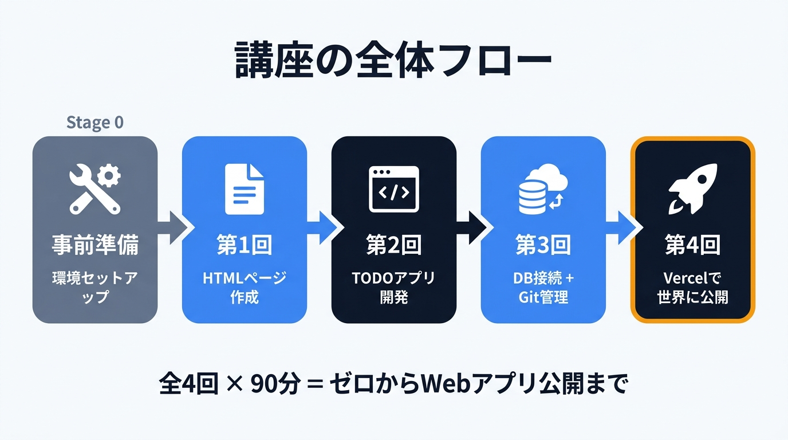
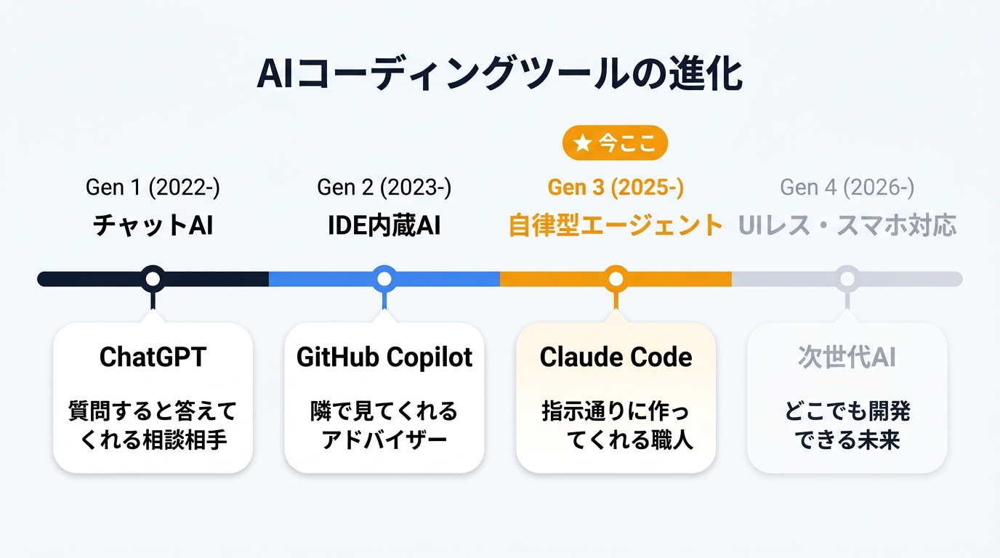
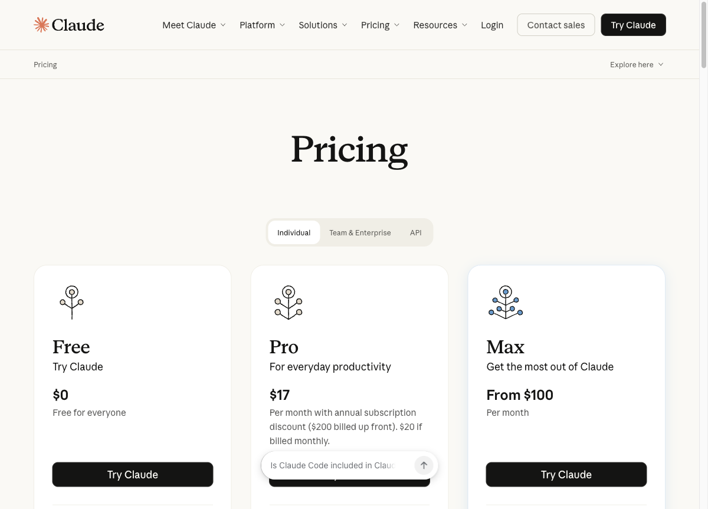
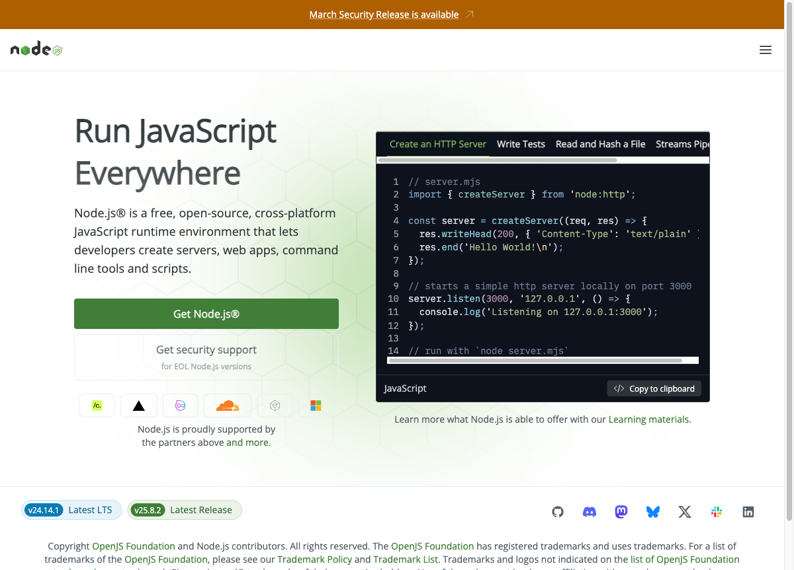
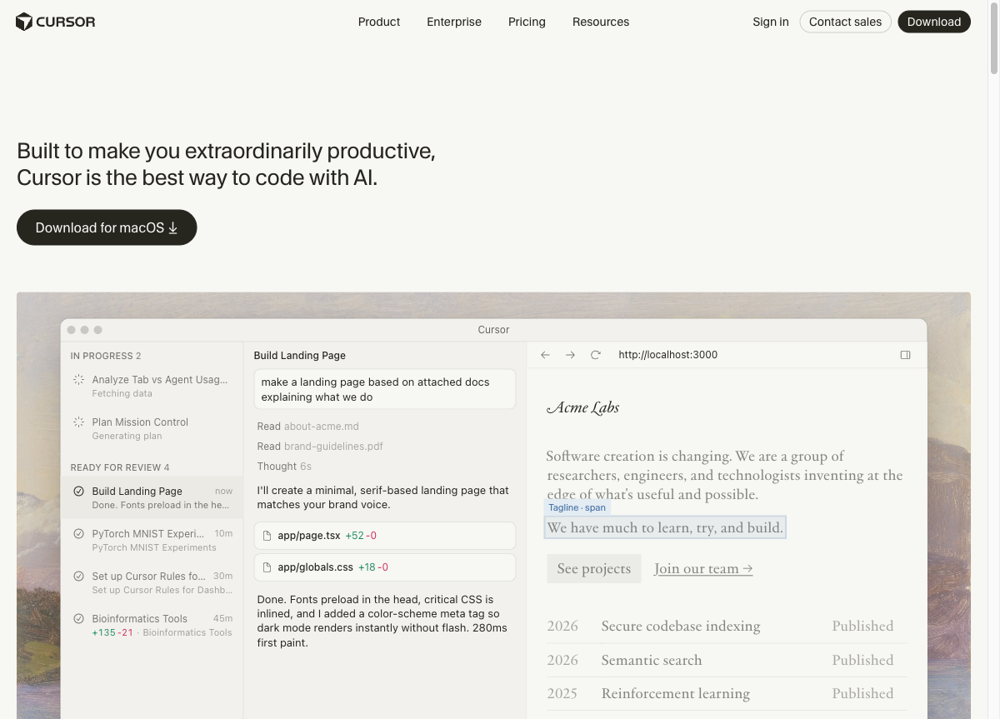

# Claude Code 活用術 — 非エンジニア向け講座

## この講座で何ができるようになるか

全4回を通じて、**プログラミング経験ゼロでも Web アプリを作ってインターネットに公開**できるようになります。

```
第1回 → AIに指示を出して Web ページを作れる
第2回 → ボタンで操作できるアプリを作れる
第3回 → データが保存されるアプリになる
第4回 → URLが発行されて世界に公開される
         ↓
   自分のスマホからもアクセスできる「自分のアプリ」が完成
```

コードは1行も自分で書きません。
「こういうアプリを作って」「ここをこう変えて」と日本語で指示するだけです。



---

## AIコーディングの進化 — 今どこにいるのか

AIを使ったソフトウェア開発は、ここ数年で劇的に変わっています。
この流れを知っておくと、今から学ぶことの位置づけが分かります。

### 第1世代: チャットAI（2022年〜）

ChatGPT の登場で「AIに質問すると答えが返ってくる」が当たり前になった。
コードについて聞くこともできるが、**自分でコピペして動かす必要があった**。

```
人間: 「TODOアプリのコードを書いて」
AI:   「はい、こちらです（コードを表示）」
人間: → コピーして、ファイルを作って、貼り付けて、保存して、実行する
```

### 第2世代: IDE搭載AI — ペアプログラミング（2023年〜）

VS Code などのエディタ（IDE）に AI が搭載された。
GitHub Copilot や Cursor が代表的。コードを書いている横で AI が続きを提案してくれる。
**隣に座ってくれるパートナー**のような存在。

> 💡 **IDE / エディタって何？**
> プログラムのファイルを開いて中身を見たり編集したりするためのソフトです。Word が文章を書くためのソフトであるように、IDE（統合開発環境）はプログラムを書くためのソフトです。この講座では「Cursor」という IDE を使います。難しい機能は使わないので、「ファイルの中身が見える画面」くらいに思っておけば大丈夫です。

```
人間: （コードを書き始める）
AI:   「この続きはこうですか？」（候補を表示）
人間: → Tab キーで採用、または修正
```

エンジニアの生産性は上がったが、あくまで「人間が主導してコードを書く」前提だった。

### 第3世代: 自律型エージェント — 指示だけで動く（2025年〜）

Claude Code の登場で、ターミナル（パソコンに文字で命令を出す画面）上で **AI が自律的にタスクを実行** できるようになった。
ファイルの作成、コードの記述、エラーの修正、テストの実行まで AI がやる。
人間は「何を作るか」を考えて指示を出すだけ。

> 💡 **ターミナルって何？**
> パソコンに文字で命令を出す画面のことです。普段はアイコンをクリックして操作しますが、ターミナルでは文字を打って操作します。プログラマーっぽく見えますが、やることは「文字を打って Enter を押す」だけです。Mac では「ターミナル」、Windows では「コマンドプロンプト」や「PowerShell」と呼ばれています。

```
人間: 「TODOアプリを作って」
AI:   → ファイルを作成、コードを書く、エラーが出たら自分で直す、完成させる
人間: → ブラウザで確認する
```

**← 本講座はここ。Claude Code を使ってアプリを作ります。**

### 第4世代: UIすら不要に — スマホから指示（2026年〜）

最新のトレンドでは、ターミナルやエディタという「画面」すら不要になりつつある。
スマホから Telegram や Discord でメッセージを送ると、
パソコン上の AI が自律的に作業を進めて結果を返してくれる。

```
人間: （スマホの Telegram から）「あのバグ直しておいて」
AI:   → 自宅PCで自律的にコードを修正、テスト、デプロイまで完了
人間: → 通知を見て確認するだけ
```

> 💡 **デプロイって何？**
> 作ったアプリを、自分のパソコンだけでなくインターネット上のサーバーに置いて、誰でもアクセスできるようにすることです。「公開する」「リリースする」とほぼ同じ意味です。第4回で実際に体験します。



Claude Channels や Dispatch といった機能がこれにあたる。

### まとめ: AI開発の進化マップ

```
第1世代  チャットAI        人間がコピペして動かす
  ↓
第2世代  IDE搭載AI         人間が書く横でAIが補助
  ↓
第3世代  自律型エージェント  AIが作る。人間は指示だけ   ← 本講座
  ↓
第4世代  UIレス            スマホから指示。画面すら不要  ← 最新トレンド
```

本講座では第3世代の環境（IDE + ターミナル）で学びますが、
将来的にはこの画面すらいらなくなる可能性があります。
だからこそ大事なのは「ツールの操作方法」ではなく
**「AIに何をどう指示するか」という考え方**です。

---

### この講座で使うツール

本講座で使うのは **Cursor** と **Claude Code** の2つだけです。


- **Cursor** = 作業台（エディタ）。AIが作ったファイルの中身を見るための画面
- **Claude Code** = 職人（AIエージェント）。Cursor の中のターミナルで動き、指示通りにモノを作る
- **Cursor の AI 機能は使いません**（Claude Code に一本化して混乱を防ぎます）

> 💡 **Git / GitHub って何？**
> **Git** はファイルの変更履歴を記録・管理する仕組みです。**GitHub** は Git のデータをインターネット上に保存・共有できるサービスです。第3回で使います。

### なぜ Claude Code を選ぶのか

1. **指示の自由度が高い**: 「TODOアプリを作って」のような大きな指示もOK
2. **自律的に動く**: エラーが出たら自分で直そうとする
3. **Skills で知識を蓄積できる**: 繰り返す業務を「スキル」として保存・再利用できる
4. **業務活用に強い**: 資料作成、データ分析、タスク管理など、開発以外にも使える

> 💡 **CLI って何？**
> Command Line Interface（コマンドライン・インターフェース）の略で、文字を打って操作するタイプのソフトのことです。マウスでクリックするのではなく、キーボードで命令を入力します。Claude Code は CLI ツールです。ターミナルの中で `claude` と打って使います。

---

## 事前準備 — 受講前にやっておくこと

以下の手順を講座の前日までに完了してください。
分からないところがあれば遠慮なく質問してください。

所要時間: 約30〜45分

---

## 1. Anthropic アカウント作成

Claude Code を使うには Anthropic のアカウント（有料プラン）が必要です。

> 💡 **認証って何？**
> 「あなたは本当にこのサービスを使う権利がある人ですか？」をシステムが確認することです。メールアドレスとパスワードでログインするのも認証の一種です。Claude Code を初めて使うときにも、ブラウザでログインして「この人は OK」と確認する認証の手順があります。

> 💡 **API って何？**
> Application Programming Interface の略で、ソフトウェア同士が情報をやり取りするための窓口です。Claude Code は裏側で Anthropic の API を通じて AI（Claude）とやり取りしています。Claude Codeが裏側で使っている仕組みなので覚えなくてOKです。API を使うには「API キー」という専用の合い鍵が必要で、Anthropic のコンソール画面で発行できます。

### 料金プランについて

Claude Code を使うには、以下のいずれかの方法があります:

| 方法 | 月額（税別） | 特徴 |
|------|-------------|------|
| **Claude Pro プラン** | $20/月 | Claude のチャット機能 + Claude Code が使える。まずはこれでOK |
| **Claude Max プラン** | $100/月 または $200/月 | Pro の 5〜20倍の使用量。ヘビーユーザー向け |
| **API 従量課金** | 使った分だけ | console.anthropic.com でクレジットを購入して使う方式 |

> 💡 **Pro プランって何？**
> Anthropic が提供する月額 $20 の有料プランです。Claude のチャット（Web / アプリ）と Claude Code の両方が使えます。講座中に使い切ることはまずありません。まずは Pro プランで始めれば十分です。年払い（$200/年）にすると月あたり $17 になります。

### 手順

1. [https://claude.ai](https://claude.ai) にアクセス
2. 「Sign Up」からアカウントを作成（メールアドレスまたは Google アカウント）
3. 画面の案内に沿って Pro プラン（月額 $20）に加入

> 📎 **参考**: [Anthropic 料金プラン](https://claude.com/pricing) — 各プランの詳細はここで確認できます


*Claude の料金ページ。左から Free（無料）、Pro（$20/月）、Max（$100〜/月）*

### 確認ポイント
- [ ] Anthropic のアカウントが作成できた
- [ ] Pro プランに加入できた

---

## 2. Node.js のインストール

第2回以降で Web アプリを作るときに Node.js（ノード・ジェイエス）が必要になります。
Claude Code 自体は Node.js なしでもインストールできますが、**講座全体を通して使う**のでここで入れておきましょう。

> 💡 **Node.js って何？**
> もともとは Web サーバー（インターネット上でサイトを動かすコンピュータ）を作るためのソフトですが、今ではいろいろなツールの土台として使われています。第2回以降の Next.js（ネクストジェイエス。Webアプリ開発の道具です）アプリ開発で必要です。インストールするだけで OK で、Node.js を直接操作することはありません。

> 💡 **なぜ Node.js なのか？**
> Next.js（第2回で使うWebアプリ開発ツール）が Node.js 上で動くため、Node.js は必須です。他の選択肢はありません。

> 💡 **npm って何？**
> Node Package Manager の略で、Node.js 用のソフトを簡単にインストールするための仕組みです。スマホで言う「App Store」や「Google Play」のようなもので、`npm install ...` と打つだけでソフトをダウンロード＆インストールできます。Node.js をインストールすると npm も一緒に入ります。

### Mac の場合

1. [https://nodejs.org/ja](https://nodejs.org/ja) にアクセス
2. 「LTS」と書かれたボタンをクリックしてダウンロード
   - 2026年3月時点では **v24.x（LTS）** が最新の安定版です

> 💡 **LTS って何？**
> Long Term Support（長期サポート）の略で、安定して使えるバージョンという意味です。最新機能よりも安定性を重視しているので、初心者はこちらを選んでおけば安心です。

3. ダウンロードした `.pkg` ファイルをダブルクリック
4. 表示される画面で「続ける」→「続ける」→「インストール」と進める（全てそのままでOK）
5. パスワードを聞かれたら、Mac のログインパスワードを入力

> 📎 **参考**: [Node.js 公式ダウンロードページ](https://nodejs.org/en/download) — ダウンロードはここから


*Node.js 公式サイト。緑の「Get Node.js®」ボタンからダウンロードできます*

### Windows の場合

1. [https://nodejs.org/ja](https://nodejs.org/ja) にアクセス
2. 「LTS」と書かれたボタンをクリックしてダウンロード
   - 2026年3月時点では **v24.x（LTS）** が最新の安定版です
3. ダウンロードした `.msi` ファイルをダブルクリック
4. 表示される画面で「Next」→「Next」→「Install」と進める（全てそのままでOK）
5. **「Add to PATH」にチェックが入っていることを必ず確認してください**（通常は最初からチェックされています）

> 📎 **参考**: [Node.js 公式ダウンロードページ](https://nodejs.org/en/download) — ダウンロードはここから

> 💡 **環境変数（PATH）って何？**
> パソコンが「このソフトはどこにあるか」を覚えておくための設定です。PATH に登録されていると、ターミナルでソフト名を打つだけで起動できます。Node.js のインストーラーが自動で設定してくれるので、「Add to PATH」にチェックが入っていることだけ確認すれば OK です。

### インストールできたか確認する

ターミナル（Mac）またはコマンドプロンプト（Windows）を開いて、以下の文字を打って Enter キーを押してください:

> 💡 **コマンドって何？**
> ターミナルに打ち込む「命令文」のことです。例えば `node --version` は「Node.js のバージョンを教えて」という命令です。難しそうに見えますが、この講座では「書いてある文字をそのまま打って Enter を押す」だけです。

```
node --version
```

`v24.xx.x` のようにバージョン番号が表示されれば成功です。

#### ターミナルの開き方

**Mac の場合:**
1. キーボードで `Command（⌘）+ Space` を押す（Spotlight 検索が開きます）
2. 「ターミナル」と入力して Enter

**Windows の場合:**
1. キーボードで `Windows キー` を押す（スタートメニューが開きます）
2. 「cmd」と入力して Enter（「コマンドプロンプト」が開きます）

### 確認ポイント
- [ ] `node --version` でバージョンが表示された

---

## 3. Cursor のインストール

Cursor（カーソル）はコードエディタ（ファイルの中身を見たり編集したりするソフト）です。
講座ではこの画面の中で Claude Code を動かします。

> 💡 **なぜ Cursor を選ぶのか？**
> VS Code（プログラマーに最も人気のあるエディタ）をベースに作られたエディタです。操作感はVS Codeとほぼ同じですが、ターミナルが内蔵されておりClaude Codeとの相性が抜群です。無料で使えます。
> なお、本講座ではCursorのAI機能は使いません。あくまでファイルを見る画面＋Claude Codeを起動する場所として使います。

> 💡 **エディタとメモ帳の違い**
> Windowsのメモ帳やMacのテキストエディットでもファイルは開けますが、Cursorのようなコードエディタは「ファイルツリー（フォルダ構成の一覧）」「シンタックスハイライト（色分け表示）」「ターミナル（コマンド入力画面）」が一体になっており、開発作業が格段にやりやすくなります。

### Mac の場合

1. [https://www.cursor.com](https://www.cursor.com) にアクセス
2. 「Download」ボタンをクリック（Mac 用が自動で選ばれます）
3. ダウンロードした `.dmg` ファイルをダブルクリック
4. 表示されたウィンドウで、Cursor のアイコンを「Applications」フォルダにドラッグ&ドロップ
5. Applications フォルダから Cursor を起動

### Windows の場合

1. [https://www.cursor.com](https://www.cursor.com) にアクセス
2. 「Download」ボタンをクリック（Windows 用が自動で選ばれます）
3. ダウンロードした `.exe` ファイルをダブルクリック
4. 表示される画面で「Next」→「Install」と進める
5. インストール完了後、Cursor を起動

> 📎 **参考**: [Cursor 公式ダウンロードページ](https://www.cursor.com/download) — ダウンロードはここから


*Cursor 公式サイト。「Download for macOS」ボタンからダウンロードできます（Windows の場合は自動で Windows 用が表示されます）*

### 初回起動時の設定

Cursor を初めて開くと設定画面が表示されます。以下のように選んでください:

- **言語**: 日本語（Japanese）を選択
- **テーマ**: お好みで（Dark がおすすめ。目が疲れにくいです）
- **AI 機能の設定**: **そのままでOK**（講座では Cursor 自体の AI 機能は使いません）

### 確認ポイント
- [ ] Cursor が起動できた
- [ ] 画面が表示された（真っ暗な画面でOK）

---

## 4. Claude Code のインストール

いよいよ本講座の主役、Claude Code をインストールします。

### 手順

1. Cursor を開く
2. 画面上部のメニューから「ターミナル」→「新しいターミナル」を選択
   - またはキーボードで `` Ctrl + ` ``（Ctrl キーを押しながらバッククォート）を押す
   - バッククォート（`` ` ``）キーは、キーボード左上の数字1の左隣にあるキーです。日本語キーボードでは Shift+@ の位置にある場合もあります
   - Mac の場合は `` Ctrl + ` `` です（Command ではなく Ctrl）
3. 画面の下のほうにターミナル（黒い画面）が表示されます
4. 以下のコマンド（命令文）をそのまま打って Enter キーを押してください:

> 以下のコマンドは「公式インストーラーをダウンロードして実行する」という意味です。コマンドの意味を覚える必要はありません。

**Mac / Linux の場合:**
```
curl -fsSL https://claude.ai/install.sh | bash
```

**Windows の場合（PowerShell）:**
```
irm https://claude.ai/install.ps1 | iex
```

> 文字が流れて少し待つとインストールが完了します。

> **注意**: 以前は `npm install -g @anthropic-ai/claude-code` でインストールしていましたが、現在は上記の方法が公式推奨です。npm 方式でも動きますが、上記の方が依存関係が少なく（他のソフトに頼らず単体で動くため）安定しています。

> 💡 **Homebrewをご存知の方向け**
> Mac で Homebrew を使っている場合は、以下のコマンドでもインストールできます:
> ```
> brew install --cask claude-code
> ```

5. インストールが完了したら、以下を入力して Enter:

```
claude
```

6. 初回起動時に認証（ログイン）を求められます
   - ブラウザが自動で開くので、先ほど作った Anthropic アカウントでログイン
   - 「Allow」（許可）ボタンをクリック
   - ターミナルに戻ると Claude Code が使える状態になっています

> 📎 **参考**: [Claude Code 公式セットアップガイド](https://code.claude.com/docs/en/setup) — 詳しい手順や認証方法はここで確認できます

### インストールできたか確認する

ターミナルで以下を入力して Enter:

```
claude --version
```

バージョン番号が表示されれば成功です。

さらに、正しくインストールされているか診断するには:

```
claude doctor
```

このコマンドで問題がないか自動チェックできます。

### 確認ポイント
- [ ] `claude --version` でバージョンが表示された
- [ ] `claude` と入力して Claude Code が起動した
- [ ] Anthropic アカウントでの認証が完了した

---

## 5. 作業フォルダの作成

講座で使うフォルダを作っておきましょう。

### 手順

1. Cursor のターミナルで以下を入力して Enter:

**Mac の場合:**
```
mkdir ~/claude-code-course
```

**Windows の場合（PowerShell）:**
```
mkdir ~/claude-code-course
```

> この命令は「ホームフォルダ（自分の場所）に claude-code-course という名前のフォルダを作って」という意味です。

2. Cursor のメニューから「ファイル」→「フォルダーを開く」を選択
3. 先ほど作った `claude-code-course` フォルダを選んで「開く」

### 確認ポイント
- [ ] `claude-code-course` フォルダを Cursor で開けた

---

## 全体チェックリスト

講座当日までに以下が全て完了していることを確認してください:

- [ ] Anthropic アカウント作成 + Pro プラン加入
- [ ] Node.js インストール済み（`node --version` でバージョンが出る）
- [ ] Cursor インストール済み（起動できる）
- [ ] Claude Code インストール済み + 認証完了（`claude --version` でバージョンが出る）
- [ ] 作業フォルダ作成済み（Cursor で開けた）

**全部できた方**: 当日は Cursor を開いた状態でお待ちください。

**途中で詰まった方**: スクリーンショットと一緒にメッセージください。一緒に解決しましょう。

---

## よくあるトラブル

### 「npm: command not found」と表示される

→ Node.js のインストールが完了していないか、ターミナルが古い状態のままの可能性があります。
1. まず **ターミナルを閉じて、もう一度開いてみてください**（これだけで直ることが多いです）
2. それでもダメな場合は、Node.js を [公式サイト](https://nodejs.org/ja) から再インストールしてください

### 「claude: command not found」と表示される

→ ターミナルを一度閉じて開き直してから、再度 `claude` と入力してください。
それでもダメな場合は以下を再実行してください:

**Mac / Linux の場合:**
```
curl -fsSL https://claude.ai/install.sh | bash
```

**Windows の場合（PowerShell）:**
```
irm https://claude.ai/install.ps1 | iex
```

### Windows で「実行ポリシー」のエラーが出る

→ これは Windows のセキュリティ設定による制限です。以下の手順で解除できます:

1. スタートメニューで「PowerShell」と検索
2. 「Windows PowerShell」を **右クリック** → 「管理者として実行」を選択
3. 以下をコピー＆ペーストして Enter:
```
Set-ExecutionPolicy -ExecutionPolicy RemoteSigned -Scope CurrentUser
```
4. 「Y」を入力して Enter
5. PowerShell を閉じて、Cursor のターミナルに戻って再度インストールを実行

### Cursor のターミナルが表示されない

→ 以下のいずれかを試してください:
- メニュー「表示」→「ターミナル」を選択
- キーボードで `` Ctrl + ` `` を押す

### 認証画面が開かない

→ ブラウザが既に開いている場合、新しいタブで [https://claude.ai](https://claude.ai) にアクセスしてログインしてから、ターミナルに戻って再度 `claude` を実行してください。

### Mac で「このアプリは開発元を確認できないため開けません」と表示される

→ Cursor をインストールしたときに出ることがあります:
1. 「システム設定」→「プライバシーとセキュリティ」を開く
2. 画面の下のほうに「Cursor は〜のため開けませんでした」という表示がある
3. 「このまま開く」をクリック

---

## 講座で出てくる用語集（ざっくり理解用）

講座中に以下のような言葉が出てくることがあります。今の段階で全部覚える必要はありませんが、
「聞いたことあるな」くらいにしておくと安心です。

> 💡 **フロントエンド / バックエンドって何？**
> **フロントエンド**は「ユーザーの目に見える部分」のことです。ボタン、画像、文字の配置など、画面に映っているもの全てがフロントエンドです。**バックエンド**は「裏側で動いている部分」で、データの保存や計算処理などを担当します。レストランに例えると、フロントエンドは「お客さんが見るメニューや料理の盛り付け」、バックエンドは「厨房での調理」です。

> 💡 **データベースって何？**
> データ（情報）を整理して保存しておく仕組みです。例えば TODO アプリなら「やること」のリストを保存するのがデータベースの役割です。Excel の表をイメージすると分かりやすいかもしれません。第3回で実際に使います。

> 💡 **localhost って何？**
> 「自分のパソコンの中だけで動いているサーバー」のことです。講座でアプリを作ると、最初は `http://localhost:3000` のようなアドレスで自分のパソコンだけで確認できます。この段階では他の人からは見えません。第4回でインターネットに公開（デプロイ）すると、誰でも見られるようになります。

> 💡 **ブラウザの開発者ツールって何？**
> Chrome や Edge などのブラウザに最初から入っている、Web ページの裏側を覗ける機能です。`F12` キーを押すと開きます。講座では「エラーが出たときにここを見てみましょう」くらいの使い方をします。プログラマーがよく使う道具ですが、見方だけ知っていれば十分です。

> 💡 **SSH って何？**
> Secure Shell の略で、離れたコンピュータに安全に接続するための仕組みです。本講座では直接使いませんが、サーバーの管理や GitHub との接続で名前が出ることがあります。「安全な遠隔操作」くらいのイメージで OK です。
