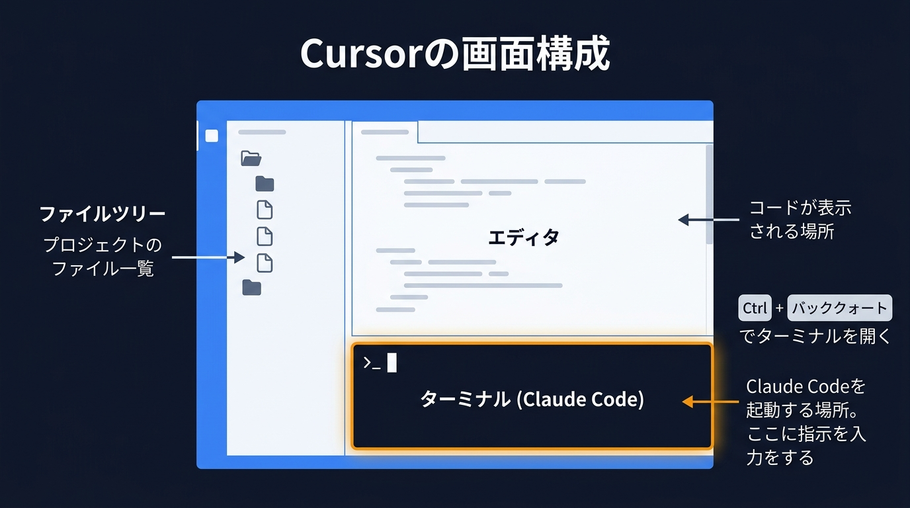
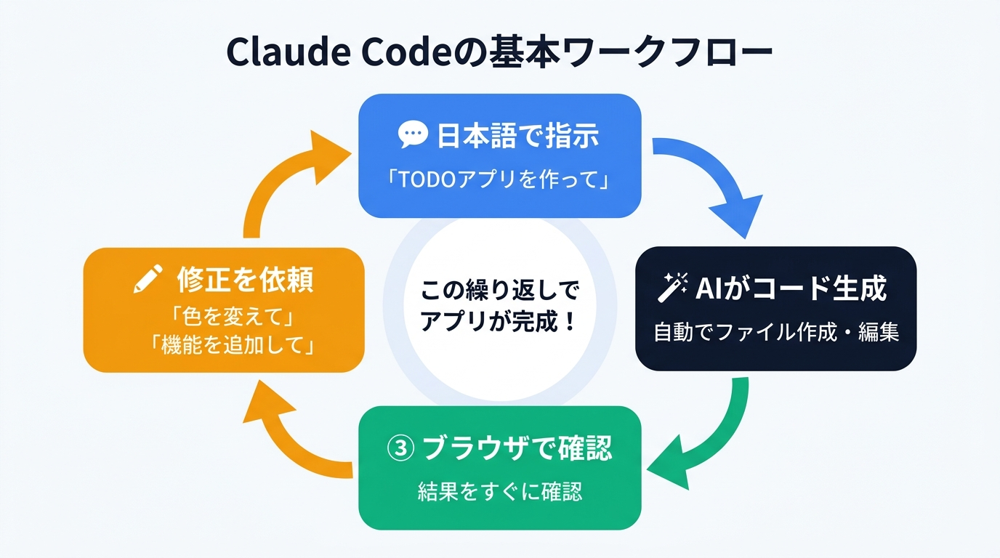

# 第1回: 導入と基本操作（90分）

## 前回（事前準備）のおさらい

事前準備で以下を完了しています:
- Anthropic アカウントの作成
- Node.js / Cursor / Claude Code のインストール
- 作業フォルダ（`claude-code-course`）の作成

まだの方は「事前準備」の資料を確認してから進めてください。

---

## ゴール

Claude Code に指示を出して、目に見える成果物（Webページ）を手に入れる。
「AIに指示するだけでモノが作れる」を体感する。

---

## 講義パート（20分）

### Claude Code って何？

- ChatGPT: チャットで質問に答えてくれる
- Cursor AI: エディタの中でコードを補完してくれる
- **Claude Code: ターミナルから指示すると、ファイルを作成・編集・実行してくれる**

→ Claude Code は「手を動かす AI」。ファイルを作り、コードを書き、エラーを直す。

### 今日の Cursor の使い方



- Cursor = ファイルの中身を見るための画面
- Claude Code = 画面下のターミナルで動く AI
- **Cursor の AI 機能は今日は使いません**（混乱防止）

> 💡 **ファイルツリーって何？**
> Cursor の画面左側に表示される、フォルダやファイルの一覧です。パソコンの「エクスプローラー」や「Finder」と同じで、どんなファイルがあるかを階層的に見ることができます。Claude Code がファイルを作ると、ここに自動で表示されます。

> 💡 **シンタックスハイライトって何？**
> コードの種類に応じて自動的に色が付く機能です。Cursor の画面右側でファイルを開くと、文字がカラフルに表示されます。これは見やすくするための表示機能なので、自分で色を付ける必要はありません。色が付いていれば正しく認識されている証拠です。

### 指示の出し方のコツ

1. **やりたいことをそのまま日本語で書く**（「自己紹介ページを作って」）
2. **具体的に書くほど精度が上がる**（「青い背景で、名前と趣味を載せた自己紹介ページを作って」）
3. **エラーが出たらそのまま貼る**（Claude Code が自分で直してくれる）



---

## ハンズオン（60分）

### Step 1: Claude Code を起動する（5分）

> **このStepでやること:** Cursor のターミナルで Claude Code を立ち上げて、指示を出せる状態にします。

1. Cursor を開く
2. 事前準備で作った `claude-code-course` フォルダを開く
3. ターミナルを開く（`Ctrl + `` ` ``）
   - バッククォート（`` ` ``）キーは、キーボード左上の数字1の左隣にあるキーです
   - 日本語キーボードでは `Shift + @` の位置にある場合もあります
4. 以下を入力:

```
claude
```

5. `claude >` のような入力待ち表示（プロンプト）が出たら起動成功です。初回は利用規約への同意を求められる場合があります

> **画面の確認**: 左側にファイルツリー（フォルダとファイルの一覧）、下にターミナル（Claude Code）が表示されていればOK

---

### Step 2: 最初の指示 — 自己紹介ページを作る（15分）

> **このStepでやること:** Claude Code に日本語で指示を出して、自分だけの自己紹介ページを作ってもらいます。

Claude Code に以下の指示を出してみましょう:

```
自己紹介のWebページを作ってください。
名前: （ご自身の名前）
趣味: （ご自身の趣味）
一言: （好きな一言）
```

**観察ポイント:**
- 左のファイルツリー（ファイル一覧）にファイルが作られていく様子を見る
- Claude Code がどんなファイルを作ったか確認する
- 作られたHTMLファイルをブラウザ（Chrome や Edge など、インターネットを見るためのソフト）で開いて確認する

> 💡 **HTMLって何？**
> Webページを作るための言語です。ブラウザが読み取って画面に表示します。メモ帳で開くとタグ（`<h1>`など）が見えますが、自分で書く必要はありません。Claude Code が全部書いてくれます。

> 💡 **CSSって何？**
> Webページの「見た目」を整えるための言語です。文字の色・大きさ・背景色・レイアウトなどをCSSで指定します。HTMLが「内容」、CSSが「デザイン」と覚えてください。これも自分で書く必要はなく、Claude Code に「背景を青にして」と伝えればOKです。

**ブラウザで確認する方法:**
- Cursor の左側ファイルツリーに表示された HTML ファイル（例: `index.html`）を右クリック → 「ファイルパスをコピー」を選択
- Chrome などのブラウザを開いて、アドレスバー（上部の URL が表示されている入力欄）に貼り付けて Enter

---

### Step 3: 修正を指示で行う（15分）

> **このStepでやること:** 作ったページの見た目を、日本語の指示だけで修正していきます。

作られたページを見て、修正を指示してみましょう。

**修正例:**
```
背景色を薄い青に変えてください
```

```
趣味の部分にアイコンを追加してください
```

```
もしプロフィール写真が含まれていれば、枠を丸くしてみましょう
```

```
全体のフォントをゴシック体にして、余白をもう少し広くしてください
```

**ポイント:**
- 1回の指示で1つの修正が基本
- 気に入らなければ「元に戻して」と言えばOK
- 「もっとかっこよくして」のような曖昧な指示も試してみる

> 💡 **ホットリロードって何？**
> ファイルを保存すると、ブラウザの画面が自動で更新される仕組みのことです。今回のハンズオンでは使いませんが、第2回以降の開発では登場します。今回はブラウザで手動で更新（F5キーまたは再読み込みボタン）してください。

---

### Step 4: CLAUDE.md を作る（10分）

> **このStepでやること:** Claude Code に「毎回守ってほしいルール」を書いたファイルを作ります。

CLAUDE.md（クロード・エムディー）は「Claude Code への申し送り事項」です。
毎回伝えなくても覚えていてほしいことを書いておきます。

> 💡 **CLAUDE.md って何？**
> Claude Code が起動するときに自動で読み込む「ルールブック」のようなファイルです。「日本語で書いて」「デザインはシンプルにして」など、毎回同じ指示を出すのが面倒なことをここに書いておけば、Claude Code が毎回自動で従ってくれます。プロジェクトのフォルダに置いておくだけでOKです。

Claude Code に以下の指示を出しましょう:

```
CLAUDE.md を作成してください。以下の内容を書いてください:

# プロジェクトルール
- 日本語でコメントを書くこと
- デザインはシンプルでモダンにすること
- ファイルを作成・変更したら何をしたか説明すること
```

> 💡 **コメント（コード内の）って何？**
> プログラムの中に書く「メモ書き」のことです。コンピュータには無視されますが、人間が読んだときに「この部分は何をしているか」が分かるように書きます。例えば `<!-- ここにプロフィール画像 -->` のような形です。Claude Code に「日本語でコメントを書いて」と指示すると、後から見返したときに分かりやすくなります。

**確認:**
- ファイルツリーに `CLAUDE.md` が作られたことを確認
- 中身をクリックして開いて内容を確認

**解説:**
- Claude Code は起動時に CLAUDE.md を読む
- ここに書いたルールは毎回自動で適用される
- プロジェクトが大きくなるほど CLAUDE.md が重要になる

---

### Step 5: もう1つ作ってみる（15分）

> **このStepでやること:** 自己紹介ページ以外のものを自由に作って、Claude Code の応用力を体験します。

自己紹介ページ以外のものを作ってみましょう。
以下から1つ選んで試してみましょう。時間が余ったら別のものにも挑戦してみてください:

**選択肢A: カウントダウンタイマー**
```
次の誕生日までのカウントダウンタイマーを作ってください。
誕生日は◯月◯日です。日数と時間をリアルタイムで表示してください。
```

**選択肢B: 名言ジェネレーター**
```
ボタンを押すとランダムで名言が表示されるページを作ってください。
名言は10個くらい用意してください。日本語で。
```

**選択肢C: じゃんけんゲーム**
```
コンピュータとじゃんけんできるゲームを作ってください。
グー・チョキ・パーのボタンを押すと結果が表示されるようにしてください。
勝敗の記録も表示してください。
```

---

## まとめ（10分）

### 今日できるようになったこと

- [ ] Cursor のターミナルで Claude Code を起動できた
- [ ] 日本語の指示で Web ページを作れた
- [ ] 修正を指示で行えた
- [ ] CLAUDE.md を作ってルールを設定できた

### 次回予告

第2回では、今日作った単一ページから一歩進んで、
**Next.js を使った本格的な Web アプリ**を作ります。

ボタンを押したらデータが追加される、削除できる、
画面が動的に切り替わる — そんなアプリを Claude Code への指示だけで作ります。

### 宿題（任意）

自己紹介ページをもっと自分好みにカスタマイズしてみてください。
やったことを次回共有しましょう。

**こんな指示を試してみよう:**
- 「ダークモードに対応させて」
- 「スマホでも見やすいレイアウトにして」
- 「ふわっと表示されるような動きを追加して」
- 「SNSリンクを追加して」

> 💡 **レスポンシブデザインって何？**
> パソコン・タブレット・スマホなど、画面の大きさが違う端末でも見やすく自動調整されるデザインのことです。Claude Code に「スマホでも見やすくして」と伝えるだけで対応してくれます。

> 💡 **アニメーションって何？**
> Webページ上で要素がふわっと現れたり、スライドして動いたりする「動き」のことです。Claude Code に「アニメーションを追加して」や「ふわっと表示されるようにして」と伝えれば、自動でコードを書いてくれます。

---

## 困ったときは

### Claude Code が動かなくなった・反応しない

キーボードの `Ctrl`（コントロール）キーを押しながら `C` キーを押してください。
これで Claude Code が止まります。そのあと、もう一度 `claude` と入力して起動し直せばOKです。

> 💡 **Ctrl + C って何？**
> 「今やっている処理を中断して」という合図です。Claude Code に限らず、ターミナルで何かが止まらないときに使える「緊急停止ボタン」のようなものです。壊れるわけではないので、安心して使ってください。

### 変な方向に行ってしまった・作り直したい

Claude Code に「今の変更を全部元に戻して」と日本語で指示すれば、直前の状態に戻してくれます。

もし完全にやり直したい場合は、講師に声をかけてください。
`git checkout`（ギット・チェックアウト）というコマンドで最初の状態に戻せます（Git は第3回で学びます。ここでは気にしなくて OK です）。

> 💡 **git checkout って何？**
> ファイルの変更を「なかったこと」にして、前の状態に戻すコマンドです。git（ギット）はファイルの変更履歴を記録する仕組みで、エンジニアが日常的に使っています。今は「困ったときに講師が使う魔法のコマンド」くらいに思っておけばOKです。

### エラーが出た

慌てなくて大丈夫です。エラーメッセージ（赤い文字や英語の文章）をそのまま Claude Code に貼り付けてください。Claude Code が内容を読み取って、自動で修正してくれます。

**やり方:** エラーの文字列を選択 → コピー（Ctrl + C）→ Claude Code のターミナルに貼り付け（Ctrl + V）

### 何を指示していいか分からなくなった

Claude Code に「今のページをもっと良くするアイデアを3つ提案して」と聞いてみてください。
いくつか候補を出してくれるので、気に入ったものを選んで「じゃあ1番をやって」と伝えればOKです。
