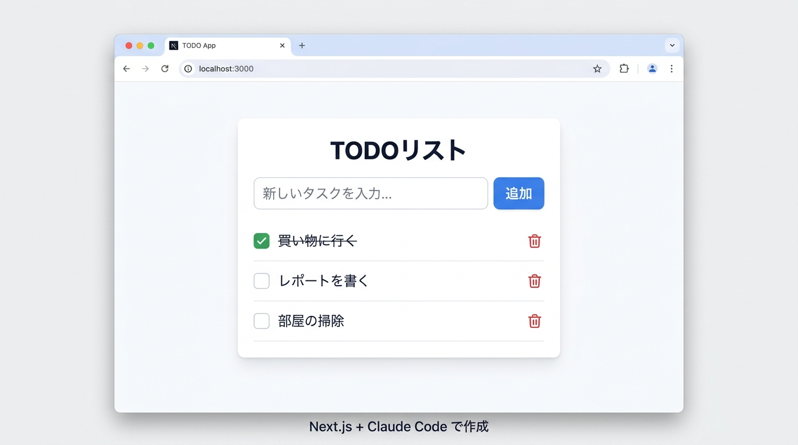
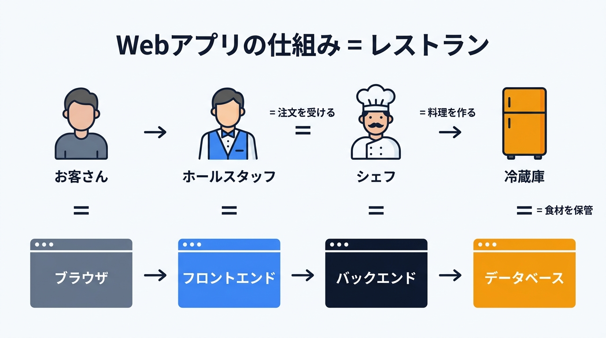

# 第2回: ローカルアプリ開発（90分）

## 前回（第1回）のおさらい

前回は以下を体験しました:
- Claude Code の起動と基本的な指示の出し方
- HTML で自己紹介ページを自動生成
- CLAUDE.md（ルールブック）の作成

今回はさらにステップアップして、本格的なWebアプリを作ります。

## ゴール

Next.js（Webアプリを作るための便利なツールセット）で動く Web アプリをローカルで作り、「データを追加・削除できるアプリ」を体験する。
ブラウザで http://localhost:3000 にアクセスして自分のアプリが動いている状態を作る。

**完成イメージ:**



> 💡 **Next.jsって何？**
> Webアプリを作るための「型紙」のようなものです。ゼロから全部作る代わりに、よく使う機能（ページ遷移、画像表示、サーバー処理など）が最初から用意されています。Claude Codeがこの型紙を使ってアプリを作ります。
>
> - 公式サイト: https://nextjs.org/
> - 公式ドキュメント: https://nextjs.org/docs
> - 日本語ドキュメント: https://nextjsjp.org/docs

> 💡 **サーバーとは？** 他のコンピュータにサービスを提供するコンピュータのこと。レストランの比喩でいうと「お店」そのものです。`npm run dev` で起動するのは、あなたのPC内だけで動く「ミニサーバー」です。

---

## 前回の振り返り（5分）

- 宿題でやったこと・詰まったことの共有
- 質問タイム

---

## 講義パート（15分）

### 前回との違い

| 第1回 | 第2回 |
|-------|-------|
| HTMLファイル1枚 | Next.js プロジェクト（複数ファイル） |
| ブラウザで直接開く | `npm run dev` でサーバー起動 |
| 静的ページ（動かない） | 動的アプリ（ボタンで操作できる） |

> 💡 **静的ページと動的アプリの違い** 静的ページ＝メニュー看板（いつ見ても同じ内容）。動的アプリ＝注文できるお店（操作に応じて内容が変わる）。第1回で作ったHTMLは静的ページ、今回のTODOアプリは動的アプリです。

### Web アプリの仕組み（超ざっくり）

Webアプリの仕組みは、**レストラン**に例えるとわかりやすいです。

```
お客さん（＝あなた。ブラウザでアプリを使う人）
    ↕ メニューを見る・注文する
ホールスタッフ（＝フロントエンド。画面の見た目・ボタン）  ← 今日はここを作る
    ↕ 注文を厨房に伝える・料理を受け取る
シェフ（＝バックエンド。裏側の計算・処理）
    ↕ 食材を取り出す
冷蔵庫（＝データベース。データの保管庫）  ← 第3回で接続する
```

- **お客さん（ブラウザ）**: レストランに来てメニューを見て注文する人。あなたがアプリの画面を見て、ボタンを押す行為と同じです。
- **ホールスタッフ（フロントエンド）**: お客さんにメニュー（画面）を見せて、注文（ボタン操作）を受け付けます。今日作るのはこのホールスタッフの部分です。
- **シェフ（バックエンド）**: ホールスタッフから受けた注文をもとに、料理（データの加工・処理）を作ります。
- **冷蔵庫（データベース）**: 食材（データ）を保管しておく場所。第3回で接続します。

今日は「ホールスタッフ」の部分、つまり画面の見た目やボタンの動きを作ります。データの保存先（冷蔵庫）はまだつながないので、ブラウザを閉じるとデータは消えます。



### Next.js を選ぶ理由

- Claude Code との相性が最も良い（Anthropic社内でも使用）
- フロントエンド（画面）とバックエンド（裏側の処理）が1つのプロジェクトにまとまる
- Vercel（第4回で使うデプロイ（ネット上に公開すること）サービス）へのデプロイが簡単
- 情報が豊富で、Claude Code が正確なコードを書きやすい

---

## ハンズオン（60分）

### Step 1: Next.js プロジェクトを作成する（10分）

**このStepでやること:** Claude Code に指示して、アプリの土台となるプロジェクトを一発で作成します。

1. `claude-code-course` フォルダを Cursor で開いた状態で
2. Cursor画面下部のターミナル（表示されていない場合は Ctrl+` で開く）に入力して Claude Code を起動

```
claude
```

3. 以下の指示を出す:

```
Next.js のプロジェクトを作成してください。
npx create-next-app@latest todo-app で作成して、以下の設定にしてください:
- recommended defaults（推奨デフォルト）: Yes でOK
- もし個別に聞かれた場合: TypeScript: Yes / Tailwind CSS: Yes / App Router: Yes / その他はデフォルト
※ React Compiler や AGENTS.md を聞かれた場合もデフォルト（Yes）でOK
作成後、npm run dev で起動してください。
```

> `create-next-app` が `todo-app` というサブフォルダを自動作成します。完了後、`claude-code-course/todo-app` フォルダの中にプロジェクト一式が生成されています。

> 💡 **npx って何？**
> 「npx」は、ネット上にある便利ツールを一時的にダウンロードして実行するコマンドです。ここでは `create-next-app` という「Next.jsプロジェクトの自動生成ツール」を取ってきて実行しています。自分でインストールする手間がなく、いつも最新版が使えます。
>
> - 参考: [create-next-app 公式ドキュメント（日本語）](https://nextjsjp.org/docs/app/api-reference/cli/create-next-app)

> 💡 **TypeScriptって何？**
> JavaScriptという言語の「進化版」です。コードに型（データの種類）を書くことで、タイプミスや間違いを事前に防いでくれます。人間が書くのは大変ですが、Claude Code が書いてくれるので心配不要です。

> 💡 **Tailwind CSSって何？**
> Webページの見た目（デザイン）を簡単に整えるための道具箱です。「文字を大きくする」「背景を青にする」「角を丸くする」などの命令があらかじめ用意されていて、それを組み合わせるだけでおしゃれなデザインが作れます。こちらもClaude Code が使ってくれるので、覚える必要はありません。
>
> - 公式サイト: https://tailwindcss.com/
> - 参考記事: [Tailwind CSSとは？概要や特徴について簡単に解説！](https://evoworx.dev/blog/what-is-tailwindcss/)

> 💡 **App Routerって何？**
> Next.js の中で「どのURLにアクセスしたら、どの画面を表示するか」を管理する仕組みです。レストランで例えると「案内係」のような役割で、お客さん（ユーザー）を正しいテーブル（ページ）に案内します。現在のNext.jsで推奨されている方式です。

4. ブラウザで http://localhost:3000 を開いて確認。Next.jsのデフォルト画面（黒い背景に白い文字で Next.js のロゴ）が表示されれば成功です

> 💡 **localhost:3000 って何？**
> `localhost` は「自分のパソコン」を指す特別な名前です。`:3000` は「3000番の出入り口（ポート）」という意味です。つまり「自分のパソコンの3000番ポートで動いているアプリを見に行く」ということ。ネット上に公開しているわけではないので、自分のパソコンからしか見られません。

> 💡 **npm run dev って何？**
> アプリを「開発モード」で起動するコマンドです。これを実行すると自分のパソコン上でWebサーバーが立ち上がり、ブラウザからアプリにアクセスできるようになります。開発モードではコードを変更するとすぐ画面に反映される便利機能（ホットリロード）が使えます。

> **ポイント**: 左のファイルツリーにたくさんのファイルが作られます。全部理解する必要はありません。Claude Code が管理してくれます。

> 💡 **プロジェクト構成って何？**
> `create-next-app` で作成されると、`app/` `public/` `node_modules/` など色々なフォルダやファイルが自動で作られます。これが「プロジェクト構成」です。料理に例えると、キッチン（app/）、盛り付けスペース（public/）、調味料棚（node_modules/）のように、それぞれ役割がある場所が用意された状態です。全部を覚える必要はなく、Claude Code が適切な場所にファイルを配置してくれます。

---

### Step 2: TODO アプリを作る（20分）

**このStepでやること:** Claude Code に自然言語で指示して、タスク管理アプリを丸ごと作ってもらいます。

以下の指示を出しましょう:

```
TODOアプリを作ってください。以下の機能が欲しいです:

- タスクを入力して追加できる
- タスクをクリックすると完了/未完了を切り替えられる
- 完了したタスクは取り消し線が引かれる
- ゴミ箱ボタンでタスクを削除できる
- デザインはシンプルでモダンにしてください

※ データベースはまだ使わないので、ブラウザのメモリに保存する形でOKです
```

> 💡 **CRUDって何？**
> 「作る（Create）・読む（Read）・更新（Update）・削除（Delete）」の頭文字を取った言葉です。ほとんどのアプリの基本操作はこの4つに分類できます。レストランに例えると、注文を書く（Create）→ メニュー一覧を見る（Read）→ 注文を変更する（Update）→ 注文をキャンセルする（Delete）です。今回のTODOアプリでは、タスクの追加（C）・一覧表示（R）・完了切り替え（U）・削除（D）がまさにCRUDです。

**観察ポイント:**
- Claude Code がどのファイルを編集しているか（左のファイルツリーを見る）
- ブラウザを更新して変化を確認する（ホットリロードで自動更新されることも多い）
- 動かしてみる（タスク追加 → 完了 → 削除）

> 💡 **ホットリロードって何？**
> コードを保存すると、ブラウザを手動で更新しなくても画面が自動で最新の状態に切り替わる機能です。ファイルを保存すると、ブラウザに表示されている画面が自動で最新版に更新されるイメージです。開発中に結果をすぐ確認できるのでとても便利です。

> 💡 **コンポーネントって何？**
> 画面を構成する「パーツ」のことです。レゴブロックのように、ボタン・入力欄・リスト・ヘッダーなどをそれぞれ1つのパーツとして作り、組み合わせて画面全体を構成します。パーツごとに分かれているので、1箇所だけ変更するのが簡単になります。

---

### Step 3: 画面を指示で修正する（15分）

**このStepでやること:** 動いているアプリを見ながら、日本語の指示だけでデザインや機能を追加・変更します。

動いている TODO アプリを見ながら、修正を指示してみましょう。

以下から好きなものを1〜2個選んで試してみましょう。

**修正例:**

```
ヘッダーに今日の日付を表示してください
```

```
タスクの横に追加した日時を表示してください
```

```
タスクを「仕事」「プライベート」でカテゴリ分けできるようにしてください
```

```
完了したタスクの数と未完了の数を上部に表示してください
```

```
ダークモードの切り替えボタンを追加してください
```

> 💡 **ダークモードって何？**
> 画面の背景を黒や濃いグレーに、文字を白にした表示モードです。暗い部屋で目に優しく、バッテリーの節約にもなります。スマホの「ダークモード」と同じ考え方で、アプリにもこの切り替え機能を付けることができます。

**ポイント:**
- 修正のたびにブラウザで結果を確認する
- 「いいね」「もう少しこうしたい」のフィードバックを Claude Code に伝える
- エラーが出たら画面のエラーメッセージを Claude Code に伝える

---

### Step 4: CLAUDE.md を育てる（5分）

**このStepでやること:** プロジェクト専用の設定ファイル（CLAUDE.md）を作り、Claude Code に守るべきルールを伝えます。

第1回で学んだ CLAUDE.md をこのプロジェクトにも作りましょう。

```
このプロジェクトの CLAUDE.md を作成してください。以下を含めてください:

# TODO アプリ

## 技術スタック
- Next.js (App Router)
- TypeScript
- Tailwind CSS

## ルール
- コンポーネントは app/components/ に配置する
- 日本語でコメントを書く
- デザインはシンプルでモダンに保つ
- 変更内容を必ず説明する
```

---

### Step 5: 自分だけの機能を追加する（10分）

**このStepでやること:** 自分のアイデアで機能を1つ追加し、「指示だけでアプリを進化させる」体験をします。

残りの時間で、自分がほしい機能を1つ追加してみましょう。

**アイデア:**
- 「優先度（高・中・低）を設定できるようにして」
- 「ドラッグ&ドロップで並べ替えできるようにして」
- 「タスクにメモを追加できるようにして」
- 「期限を設定して、過ぎたら赤くなるようにして」

自由に指示を出してみてください。

---

## まとめ（10分）

### 今日できるようになったこと

- [ ] Next.js プロジェクトを作成できた
- [ ] TODO アプリが動いた
- [ ] 画面の修正を指示だけで行えた
- [ ] CLAUDE.md をプロジェクトに合わせて書けた

### 今日のデータの注意点

今日作った TODO アプリのデータは**ブラウザを閉じると消えます**。
次回（第3回）で Supabase というデータベースを接続して、データが消えないようにします。

### 次回予告

第3回では:
- **Supabase**（データベース）を接続してデータを永続化
- **GitHub** でコードをバックアップ
- ブラウザを閉じてもデータが残る本格アプリに進化させます

### 宿題（任意）

TODO アプリに自分がほしい機能をもう1つ追加してみてください。
次回、Supabase 接続前の最終形として共有しましょう。

---

## 困ったときは

### `npm run dev` でエラーが出る
→ エラーメッセージを Claude Code に貼り付ける。大抵は自動で直してくれる

### ブラウザに何も表示されない
→ http://localhost:3000 にアクセスしているか確認。ターミナルでサーバーが起動しているか確認

### 画面が真っ白になった
→ ブラウザのDevTools（開発者ツール）を開いて、Consoleタブの赤いエラーを Claude Code に伝える

> 💡 **DevTools（開発者ツール）って何？**
> ブラウザに最初から入っている「裏側を覗く道具」です。キーボードの `F12` キーを押すと開きます。「Console」タブにはエラーメッセージが赤字で表示されるので、それをコピーして Claude Code に渡すと、原因を調べて直してくれます。最初は「Console」タブだけ知っていれば十分です。

### 「前の状態に戻したい」
→ 「直前の変更を元に戻して」と指示する。Git を使っていれば `git checkout .` でも戻せる（Gitは第3回で学びます。ここでは気にしなくてOKです）

---

## 参考リンク

- [Next.js 公式サイト](https://nextjs.org/)
- [Next.js 公式ドキュメント](https://nextjs.org/docs)
- [Next.js 日本語ドキュメント](https://nextjsjp.org/docs)
- [create-next-app 公式ドキュメント（日本語）](https://nextjsjp.org/docs/app/api-reference/cli/create-next-app)
- [Tailwind CSS 公式サイト](https://tailwindcss.com/)
- [Tailwind CSSとは？概要や特徴について簡単に解説！](https://evoworx.dev/blog/what-is-tailwindcss/)
- [Tailwind CSS入門（初心者向け）](https://reffect.co.jp/html/tailwindcss-for-beginners)
