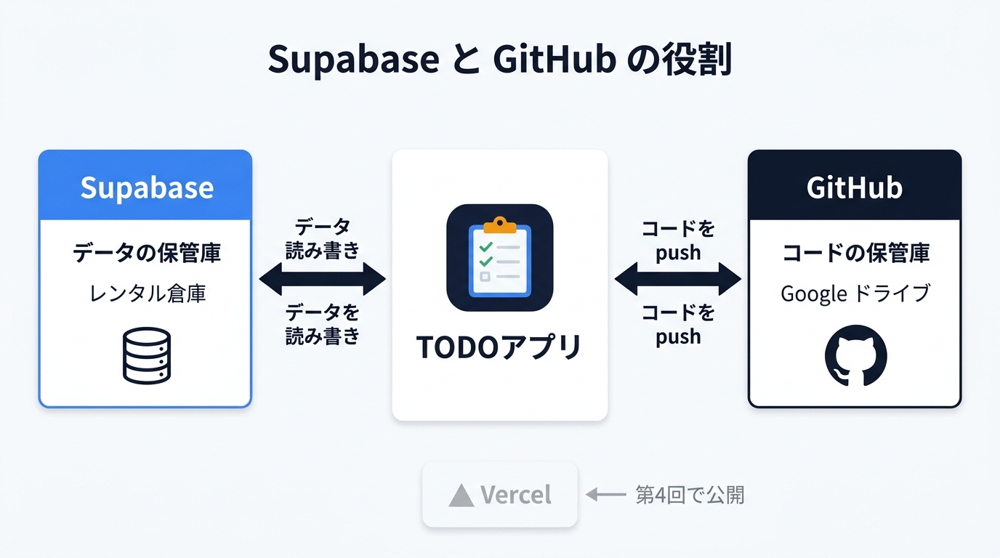
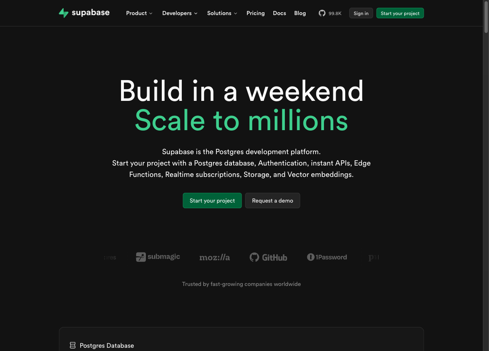
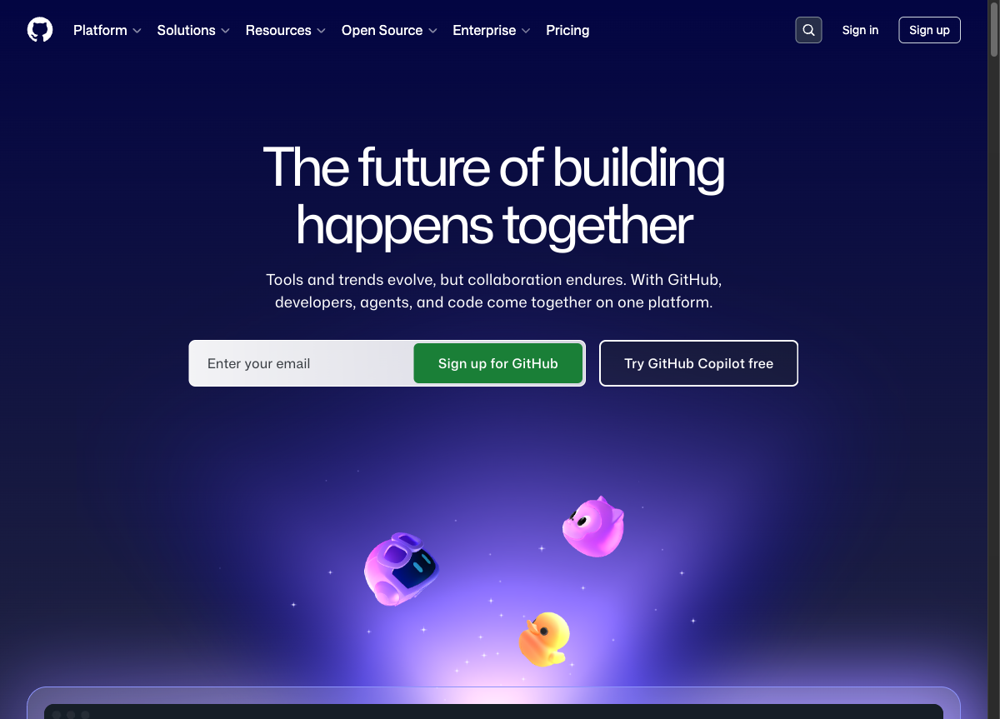
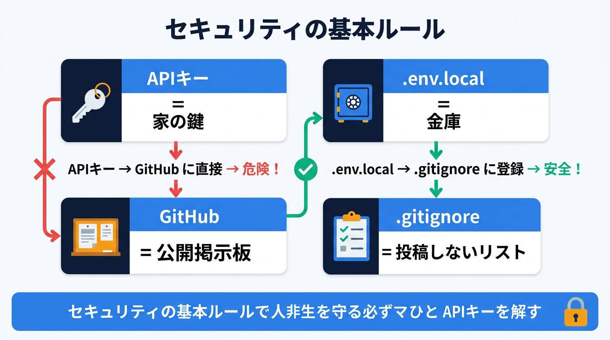

# 第3回: Supabase + GitHub（90分）

## 前回（第2回）のおさらい

前回は以下を体験しました:
- Next.js で TODO アプリを作成
- Claude Code への指示で機能を追加・修正
- CLAUDE.md でプロジェクトのルールを設定

ただし前回のアプリはブラウザを閉じるとデータが消えてしまいました。今回はデータを永続的に保存する仕組みを導入します。

---

## ゴール

TODO アプリにデータベース（アプリのデータを保管する仕組み）を接続し、ブラウザを閉じてもデータが残るようにする。
さらに GitHub（コードのバックアップ・共有サービス）でコードをバックアップし、壊しても戻せる安心感を手に入れる。



---

## 参考リンク集

| トピック | URL |
|---------|-----|
| Supabase 公式サイト | https://supabase.com |
| Supabase 始め方ガイド | https://supabase.com/docs/guides/getting-started |
| Supabase + Next.js チュートリアル | https://supabase.com/docs/guides/getting-started/tutorials/with-nextjs |
| GitHub アカウント作成（公式） | https://docs.github.com/en/get-started/start-your-journey/creating-an-account-on-github |
| GitHub CLI (gh) クイックスタート | https://docs.github.com/en/github-cli/github-cli/quickstart |
| GitHub CLI について（公式） | https://docs.github.com/en/github-cli/github-cli/about-github-cli |
| .gitignore について（公式） | https://docs.github.com/en/get-started/git-basics/ignoring-files |
| .gitignore テンプレート集 | https://github.com/github/gitignore |

---

## 前回の振り返り（5分）

- 宿題で追加した機能の共有
- 質問タイム

---

## 講義パート（15分）

### なぜデータベースが必要？

> 💡 **データベースって何？**
> アプリのデータを保管する「倉庫」です。今までのTODOアプリはブラウザの一時メモリにデータがあったので、閉じると消えていました。データベースに保存すると、いつ開いてもデータが残っています。スマホの「連絡先」アプリの裏側にもデータベースがあります。

| 今の状態（第2回） | これからの状態（第3回） |
|-------------------|----------------------|
| ブラウザのメモリに保存 | Supabase（クラウドDB）に保存 |
| ブラウザ閉じたら消える | **閉じても残る** |
| 自分のPCだけ | **どこからでもアクセス可能** |
| 1人専用 | **複数人で使える（将来）** |

> 💡 **クラウドって何？**
> インターネット上にある「誰かが管理してくれるコンピュータ」のことです。自分のPCではなく、インターネットの向こう側にあるコンピュータにデータを置くので、どこからでもアクセスできます。Google ドライブや iCloud もクラウドサービスの一種です。

### Supabase とは

> 💡 **Supabase（スーパベース）って何？**
> データベースを「無料で」「かんたんに」使えるようにしてくれるクラウドサービスです。自分でデータベースを設置・管理する必要がなく、ブラウザ上の管理画面からポチポチ操作できます。例えるなら「レンタル倉庫」のようなものです。倉庫を自分で建てなくても、借りるだけで使えます。

- 無料で使えるクラウドデータベース
- 中身は PostgreSQL（世界で最も使われているDBの一つ）
- 管理画面が直感的で初心者にやさしい
- Claude Code との相性が良い

> 💡 **PostgreSQL（ポストグレスキューエル）って何？**
> データベースの種類の一つで、世界中のプロの開発者が使っている信頼性の高い仕組みです。「データベース」が概念なら、「PostgreSQL」はその具体的な製品名です。車に例えると、「車」がデータベース、「トヨタのプリウス」がPostgreSQLのようなイメージです。Supabaseの裏側で動いていますが、今回は直接触ることはありません。

### GitHub とは

> 💡 **GitHub（ギットハブ）って何？**
> プログラムのコードを保管・共有できるクラウドサービスです。「コードのGoogleドライブ」と考えてください。世界中の開発者が使っていて、コードのバックアップだけでなく、「いつ、誰が、何を変えたか」の履歴が全部残ります。

- コードのバックアップ先
- 「いつ、何を変えたか」の履歴が全部残る
- 壊しても過去の状態に戻せる
- 第4回の Vercel デプロイにも使う

> 💡 **バージョン管理って何？**
> ファイルの変更履歴を記録する仕組みです。Wordの「変更履歴」機能やGoogleドキュメントの「版の履歴」に似ています。いつでも過去の状態に戻せるので、「さっきまで動いてたのに壊れた！」というときに「動いていたときの状態」にワンクリックで戻せます。

---

## ハンズオン（60分）

### Step 1: Supabase のセットアップ（15分）

> **このStepでやること:** Supabaseのアカウントを作り、TODOデータを保存するためのデータベースとテーブルを準備します。

**1-1. アカウント作成**

このステップでは GitHub アカウントが必要です。まだお持ちでない方は先に https://github.com でアカウントを作成してください（無料）。

1. https://supabase.com にアクセス


*Supabase 公式サイト。「Start your project」ボタンからアカウント作成に進みます*

2. 「Start your project」→ GitHub アカウントでログイン
   - GitHub アカウントがなければ先に作成（Step 3 で使うので必要）
   - 参考: [GitHub アカウント作成手順（公式）](https://docs.github.com/en/get-started/start-your-journey/creating-an-account-on-github)
3. 「New Project」をクリック
4. 以下を入力:
   - Organization（グループ名のようなもの。個人利用ならデフォルトのままでOK）
   - Project name: `todo-app`
   - Database Password: 自動生成されたものをメモしておく
   - Region: Northeast Asia (Tokyo)
5. 「Create new project」をクリック（1-2分待つ）

**1-2. テーブル作成**

> 💡 **テーブル・カラム・行って何？**
> テーブルはExcelの「シート」、カラムは「列の見出し」（A列、B列...）、行は「1件分のデータ」にあたります。例えば「連絡先」テーブルなら、カラムが「名前」「電話番号」「メール」で、行が「田中太郎 / 090-xxxx / tanaka@...」という1人分のデータです。

> 💡 **SQL（エスキューエル）って何？**
> データベースに「このデータを取ってきて」「このデータを追加して」と命令するための言語です。英語に似た文法で書きます。今回はClaude Codeが書いてくれるので、自分で覚える必要はありませんが、「データベースへの命令文」と理解しておけばOKです。

Claude Code に指示:

```
Supabase のダッシュボードで TODO テーブルを作る SQL を教えてください。
以下のカラムが欲しいです:
- id（自動生成）
- title（タスク名）
- completed（完了フラグ）
- category（カテゴリ、任意）
- created_at（作成日時）
```

生成された SQL を Supabase ダッシュボードの「SQL Editor」に貼り付けて実行します。具体的には、Supabaseダッシュボード左メニューの「SQL Editor」をクリック → 「New query」をクリック → 以下のSQLを貼り付け → 右上の「Run」ボタンをクリックしてください。

**1-3. 環境変数の取得**

> 💡 **環境変数って何？**
> アプリが動くために必要な「設定値」を、コードの外に置いておく仕組みです。なぜコードの外に置くかというと、パスワードや秘密のキーをコードに直接書くと、コードを共有したときに一緒に漏れてしまうからです。環境変数は「アプリ専用のメモ帳」のようなもので、アプリだけが読めます。

> 💡 **.env.local ファイルって何？**
> 環境変数を書いておくファイルです。`.env.local`（ドット・イーエヌブイ・ドット・ローカル）という名前で、自分のPC（ローカル環境）でだけ使う設定値を入れます。Supabaseの接続情報（URLとキー）をここに保存します。

Supabase ダッシュボード → **Settings → API Keys**（または画面上部の「**Connect**」ボタン）から以下をコピー:
- `Project URL`
- `anon public` キー

コピーした値は `https://xxxx.supabase.co` のような形式（Project URL）、`eyJhbGci...` のような長い文字列（anon key）になります。

> 💡 **anon public キーとは？** anon は anonymous（匿名）の略。ログインしていないユーザーでも使える公開用のキーです。家の玄関の呼び鈴のようなもの — 誰でも押せるけど、家の中に勝手に入ることはできません。一方、`service_role` キーは「マスターキー」なので絶対に使わないでください。

> ※ Supabase のダッシュボードは頻繁に UI が更新されます。見つからない場合は画面内で「API」「Connect」を探してみてください。

---

### Step 2: TODO アプリに Supabase を接続する（20分）

> **このStepでやること:** 第2回で作ったTODOアプリを改造して、ブラウザのメモリではなくSupabaseデータベースにデータを保存するようにします。

> 💡 **CRUD（クラッド）って何？**
> データの基本操作4つの頭文字です。**C**reate（作成）、**R**ead（読み取り）、**U**pdate（更新）、**D**elete（削除）。TODOアプリでいうと、タスクを「追加」「表示」「完了に変更」「削除」する操作がまさにCRUDです。ほぼ全てのアプリはこの4つの操作で成り立っています。

> 💡 **クライアントライブラリって何？**
> アプリからSupabaseに接続するための「通訳ツール」です。JavaScriptで`supabase.from('todos').select()`のように書くだけで、裏側で自動的にSupabaseと通信してくれます。自分で通信の仕組みを作る必要はありません。

Claude Code に指示:

```
TODO アプリに Supabase を接続してください。

Supabase の情報:
- URL: （コピーした Project URL）
- Anon Key: （コピーした anon public キー）

やってほしいこと:
1. プロジェクトのルートフォルダ（todo-app フォルダの直下）に .env.local ファイルを作成して環境変数を設定
2. Supabase クライアントライブラリをインストール
3. 今のメモリ保存を Supabase 保存に切り替え
4. タスクの追加・完了切替・削除が DB に反映されるようにする（CRUD操作）
```

**確認ポイント:**
- タスクを追加 → ブラウザを更新 → **データが残っている**
- Supabaseダッシュボード左側メニューにある「Table Editor」でもデータが見える
- タスクを削除 → Supabase 上からも消えている

---

### Step 3: GitHub にコードをバックアップする（15分）

> **このStepでやること:** 書いたコードをGitHubにアップロードして、安全にバックアップします。あわせて「秘密の情報をアップしない」設定も行います。

> 💡 **Git（ギット）って何？**
> ファイルの変更履歴を管理するツールです。GitHubの土台になっている仕組みで、自分のPC上で動きます。「Git」がツール、「GitHub」がそのツールを使ったクラウドサービスという関係です。メールソフト（Git）とGmail（GitHub）の関係に似ています。

> 💡 **リポジトリって何？**
> プロジェクトのファイル一式と、その変更履歴をまとめて保管する「フォルダ」のようなものです。「todo-app」というリポジトリを作ると、TODOアプリに関するコード・履歴が全てそこに入ります。

> 💡 **git init / commit / push って何？**
> - `git init`（イニット）: 「このフォルダをGitで管理するよ」と宣言するコマンド。最初に1回だけ実行します。
> - `commit`（コミット）: 変更内容を「セーブ」すること。ゲームのセーブポイントと同じで、いつでもこの時点に戻れます。
> - `push`（プッシュ）: セーブしたデータをGitHub（クラウド）にアップロードすること。PCが壊れてもGitHubにデータが残ります。

> 💡 **.gitignore（ギットイグノア）って何？**
> 「Gitで管理しないファイル」を指定するリストです。`.env.local`のような秘密情報が入ったファイルを、うっかりGitHubにアップしてしまわないよう、ここに書いておきます。Next.jsプロジェクトでは最初から用意されていることが多いです。
> 参考: [.gitignore について（GitHub公式）](https://docs.github.com/en/get-started/git-basics/ignoring-files)

**3-1. GitHub アカウント確認**

https://github.com にログインできることを確認。


*GitHub 公式サイト。右上の「Sign in」からログインできます*

**3-2. リポジトリ作成 & プッシュ**

Claude Code に指示:

```
このプロジェクトを GitHub にプッシュしてください。
以下の手順でお願いします:
1. .gitignore に .env.local が含まれていることを確認（重要）
2. git init で初期化
3. 全ファイルをコミット
4. GitHub に todo-app という名前でリポジトリを作成
5. プッシュ

※ gh コマンド（GitHub CLI）が使えない場合は手順だけ教えてください
```

> 💡 **GitHub CLI（gh コマンド）って何？**
> ターミナル（黒い画面）からGitHubを操作できるツールです。ブラウザを開かなくても、コマンド一つでリポジトリ作成やプッシュができます。Claude Codeが自動的に使ってくれるので、覚えなくて大丈夫です。
> インストール方法: [GitHub CLI クイックスタート（公式）](https://docs.github.com/en/github-cli/github-cli/quickstart)

---

> 🔒 **セキュリティの重要ポイント: .env.local は絶対にGitHubにアップしない**
>
> `.env.local`には Supabase の接続キーが入っています。これは**家の鍵**のようなものです。
> 一方、GitHub は（設定によりますが）**インターネット上の公開掲示板**になり得ます。
>
> 鍵を公開掲示板に貼ったら、誰でも家に入れてしまいますよね？
> 同じように、接続キーが公開されると、**他人があなたのデータベースを自由に操作できてしまいます**。
> データを全部消されたり、勝手にデータを書き換えられたりする危険があります。
>
> **対策:**
> - `.gitignore`ファイルに`.env.local`が書かれていることを確認する（Claude Codeに任せればOK）
> - 不安なときは Claude Code に「`.env.local`が`.gitignore`に入っているか確認して」と聞く
> - Supabase のキーを Slack やメールで人に送らない
> - もし間違えてアップしてしまったら、すぐに Supabase ダッシュボードからキーを再生成する



---

**確認ポイント:**
- GitHub のリポジトリページでファイルが見える
- `.env.local` がアップロードされていない（ここが最重要！）

---

### Step 4: 変更 → コミットの体験（10分）

> **このStepでやること:** コードを少し変更して、「変更→セーブ（コミット）→アップロード（プッシュ）」という開発の基本サイクルを体験します。

コードを変更して GitHub に反映する流れを体験しましょう。

Claude Code に指示:

```
TODOアプリのヘッダーのタイトルを「My TODO App」に変更してください。
変更後、git commit して GitHub に push してください。
```

**確認ポイント:**
- ブラウザでタイトルが変わった
- GitHub のリポジトリで最新のコミットが見える
- コミットメッセージが付いている

---

## まとめ（10分）

### 今日できるようになったこと

- [ ] Supabase でデータベースを作成できた
- [ ] TODO アプリのデータが永続化された（ブラウザを閉じてもデータが残る）
- [ ] GitHub にコードをバックアップできた
- [ ] 変更 → コミット → プッシュの流れを体験した

### 重要なセキュリティルール

> 🔒 **もう一度確認: 守るべき3つのルール**
>
> 1. **`.env.local`は絶対にGitHubにアップしない** -- 家の鍵を掲示板に貼らない
> 2. **Supabaseのキーは人に見せない** -- 銀行の暗証番号と同じ扱い
> 3. **不安なときはClaude Codeに聞く** -- 「.env.localが.gitignoreに入っているか確認して」でOK

### 次回予告

第4回（最終回）では:
- **Vercel** でアプリをインターネットに公開
- URL が発行されて、スマホからもアクセスできるようになる
- 「自分が作ったアプリ」を人に見せられる状態にする

### 宿題（任意）

TODO アプリを使ってみて、改善したい点を Claude Code に指示して修正してみてください。
GitHub に push するところまでやってみましょう。

---

## 困ったときは

### Supabase に接続できない
→ `.env.local` の URL と Key が正しいか確認。Supabase ダッシュボードからコピーし直す

### データが保存されない
→ Supabaseダッシュボード左側メニューにある「Table Editor」で todos テーブルが存在するか確認

### `git push` でエラー
→ GitHub の認証が必要な場合がある。`gh auth login` を実行するか、ブラウザで認証する

### 「Permission denied」と表示される

> 💡 **RLS（Row Level Security / 行レベルセキュリティ）って何？**
> 「このデータは誰が見てOKか」をデータベース側で制御する仕組みです。Supabaseではダッシュボードの Table Editor からテーブルを作成すると自動的にONになります（SQL Editor で作成した場合は手動で有効にする必要があります）。学習段階ではこの制限が邪魔になることがあるので、一旦OFFにして進めます。本番のアプリでは必ずONにする重要な機能です。

→ Supabase の RLS（Row Level Security）が原因の可能性。Claude Code に「RLS を一旦無効にして」と指示する（学習目的のため）

> 💡 **RLSを無効にした場合のリカバリ** 学習が終わったら、Claude Code に「RLSを有効にして、全ユーザーが読み書きできるポリシーを追加して」と指示してください。本番アプリではRLSは必ず有効にします。

---

## 今日出てきた用語まとめ

| 用語 | 一言でいうと |
|------|-------------|
| データベース (DB) | アプリのデータを保管する倉庫 |
| PostgreSQL | データベースの種類の一つ（プロ御用達） |
| Supabase | PostgreSQLを簡単に使えるクラウドサービス |
| テーブル | Excelのシートのようなもの |
| カラム | テーブルの列（名前、電話番号 など） |
| 行 | テーブルの1件分のデータ |
| SQL | データベースへの命令文 |
| CRUD | データの基本操作4つ（作成・読取・更新・削除） |
| 環境変数 | アプリの設定値をコードの外に置く仕組み |
| .env.local | 環境変数を書いておくファイル |
| クライアントライブラリ | アプリからサービスに接続する通訳ツール |
| RLS | データの閲覧権限を制御する仕組み |
| GitHub | コードのバックアップ・共有クラウドサービス |
| リポジトリ | プロジェクトの保管フォルダ |
| Git | ファイルの変更履歴を管理するツール |
| git init | Gitでの管理を開始するコマンド |
| commit | 変更を「セーブ」すること |
| push | セーブしたデータをGitHubにアップロード |
| .gitignore | Gitで管理しないファイルのリスト |
| バージョン管理 | ファイルの変更履歴を記録する仕組み |
| クラウド | インターネット上の他人が管理するコンピュータ |
| GitHub CLI (gh) | ターミナルからGitHubを操作するツール |
