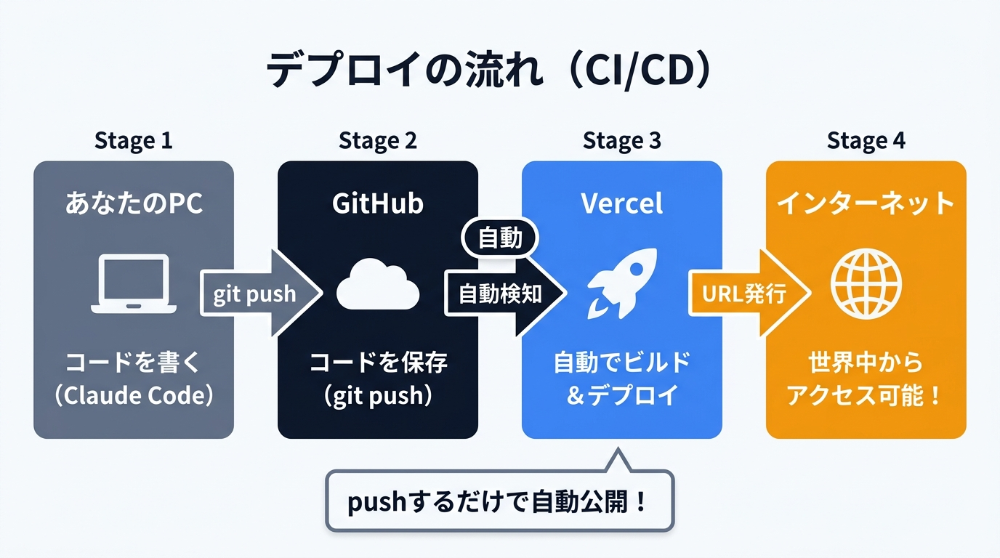
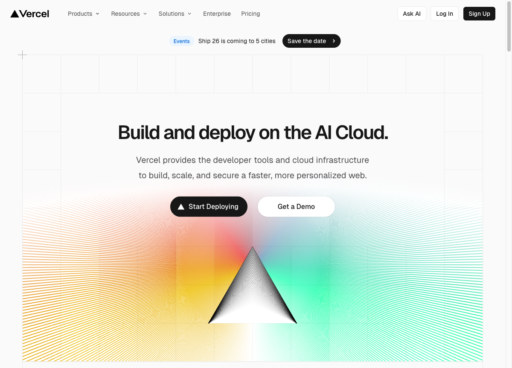

# 第4回: Vercel デプロイ — アプリを世界に公開する（90分）

## 参考リンク集

| トピック | URL |
|---------|-----|
| Vercel 公式サイト | https://vercel.com/ |
| Vercel 公式ドキュメント（始め方） | https://vercel.com/docs |
| Vercel 料金プラン（Hobby / Pro / Enterprise） | https://vercel.com/pricing |
| Vercel Hobby プラン詳細 | https://vercel.com/docs/plans/hobby |
| OGP（Open Graph Protocol）公式仕様 | https://ogp.me/ |
| OGP とは（IT用語辞典 e-Words） | https://e-words.jp/w/OGP.html |
| Vercel カスタムドメイン設定ガイド（公式） | https://vercel.com/docs/domains/working-with-domains/add-a-domain |
| Vercel 初心者向け完全ガイド（テックジム） | https://techgym.jp/column/first-vercel/ |

---

## 前回（第3回）のおさらい

前回は以下を体験しました:
- Supabase でクラウドデータベースを構築
- TODO アプリのデータを永続保存
- GitHub にコードをバックアップ

今回はその GitHub リポジトリを Vercel と連携して、アプリをインターネットに公開します。

---

## ゴール

TODO アプリをインターネットに公開し、URL で誰でもアクセスできるようにする。
スマホからも使える「自分のアプリ」を手に入れる。

---

## 用語解説

この回では新しい専門用語がたくさん出てきます。初めて見る言葉はここで確認しながら進めましょう。

> 💡 **デプロイって何？**
> 自分のパソコンで動いているアプリを、インターネット上のサーバーに設置して、世界中の人がアクセスできるようにすることです。お店で言えば「試作品を店頭に並べる」イメージです。

> 💡 **Vercel（バーセル）って何？**
> Next.js の開発元が運営している、Web アプリを簡単にインターネット上に公開できるサービスです。GitHub と連携するだけで、コードを push するたびに自動で公開してくれます。個人利用なら無料で使えます。

> 💡 **ホスティングって何？**
> アプリやWebサイトのファイルをインターネット上のサーバーに置いて、誰でもアクセスできるようにするサービスのことです。「アプリの置き場所を借りる」と考えてください。Vercel はホスティングサービスの一つです。

> 💡 **URL / ドメイン / カスタムドメインって何？**
> **URL** はインターネット上の住所（例: `https://my-todo-app.vercel.app`）です。**ドメイン** は URL の中心部分で、いわば「表札」にあたるもの（例: `my-todo-app.vercel.app`）。**カスタムドメイン** は自分で好きな名前を付けた独自のドメイン（例: `mytodo.com`）のことです。お店で言えば「商店街の住所」が URL、「店名の看板」がドメインです。

> 💡 **SSL / https って何？**
> インターネット上でデータを暗号化してやり取りする仕組みです。URL が `https://` で始まっていれば SSL で保護されています。ブラウザのアドレスバーに鍵マークが表示されるアレです。Vercel では自動的に SSL が設定されるので、特に何もする必要はありません。

> 💡 **ビルドって何？**
> 人間が書いたコード（ソースコード）を、ブラウザが理解できる形に変換する処理のことです。料理で言えば「材料を調理して完成品にする」工程です。Vercel にコードを送ると、自動でビルドしてくれます。

> 💡 **CI/CD（継続的デプロイ）って何？**
> コードを変更して GitHub に push するだけで、自動でビルド・テスト・デプロイまで行ってくれる仕組みです。手動でサーバーを操作する必要がなく、「push したら勝手に本番に反映される」状態を作れます。Googleドキュメントで編集すると自動保存されますよね？ CI/CDはそれに近い感覚で、コードをpushするだけで自動的に本番アプリも更新されます。



> 💡 **環境変数（本番環境）って何？**
> アプリが動くために必要な設定値（API キーやデータベースの接続先など）を、コードの外に保存する仕組みです。自分のパソコン（開発環境）と Vercel（本番環境）で別々に設定できます。パスワードのような秘密情報をコードに直接書かずに済む、安全な方法です。

> 💡 **OGP（Open Graph Protocol）って何？**
> X（旧 Twitter）や LINE で URL を共有したとき、タイトル・説明文・画像が自動で表示される仕組みです。Meta 社（旧 Facebook 社）が作った規格で、HTML に数行のコードを追加するだけで設定できます。これを設定すると、SNS でシェアしたときの見た目がぐっと良くなります。

> 💡 **レスポンシブデザイン（スマホ対応）って何？**
> PC でもスマホでもタブレットでも、画面サイズに合わせて自動的にレイアウトが調整されるデザイン手法です。1つの URL で全デバイスに対応できます。Next.js + Tailwind CSS で作ったアプリは、基本的にレスポンシブ対応されています。

> 💡 **Framework Preset って何？**
> Vercel がプロジェクトの種類を自動判定してくれる設定。「Next.js」と表示されていればそのままでOKです。

> 💡 **サーバーレス関数って何？**
> サーバーを自分で管理せずに、必要な時だけ動くプログラムのこと。今回のTODOアプリでは意識する必要はありません。

> 💡 **Tailwind CSS って何？**
> デザインを効率よく作れるツール。第2回で Next.js と一緒にインストール済みです。

> 💡 **Redeploy って何？**
> 再デプロイ。もう一度ビルドしてデプロイし直すこと。

> 💡 **Hobby プラン（無料枠）って何？**
> Vercel の個人向け無料プランです。商用利用でなければ十分な機能が使えます。主な制限として、データ転送量が月 100GB まで、サーバーレス関数の CPU 実行時間が月 4 時間まで、ビルド時間に上限があります。上限を超えると翌月まで一部機能が制限されますが、個人の学習・ポートフォリオ用途では上限に達することはほぼありません。詳細: https://vercel.com/docs/plans/hobby

---

## 前回の振り返り（5分）

- 宿題で改善した内容の共有
- 質問タイム

---

## 講義パート（10分）

### デプロイとは

```
今まで                      今日のゴール
localhost:3000              https://my-todo-app.vercel.app
（自分のPCだけ）            （世界中からアクセス可能）
```

### Vercel を選ぶ理由

- Next.js の開発元が運営（相性最強）
- Hobby プラン（無料枠）で個人利用には十分
- GitHub と連携すると push するだけで自動デプロイ（CI/CD）
- SSL（https）も自動で設定される

### 今日の流れ

```
GitHub（コード）→ Vercel（自動ビルド）→ URL 発行 → 公開
         ↑
  push するたびに自動で更新される（= CI/CD）
```

---

## ハンズオン（60分）

### Step 1: Vercel アカウント作成と連携（10分）

**このStepでやること:** Vercel に登録し、GitHub のリポジトリを接続して初回デプロイを実行します。

1. https://vercel.com にアクセス


*Vercel 公式サイト。「Start Deploying」または右上の「Sign Up」からアカウント作成に進みます*

2. 「Sign Up」→ **GitHub アカウントでログイン**
3. ログイン後のダッシュボードに「Add New...」または「Import Project」ボタンが表示されます。クリックして GitHub の `todo-app` リポジトリを選択します
4. 設定画面:
   - Framework Preset: Next.js（自動検出されるはず）
   - Root Directory: そのまま
   - **Environment Variables**（環境変数）: ここが重要

**環境変数の設定:**

第3回で `.env.local` に書いた値を、今度は Vercel（本番環境）にも教えてあげます。コードに直接書かず環境変数として設定する理由は第3回と同じ — 秘密の鍵をコードに含めないためです。

本番環境で Supabase に接続するために、以下の手順で値を Vercel に登録します（Supabase ダッシュボードからコピー）:

1. 「Environment Variables」セクションの「NAME」欄に `NEXT_PUBLIC_SUPABASE_URL` と入力
2. 「VALUE」欄に Supabase からコピーした Project URL を貼り付け
3. 「Add」をクリック
4. 同様に `NEXT_PUBLIC_SUPABASE_ANON_KEY` も追加

5. 「Deploy」をクリック

**1-2分待つとデプロイ完了。あなた専用の URL が発行されます。**

---

### Step 2: 動作確認（10分）

**このStepでやること:** 公開された URL を PC とスマホの両方で開いて、アプリが正しく動くか確認します。

1. 発行された URL をブラウザで開く
2. TODO を追加してみる
3. **スマホでも同じ URL を開いてみる**（レスポンシブデザインの確認）
4. PC で追加したタスクがスマホでも見えることを確認

**確認ポイント:**
- [ ] URL でアプリが表示される
- [ ] タスクの追加・完了・削除ができる
- [ ] スマホからもアクセスできる（レスポンシブデザインが効いている）
- [ ] Supabase にデータが反映されている

> **感動ポイント**: 自分が作ったアプリが、自分のスマホで動いている。これはもう立派な Web サービスです。

---

### Step 3: 修正 → 自動デプロイを体験する（10分）

**このStepでやること:** コードを修正して push し、Vercel が自動で更新してくれる CI/CD の流れを体験します。

Claude Code で修正を加えて、自動デプロイ（CI/CD）を体験しましょう。

```
TODOアプリのフッターに「Built with Claude Code」と表示してください。
変更を git commit して GitHub に push してください。
```

**確認:**
- GitHub に push したら Vercel が自動でビルドを開始する
- Vercel ダッシュボードで「Building...」→「Ready」になるのを確認（1-2分）
- URL を更新してフッターが変わっていることを確認

**これが CI/CD（継続的デプロイ）の威力です:**
- コードを変更 → push → 自動で本番に反映
- 手動でサーバーを操作する必要がない
- プロの開発現場でも、この仕組みで日々リリースしています

---

### Step 4: OGP 設定 — SNS シェア用の見た目（10分）

**このStepでやること:** X や LINE で URL をシェアしたとき、タイトルと画像がきれいに表示されるように OGP を設定します。

X や LINE で URL を共有したときに、タイトルと画像が表示されるようにしましょう。

```
このアプリの OGP（Open Graph Protocol）を設定してください。
- タイトル: My TODO App
- 説明: Claude Code で作った TODO アプリ
- OGP画像は簡単なものを自動生成してください
```

**確認方法:**
- push → Vercel で自動デプロイ待ち
- デプロイ完了後、X の投稿画面に URL を貼ってプレビューを確認

> OGP の仕様について詳しく知りたい方は公式サイトをどうぞ: https://ogp.me/

---

### Step 5: 最終カスタマイズ（20分）

**このStepでやること:** 残り時間を使って自分だけのアプリに仕上げます。デザインでも機能でも、やりたいことを Claude Code に伝えましょう。

ここが一番楽しい時間です。

**デザイン系:**
```
全体のデザインをもっとオシャレにしてください。
グラスモーフィズム風のカードデザインにして、背景にグラデーションを入れてください。
```

**機能系:**
```
タスクを日付で絞り込めるフィルター機能を追加してください
```

```
完了したタスクだけ表示する/全部表示する の切り替えボタンを追加してください
```

**実用系:**
```
TODO アプリではなく、自分の業務に使えるものに作り変えてください。
例: 読書記録アプリ / 日報アプリ / 習慣トラッカー

読書記録アプリにしたいです。
- 書籍名、著者、感想を入力できる
- 読了/読書中のステータスを切り替えられる
- 星5段階の評価をつけられる
```

修正したら push → 自動デプロイ → URL で確認、を繰り返しましょう。

**発展: カスタムドメインを設定したい方へ**

Vercel では、自分だけの URL（カスタムドメイン）を設定することもできます。
お名前.com などでドメインを取得し、Vercel の Settings → Domains から追加するだけです。
SSL 証明書も自動で発行されます。手順の詳細は公式ガイドを参照してください:
https://vercel.com/docs/domains/working-with-domains/add-a-domain

---

## 全4回の振り返り（15分）

### 4回でここまで来ました

4回前、「プログラミングなんて自分には無理」と思っていたかもしれません。
でも今、あなたの目の前には **自分で作って、インターネットに公開された Web アプリ** があります。

| 回 | やったこと | 手に入れたもの |
|----|-----------|---------------|
| 第1回 | 環境構築・基本操作 | Claude Code に指示を出す力 |
| 第2回 | Next.js アプリ開発 | 自分の手で動かせる Web アプリ |
| 第3回 | Supabase + GitHub | データが消えない仕組み + コードのバックアップ |
| 第4回 | Vercel デプロイ | **世界中からアクセスできる、自分だけのアプリ** |

振り返ってみてください。

- **第1回**: ターミナルを開くのもドキドキだった
- **第2回**: 「これ、自分が作ったの？」と驚いた
- **第3回**: データベースに接続して、GitHub にコードを保存した
- **第4回**: アプリを公開して、スマホからアクセスできた

たった4回で、ゼロから Web アプリを公開するところまで到達しました。
これは「コードが書けるようになった」ということではなく、**「AI に的確に指示を出して、ものを作れるようになった」** ということです。これは今後あらゆる場面で使えるスキルです。

---

### ここから先の道

この講座で身につけた「AI に指示を出してものを作る力」は、さまざまな方向に広げることができます。

```
今のあなた
  |
  |-- もっとアプリを作りたい
  |     例: ポートフォリオサイト、社内ツール、家計簿アプリなど
  |
  |-- 業務を自動化したい
  |     例: 日報の自動生成、データ集計の自動化、定型メールの送信など
  |
  |-- 外部ツールと連携したい
  |     例: Slack に通知を飛ばす、Google スプレッドシートと同期するなど
  |
  |-- チームや会社で活用したい
  |     例: 部門の業務フローを AI で効率化、社内研修の企画など
```

---

### この先も作り続けたい方へ

この4回の講座で、基礎はしっかり身についています。
ただ、ここから先は「自分が作りたいもの」によって学ぶべきことが変わってきます。

一人で進めていると、ちょっとしたエラーで数時間ハマってしまったり、「次に何をすればいいか分からない」と手が止まったりすることもあります。

そんなとき、気軽に相談できる相手がいると、驚くほどスムーズに進みます。

**MENTA 伴走プラン** では、あなたのやりたいことを起点に、一緒に進めていくスタイルでサポートしています:

- 週1回30分のオンライン相談（画面共有で一緒にデバッグも可能）
- チャットで随時質問OK（「このエラー何？」レベルの質問も大歓迎）
- 業務自動化 / 新しいアプリ開発 / Skills 作成 / MCP 連携など、あなたの「作りたい」に合わせて伴走

「講座は終わったけど、もう少し続けてみたい」と思った方は、お気軽に声をかけてください。

詳細・お申し込み: [MENTAプランページ（準備中）]

---

### 最後に

4回の講座を通じて、**プログラミング経験がなくても Web アプリを作って公開できる**ことを体験していただきました。

大事なのは「コードを書く力」ではなく「何を作るか考えて、AI に的確に指示を出す力」です。

これからも Claude Code を使って、どんどん形にしていってください。
今日公開したアプリは、あなたの最初の作品です。ぜひ周りの人にも URL を共有してみてください。

---

## 今日出てきた用語まとめ

| 用語 | 意味 |
|------|------|
| デプロイ | アプリをインターネット上のサーバーに設置して公開すること |
| Vercel（バーセル） | Next.js の開発元が運営する、Web アプリを簡単に公開できるホスティングサービス |
| ホスティング | アプリやWebサイトをインターネット上のサーバーに置いて公開するサービス |
| URL | インターネット上の住所（例: `https://my-todo-app.vercel.app`） |
| ドメイン | URL の中心部分。いわば「表札」にあたるもの |
| カスタムドメイン | 自分で好きな名前を付けた独自のドメイン（例: `mytodo.com`） |
| SSL / https | データを暗号化してやり取りする仕組み。Vercel では自動設定 |
| ビルド | ソースコードをブラウザが理解できる形に変換する処理 |
| CI/CD（継続的デプロイ） | push するだけで自動でビルド・デプロイまで行ってくれる仕組み |
| 環境変数 | API キーなどの設定値をコードの外に安全に保存する仕組み |
| OGP（Open Graph Protocol） | SNS で URL を共有したときにタイトル・画像が表示される仕組み |
| レスポンシブデザイン | 画面サイズに合わせてレイアウトが自動調整されるデザイン手法 |
| Framework Preset | Vercel がプロジェクトの種類を自動判定してくれる設定 |
| サーバーレス関数 | サーバーを自分で管理せず、必要な時だけ動くプログラム |
| Tailwind CSS | デザインを効率よく作れるツール。第2回でインストール済み |
| Redeploy | 再デプロイ。もう一度ビルドしてデプロイし直すこと |
| Hobby プラン | Vercel の個人向け無料プラン |

---

## 困ったときは

### Vercel のビルドでエラーが出る
→ Vercel ダッシュボードの「Deployments」→ 該当デプロイ → 「Build Logs」を開いてエラーを確認。Claude Code に貼り付ける

### 環境変数が反映されない
→ Vercel ダッシュボード → Settings → Environment Variables を確認。変更後は「Redeploy」が必要

### URL にアクセスしても表示されない
→ デプロイが完了しているか確認（Vercel ダッシュボードで Status が「Ready」になっているか）

### Supabase に接続できない（本番環境）
→ Vercel の環境変数が正しく設定されているか確認。ローカルの `.env.local` と同じ値が入っているか

### Hobby プランの制限に引っかかった
→ 個人学習用途で上限に達することはほぼありませんが、万が一の場合は翌月にリセットされます。詳細は https://vercel.com/pricing を確認してください
