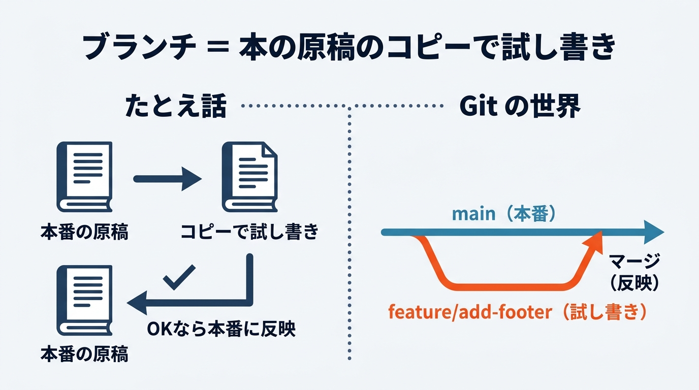
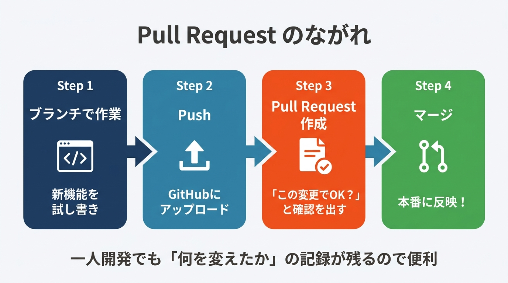

# 応用1: VSCode で Git/GitHub 入門（90分）

## 前回のおさらい

基本コース全4回で以下を体験しました:
- Claude Code を使った TODO アプリの開発
- Supabase でデータベースを接続（データの永続化）
- GitHub にコードをバックアップ（git init / commit / push）
- Vercel でアプリをインターネットに公開

第3回では GitHub アカウント作成と、Claude Code 経由での git init / commit / push を体験しました。今回は **VSCode の GUI（画面操作）だけで** Git と GitHub を操作する方法を学びます。

---

## ゴール

VSCode の画面操作だけで「ブランチ作成 → コード変更 → コミット → Pull Request → マージ」の一連の開発フローを体験し、その上で Claude Code に任せると何が変わるかを実感する。





---

## 参考リンク集

| トピック | URL |
|---------|-----|
| VSCode 公式ドキュメント（Git連携） | https://code.visualstudio.com/docs/sourcecontrol/overview |
| Git Graph 拡張機能 | https://marketplace.visualstudio.com/items?itemName=mhutchie.git-graph |
| GitHub Pull Request ガイド | https://docs.github.com/en/pull-requests/collaborating-with-pull-requests/proposing-changes-to-your-work-with-pull-requests/about-pull-requests |
| GitHub Flow について | https://docs.github.com/en/get-started/using-github/github-flow |
| VSCode 拡張機能マーケットプレイス | https://marketplace.visualstudio.com/vscode |

---

## 前回の振り返り（5分）

- 基本コースで作った TODO アプリの状況を確認
- GitHub にプッシュできているか確認
- 質問タイム

---

## 講義パート（10分）

### なぜ GUI で Git を操作するのか？

第3回では Claude Code がコマンドを実行してくれたので、Git の操作を「目で見る」機会がありませんでした。今回は VSCode の画面を使って、自分の手で Git を操作します。

> 💡 **CLI と GUI の違い**
> CLI（コマンドライン）は「文字を打って命令する」方式、GUI（グラフィカルユーザーインターフェース）は「ボタンをクリックして操作する」方式です。スマホで例えると、CLI は Siri に声で命令すること、GUI は画面をタップして操作することに当たります。どちらでも同じことができますが、今回は「何が起きているか目で見て理解する」ために GUI を使います。

### ブランチとは何か

> 💡 **ブランチ = 「本の原稿のコピーで試し書き」**
> 小説を書いているとき、「この展開で本当にいいかな？」と思ったら、原稿をコピーして別の紙に試し書きしますよね。うまくいったら本番の原稿に反映する。ブランチはまさにこれです。本番（main ブランチ）を壊す心配なく、安全に新しい機能を試せます。

### Pull Request とは何か

> 💡 **Pull Request = 「変更の稟議書」**
> 会社で大きな買い物をするとき、稟議書を出して上司に確認してもらいますよね。Pull Request（略してPR）も同じで、「こういう変更をしたいのですが、よいですか？」と確認するための仕組みです。一人開発でも「自分がどんな変更をしたか」の振り返り記録になるので便利です。

---

## ハンズオン（65分）

### Step 1: VSCode Source Control パネルに慣れる（10分）

> **このStepでやること:** VSCode に備わっている Git 操作パネル（Source Control）を使って、ファイルの変更 → ステージング → コミットを GUI だけで行います。

> 💡 **Source Control パネルって何？**
> VSCode に最初から入っている Git 操作用の画面です。左サイドバーの分岐マーク（Y字のアイコン）をクリックすると開きます。コマンドを打たなくても、ボタン操作だけで Git を使えます。

**1-1. Source Control パネルを開く**

1. VSCode を起動し、第3回で作った `todo-app` フォルダを開く（「ファイル」→「フォルダーを開く」）
2. 左サイドバーの分岐マーク（上から3番目あたりのアイコン）をクリック


*VSCode 左サイドバーの Source Control パネル。分岐マークのアイコンをクリックすると開きます*

**1-2. ファイルを編集して変更を確認する**

1. 左サイドバーのエクスプローラー（一番上のアイコン）をクリックし、`README.md` を開く
2. ファイルの末尾に「このアプリは Claude Code で作りました。」と1行追加して保存（Ctrl+S / Cmd+S）
3. 左サイドバーの Source Control アイコンをクリック
4. 「Changes」の下に `README.md` が表示されていることを確認

> 💡 **差分表示（Diff）の見方**
> Source Control パネルでファイル名をクリックすると、変更前と変更後を横に並べた画面が開きます。赤い背景が「削除された行」、緑の背景が「追加された行」です。何が変わったか一目でわかります。


*差分表示画面。赤が削除、緑が追加を示します*

**1-3. ステージングとコミット**

> 💡 **ステージング = 「レジに商品を並べる」**
> スーパーで買い物をするとき、カゴに入れた商品をレジに並べてから会計しますよね。Git のステージングも同じです。変更したファイルの中から「今回コミット（会計）するもの」を選んでステージングエリア（レジ）に並べます。並べ終わったらコミット（会計）です。

1. Source Control パネルで `README.md` の右にある「+」ボタンをクリック（ステージング）
2. ファイルが「Changes」から「Staged Changes」に移動したことを確認


*「+」ボタンをクリックすると、ファイルが Staged Changes に移動します*

3. 上部のテキスト入力欄に「READMEに説明を追加」と入力（これがコミットメッセージ）
4. 「Commit」ボタンをクリック


*コミットメッセージを入力して「Commit」ボタンをクリック*

**確認ポイント:**
- [ ] Source Control パネルで変更ファイルが表示された
- [ ] 差分表示（赤/緑）でどこが変わったか確認できた
- [ ] ステージング（+ボタン）でファイルを Staged Changes に移動できた
- [ ] コミットメッセージを入力してコミットが完了した

---

### Step 2: Git Graph で履歴を可視化する（10分）

> **このStepでやること:** VSCode の拡張機能「Git Graph」をインストールして、コミット履歴を線路のような図で見られるようにします。

> 💡 **拡張機能って何？**
> VSCode に後から追加できる便利ツールのことです。スマホにアプリをインストールするのと同じ感覚です。Git Graph は Git の履歴を図で見やすくしてくれる拡張機能です。

**2-1. Git Graph をインストールする**

1. VSCode 左サイドバーの四角が4つ並んだアイコン（拡張機能マーケットプレイス）をクリック
2. 検索欄に「Git Graph」と入力
3. 「Git Graph」（作者: mhutchie）の「Install」ボタンをクリック


*拡張機能マーケットプレイスで「Git Graph」を検索してインストール*

**2-2. コミット履歴を確認する**

1. インストール後、Source Control パネルの上部に「Git Graph」のアイコンが追加される（丸が線で繋がったマーク）
2. そのアイコンをクリックして Git Graph を開く
3. コミット履歴が「線路」のように縦に並んで表示される


*Git Graph の画面。コミットが線路のように並び、いつ・何を変更したかが一目でわかります*

> 💡 **コミット履歴 = 「ゲームのセーブデータ一覧」**
> ゲームのセーブデータ一覧を見ると、「いつ」「どこまで進んだか」がわかりますよね。Git のコミット履歴も同じです。「いつ」「何を変更したか」が全て記録されていて、いつでも過去の状態に戻せます。第3回で Claude Code がやってくれた commit が全て残っていることを確認してみてください。

**確認ポイント:**
- [ ] Git Graph 拡張機能がインストールできた
- [ ] コミット履歴が線路のように表示されている
- [ ] 第3回でコミットした履歴が残っていることを確認できた

---

### Step 3: ブランチを作って機能を追加する（20分）

> **このStepでやること:** main ブランチから新しいブランチを作り、TODOアプリにフッター（ページ下部の表示）を自分の手で追加します。ブランチを切り替えると変更が現れたり消えたりすることを体験します。

> 💡 **ブランチ = 「本の原稿のコピーで試し書き」**
> 本の原稿を書いているとき、「このキャラクターの結末を変えてみたい」と思ったら、原稿をコピーして試し書きしますよね。失敗しても本番の原稿は無傷です。Git のブランチも同じで、main（本番）はそのままに、コピー上で安全に新機能を試せます。

> 💡 **feature/ という命名規則**
> ブランチ名の先頭に `feature/` を付けるのは、「これは新機能を追加するためのブランチです」という目印です。他にも `fix/`（バグ修正）、`docs/`（ドキュメント修正）などがあります。チーム開発でブランチの目的がひと目でわかるようにする慣習です。

**3-1. 新しいブランチを作成する**

1. VSCode 画面左下に表示されている「main」をクリック
2. 画面上部にメニューが表示されるので「新しいブランチの作成...」を選択
3. ブランチ名に `feature/add-footer` と入力して Enter


*VSCode 左下の「main」をクリックすると、ブランチの作成・切替メニューが表示されます*

4. 左下の表示が「main」から「feature/add-footer」に変わったことを確認
5. Git Graph を開いて、枝分かれが発生していることを確認


*Git Graph に新しいブランチが表示され、線路が枝分かれしています*

**3-2. フッターを自分の手で追加する**

ここでは Claude Code は使いません。自分の手でコードを書く体験をします。

1. エクスプローラーで `src/app/page.tsx` を開く
2. ファイルの一番下、最後の `</div>` の直前に以下のコードを追加する:

```tsx
<div style={{ textAlign: 'center', padding: '20px', color: '#888', fontSize: '14px', borderTop: '1px solid #eee', marginTop: '40px' }}>
  作成者: ○○ / 作成日: 2026年○月
</div>
```

※ 「○○」の部分は自分の名前、「○月」は今月に置き換えてください。

3. ファイルを保存（Ctrl+S / Cmd+S）
4. ブラウザで TODO アプリを開き、ページ下部にフッターが表示されていることを確認

**3-3. 変更をコミットする**

1. Source Control パネルを開く
2. `page.tsx` の右にある「+」ボタンをクリック（ステージング）
3. コミットメッセージに「フッターを追加」と入力
4. 「Commit」ボタンをクリック

**3-4. ブランチの独立性を体験する**

1. VSCode 左下の「feature/add-footer」をクリック
2. メニューから「main」を選択して切り替える
3. `src/app/page.tsx` を確認 -- フッターのコードが **消えている**
4. ブラウザでも確認 -- フッターが **表示されていない**
5. 再度左下の「main」をクリックし、「feature/add-footer」に切り替える
6. `src/app/page.tsx` を確認 -- フッターのコードが **復活している**

> 💡 **なぜ消えたり復活したりするのか？**
> ブランチは独立した作業空間です。`feature/add-footer` ブランチで追加したフッターは、そのブランチにだけ存在します。`main` に切り替えると、main の状態に戻るのでフッターはありません。これが「本番を壊さずに試し書きできる」仕組みです。

**確認ポイント:**
- [ ] `feature/add-footer` ブランチを作成できた
- [ ] Git Graph で枝分かれが表示されている
- [ ] フッターを自分の手で追加してコミットできた
- [ ] main に切り替えるとフッターが消え、feature/add-footer に戻すと復活することを確認できた

---

### Step 4: Pull Request を作成・マージする（15分）

> **このStepでやること:** feature/add-footer ブランチの変更を GitHub に push し、Pull Request（変更の稟議書）を作成して main ブランチにマージ（反映）します。

> 💡 **マージ = 「試し書きの内容を本番原稿に反映」**
> Step 3 でブランチは「原稿のコピーで試し書き」と説明しました。マージはその試し書きの内容を「よし、これでいこう」と決めて本番原稿に書き写すことです。Pull Request を経由してマージすることで、「何を変えたか」の記録が残ります。

**4-1. 変更を GitHub に push する**

1. VSCode 左下のブランチ名が `feature/add-footer` になっていることを確認
2. Source Control パネル上部の「...」メニューをクリック、または左下のクラウドに上矢印が付いたアイコン（変更を同期/公開）をクリック
3. 「ブランチを公開しますか？」と聞かれたら「OK」を選択


*クラウドに上矢印のアイコンをクリックして push します*

**4-2. GitHub で Pull Request を作成する**

1. ブラウザで GitHub のリポジトリページ（`https://github.com/自分のユーザー名/todo-app`）にアクセス
2. ページ上部に「Compare & pull request」という黄色いバナーが表示されている


*push 直後に表示される黄色いバナー。これをクリックして PR を作成します*

3. 「Compare & pull request」をクリック
4. PR タイトルに「フッターを追加」と入力
5. 説明欄に「ページ下部に作成者名と作成日を表示するフッターを追加しました」と入力
6. 「Create pull request」ボタンをクリック


*Pull Request の作成画面。タイトルと説明を入力して作成します*

**4-3. 差分を確認してマージする**

1. PR ページの「Files changed」タブをクリック
2. 変更箇所（フッターの追加部分）が赤/緑で表示されることを確認


*「Files changed」タブで変更内容を確認できます*

3. 問題なければ「Conversation」タブに戻る
4. 「Merge pull request」ボタンをクリック
5. 「Confirm merge」をクリック


*マージ完了画面。紫色の「Merged」バッジが表示されれば成功です*

**4-4. VSCode で main を最新にする**

1. VSCode 左下のブランチ名をクリックし、「main」に切り替える
2. Source Control パネルの「...」メニュー →「Pull」を選択（またはクラウドの同期アイコンをクリック）
3. `src/app/page.tsx` を開いて、フッターが反映されていることを確認

**確認ポイント:**
- [ ] feature/add-footer ブランチを GitHub に push できた
- [ ] GitHub 上で Pull Request を作成できた
- [ ] 差分タブで変更箇所を確認できた
- [ ] マージが完了し、紫色の「Merged」バッジが表示された
- [ ] VSCode で main を pull し、フッターが反映されていることを確認できた

---

### Step 5: 同じ操作を Claude Code に任せる（10分）

> **このStepでやること:** Step 1-4 で手動で行った一連の操作（ブランチ作成 → ファイル編集 → コミット → push → PR 作成）を、Claude Code への1つの指示で全て自動化します。

> 💡 **「理解してから任せる」が大事**
> Step 1-4 で手動操作を体験したからこそ、Claude Code が何をやっているか理解できます。「何が起きているかわからないけど動いた」ではなく、「あの操作を自動でやってくれているのか」とわかる。これが本講座の目指す「理解なき自動化」を避ける姿勢です。

**5-1. Claude Code に一括指示を出す**

VSCode のターミナルで Claude Code を起動し、以下のように指示します:

```
READMEに「## 使い方」セクションを追加してください。
内容は以下を含めてください:
- アプリの起動方法
- 基本的な操作方法（タスクの追加・完了・削除）

新しいブランチで作業して、コミットして、GitHubにPull Requestを作ってください。
```

**5-2. Claude Code の動きを観察する**

Claude Code が自動で以下を実行する様子を観察してください:

1. 新しいブランチを作成（例: `feature/add-usage-section`）
2. README.md を編集して「使い方」セクションを追加
3. 変更をコミット（コミットメッセージも自動生成）
4. GitHub に push
5. Pull Request を作成

Step 1-4 で手動で行った全ての操作が、1つの指示で完了します。


*Claude Code が自動でブランチ作成から PR 作成まで実行した様子*

**5-3. /commit スキルの紹介**

Claude Code には `/commit` というスキル（便利機能）があります。変更内容を分析して適切なコミットメッセージを自動生成してくれます。

```
/commit
```

と入力するだけで、「何を変えたか」を読み取って英語のコミットメッセージを作ってくれます。自分でメッセージを考える手間が省けます。

**5-4. Claude Code の Git 安全機構**

Claude Code には Git 操作で危険なことをしないための安全機構が備わっています:

> 💡 **force push 禁止 = 「共有書類の上書き防止」**
> 会社の共有フォルダにある書類を、自分の古いバージョンで上書きしたら、他の人の変更が消えてしまいますよね。force push はこれと同じ危険な操作です。Claude Code は force push を自動的にブロックして、チームの作業を守ります。

- **force push の禁止**: 他の人の変更を上書きする危険な操作をブロック
- **.env ファイルのコミット警告**: パスワードや秘密のキーが入ったファイルをうっかりアップしようとすると警告
- **破壊的操作の確認**: データを消す可能性がある操作の前に確認を求める

**確認ポイント:**
- [ ] Claude Code への1つの指示でブランチ作成から PR 作成まで完了した
- [ ] GitHub に Pull Request が作成されていることを確認できた
- [ ] /commit スキルの存在を知った
- [ ] Claude Code の安全機構について理解できた

---

## まとめ（10分）

### 今日できるようになったこと

- [ ] VSCode の Source Control パネルで変更の確認・ステージング・コミットができた
- [ ] Git Graph で履歴を可視化できた
- [ ] ブランチを作成して、main を壊さずに新機能を試せた
- [ ] GitHub で Pull Request を作成してマージできた
- [ ] Claude Code に任せると同じ操作が1つの指示で完了することを体験した

### 手動操作と Claude Code の使い分け

| 操作 | 手動（Step 1-4） | Claude Code（Step 5） |
|------|-------------------|----------------------|
| ブランチ作成 | VSCode 左下をクリック | 自動 |
| ファイル編集 | 自分でコードを書く | 自動 |
| ステージング | +ボタンをクリック | 自動 |
| コミット | メッセージを書いてボタン | 自動（メッセージも生成） |
| push | 同期ボタンをクリック | 自動 |
| PR 作成 | GitHub で入力 | 自動 |

仕組みを理解した上で Claude Code に任せれば、安心して作業を効率化できます。

---

## 困ったときは

### Source Control パネルに変更が表示されない
→ ファイルを保存したか確認してください（Ctrl+S / Cmd+S）。また、フォルダを「開く」ときに `todo-app` フォルダ自体を開いているか確認してください。サブフォルダや親フォルダを開いていると Git が認識されません。

### ブランチの切り替えでエラーが出る
→ 「未コミットの変更があります」というメッセージが出た場合、先に変更をコミットするか、Source Control パネルで変更を「Discard Changes」（変更の破棄）してからブランチを切り替えてください。

### push で認証エラーが出る
→ GitHub にログインしていない可能性があります。VSCode が認証ダイアログを表示したら、ブラウザで GitHub にログインして認可してください。それでもダメな場合は、ターミナルで `gh auth login` を実行してください。

### 「Compare & pull request」バナーが表示されない
→ push 後しばらく経つとバナーが消えることがあります。その場合は GitHub リポジトリページの「Pull requests」タブ → 「New pull request」ボタンから手動で作成できます。「base: main」「compare: feature/add-footer」を選択してください。

### マージで「コンフリクト」が発生した
→ 同じファイルの同じ箇所を別々のブランチで変更した場合に起きます。今回の手順通りに進めていれば発生しませんが、もし発生した場合は Claude Code に「コンフリクトを解消して」と指示してください。

### Git Graph が表示されない
→ 拡張機能のインストール後、VSCode を再起動してみてください。Source Control パネル上部に Git Graph のアイコン（丸が線で繋がったマーク）が表示されていればインストール成功です。

---

## 今日出てきた用語まとめ

| 用語 | 一言でいうと |
|------|-------------|
| Source Control パネル | VSCode に備わっている Git 操作画面 |
| ステージング | コミットするファイルを選ぶ操作（レジに商品を並べる） |
| コミット | 変更を確定・記録すること（会計する） |
| 差分表示（Diff） | 変更前後を赤/緑で見比べる画面 |
| 拡張機能 | VSCode に後から追加できる便利ツール |
| Git Graph | コミット履歴を図で表示する拡張機能 |
| ブランチ | 本番を壊さず試せる独立した作業空間（原稿のコピー） |
| main ブランチ | 本番の原稿にあたるメインのブランチ |
| feature/ | 新機能用ブランチの命名規則 |
| マージ | ブランチの変更を本番に反映すること（試し書きを本番に書き写す） |
| Pull Request (PR) | 変更内容を確認・記録してからマージするための仕組み（稟議書） |
| push | ローカルの変更を GitHub にアップロードすること |
| pull | GitHub の最新状態をローカルに取り込むこと |
| コンフリクト | 同じ箇所を別々に変更したときに起きる衝突 |
| force push | 他人の変更を上書きする危険な操作（Claude Code がブロック） |
| /commit | Claude Code のコミットメッセージ自動生成スキル |
| CLI | 文字を打って命令する操作方式 |
| GUI | ボタンをクリックして操作する方式 |
