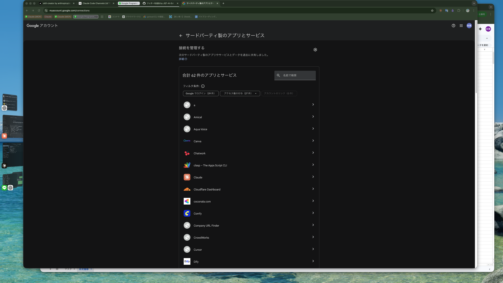

# 応用2: Claude × Google Drive セキュリティ入門（90分）

## これまでのおさらい

これまでの講座で以下を体験しました:

- Claude Code の基本操作（指示の出し方、ファイル操作）
- Next.js で TODO アプリを作成・改善
- Supabase でデータベースを接続
- GitHub でコードをバックアップ
- Vercel でアプリをインターネットに公開

今回は Claude.ai から Google Drive のファイルを安全に読み取る方法を学びます。「便利に使いたいけどセキュリティが心配」という課題を、3層のセキュリティモデルで解決します。

---

## ゴール

Claude.ai から Google Drive のファイルを安全に読み取れる環境を理解し、3層セキュリティモデルで「何が守られているか」「自分で追加できる対策は何か」を実践する。

---

## 参考リンク集

| トピック | URL |
|---------|-----|
| Claude.ai Google Workspace コネクタ | https://support.claude.com/en/articles/10166901-use-google-workspace-connectors |
| Claude.ai コネクタ概要 | https://support.claude.com/en/articles/11176164-use-connectors-to-extend-claude-s-capabilities |
| Anthropic プライバシーセンター | https://privacy.claude.com |
| Incognito チャットについて | https://support.claude.com/en/articles/12260368-using-incognito-chats |
| Google アカウント接続管理 | https://myaccount.google.com/connections |

---

## 導入（5分）

「会社の Google Drive にある資料を Claude で要約したい」「スプレッドシートのデータを分析させたい」 -- こんな要望は自然ですが、同時に「勝手にファイルを消されたらどうしよう」「社外秘の情報が漏れないか」という不安もあります。

結論から言うと、Claude.ai の Google Drive コネクタは**検索・閲覧が中心**で、既存ファイルを書き換えたり削除したりすることはできません（書き込みは「Claude が生成した新規ファイルを保存する」用途に限定）。さらに、3つのセキュリティ層で守られています。今回のハンズオンでは、その仕組みを一つずつ確認していきます。

---

## 講義パート（20分）

### Claude.ai コネクタとは

> 💡 **コネクタって何？**
> Claude.ai に組み込まれた外部サービス接続機能です。Google Drive、Calendar、Notion、Slack などに対応しています。出張先のホテルの Wi-Fi に例えるとわかりやすいでしょう。ホテルが提供する安全な接続を使うので、自分でケーブルを持ち込む必要がありません。コネクタも同じで、Claude.ai が安全な接続を用意してくれます。

### Google Drive コネクタの仕様

| できること | できないこと |
|-----------|-------------|
| ファイルの検索（Docs, Sheets, Slides など） | ファイルの削除 |
| ファイルの内容読み取り | 既存ファイルの上書き・編集 |
| 検索結果の要約・分析 | ファイルの移動 |
| Claude が生成した文書の Drive への保存 | あなたが権限を持たないファイルへのアクセス |

Google Drive コネクタの重要な特徴をまとめます:

- **検索・読み取りが中心**: ファイルの検索・閲覧がメイン。書き込みは「Claude が生成したファイルを Drive に保存する」用途に限定され、既存ファイルの編集や削除はできない
- **権限継承**: あなたが Drive でアクセスできないファイルには、Claude 経由でもアクセスできない
- **モデル学習の扱いはプラン依存**: Team / Enterprise プランではコネクタデータはモデル学習に使われない。Free / Pro / Max プランでは、プライバシー設定で学習に協力する選択をしている場合、コネクタから取得しチャットに取り込んだ内容が学習対象になり得る（設定で無効化可能）
- **暗号化**: 転送中・保存時ともに暗号化される（公式表記「encrypted at rest and in transit」）

> 💡 **権限継承って何？**
> あなたが Google Drive で「閲覧権限がないファイル」には、Claude を通してもアクセスできません。あなたのアカウントの権限がそのまま引き継がれる（継承される）仕組みです。Claude が特別な権限を持つわけではありません。

### 3層セキュリティモデル

外部サービスとの接続を安全にするために、3つの防御層が重なっています。1つが突破されても、次の層が守ってくれる「多層防御」の考え方です。

> 💡 **多層防御って何？**
> 「カードキー + 金庫 + 監視カメラ」で守るイメージです。カードキーだけだと合鍵を作られたら終わりですが、金庫もあって、監視カメラもあれば、安全性が格段に上がります。

| 層 | 名前 | 役割 | 比喩 |
|----|------|------|------|
| 第1層 | Google アカウント権限 | Google アプリの接続許可・取り消し | ホテルのカードキー（チェックアウトで無効化） |
| 第2層 | Claude.ai の設定 | Incognito チャット・コネクタ切断 | ホテルの部屋の金庫（貴重品は別途保管） |
| 第3層 | 組織の管理 | Workspace Admin / 利用ルール | ホテルのセキュリティカメラ（全体を見張る） |

> 重要な注意: Claude.ai コネクタ経由のデータは Anthropic サーバーで処理されます（あなたの PC 上での処理ではありません）。ただし、モデルの学習には使われません。

---

## ハンズオン（55分）

### Step 1: Google Drive コネクタを接続する（10分）

> **このStepでやること:** Claude.ai の設定画面から Google Drive コネクタを接続し、OAuth（限定的な許可証）の仕組みを理解します。

> 💡 **OAuth（オーオース）って何？**
> アプリに「限定的な許可証」を発行する仕組みです。あなたの Google パスワードをアプリに渡すのではなく、「このアプリには、ドライブの読み取りだけ許可します」という許可証を発行します。銀行窓口で身分証を見せて「この口座の残高照会だけお願いします」と頼むようなイメージです。パスワード（通帳と印鑑）は渡しません。

**1-1. Claude.ai でコネクタ設定画面を開く**

1. ブラウザで https://claude.ai にアクセスしてログイン
2. 画面左下のアカウントメニューから「カスタマイズ」を選択
3. 「コネクタ」の項目を探す
4. 「Google Drive」をクリック


*Google Drive コネクタの詳細画面。ここから接続を開始します*

**1-2. Google アカウントで認証する**

1. 「接続」ボタンをクリック
2. Google アカウントのログイン画面が表示される
3. ログインして「許可」をクリック

これが OAuth の認証フローです。あなたの Google パスワードを Claude に渡しているわけではなく、「読み取りだけ許可する」という限定的な許可証を発行しています。

**1-3. 接続を確認する**

1. コネクタ一覧画面に戻る
2. Google Drive が「接続済み」になっていることを確認


*コネクタ一覧画面。Google Drive が接続済みになっていれば成功です*

**確認ポイント:**
- [ ] Claude.ai のコネクタ設定画面を開けた
- [ ] Google アカウントでの認証が完了した
- [ ] コネクタ一覧で Google Drive が「接続済み」と表示されている

---

### Step 2: 実際に読み取りテスト（10分）

> **このStepでやること:** Google Drive にテスト用ファイルを作成し、Claude.ai から検索・読み取りができることを確認します。さらに、削除が**できない**ことも確認します。

**2-1. テスト用ファイルを準備する**

1. Google Drive をブラウザで開く（https://drive.google.com）
2. 「新規」→「Google スプレッドシート」をクリック
3. ファイル名を「講座テスト用」に変更
4. 適当な表データを入力（例: A1に「商品名」、B1に「価格」、A2に「りんご」、B2に「150」）

**2-2. Claude.ai で検索・読み取りを試す**

1. Claude.ai で新しいチャットを開く
2. 以下のように入力:

```
Google Driveから「講座テスト用」を検索して内容を要約してください
```


*検索結果と内容の要約が表示されます。スプレッドシートの中身が読み取れていれば成功です*

**2-3. 削除を試みる（拒否されることを確認）**

1. 同じチャットで以下のように入力:

```
そのファイルを削除してください
```

Claude は「削除する機能がない」「このコネクタでは削除ができない」といった回答をします。Google Drive コネクタには削除アクションそのものが用意されていないため、どう指示しても既存ファイルを消すことはできません。

> 補足: コネクタには「Claude が生成した新しいファイルを Drive に保存する」書き込み機能はあります。ただし、これは新規作成のみで、**既存ファイルの上書き・編集・削除はできない**という点が重要です。検索・閲覧が中心のコネクタだと理解しておきましょう。

**確認ポイント:**
- [ ] テスト用スプレッドシートを Google Drive に作成できた
- [ ] Claude.ai からファイルを検索・読み取りできた
- [ ] 削除を指示しても実行できないことを確認した

---

### Step 3: 第1層 -- Google アカウントの権限管理（10分）

> **このStepでやること:** Google アカウントの接続管理画面で、Claude にどのような権限が付与されているかを確認します。不要になったときの切断方法も学びます。

> 💡 **「ホテルのカードキー」の比喩**
> ホテルに泊まるとカードキーをもらいますよね。チェックアウトしたらカードキーは無効になります。Google アカウントの権限管理も同じです。Claude への接続を許可している間はカードキーが有効で、権限を取り消せばカードキーは無効になり、Claude は Drive にアクセスできなくなります。

**3-1. Google アカウントの接続管理画面を開く**

1. ブラウザで https://myaccount.google.com/connections にアクセス
2. 接続済みアプリの一覧から「Claude」を探す


*Google アカウントの接続管理画面。Claude に付与されている権限を確認できます*

**3-2. 付与されている権限を確認する**

1. 「Claude」をクリックして詳細を開く
2. どのようなアクセス権が付与されているかを確認する
3. 「Google Drive のファイルの閲覧」など、読み取りに関する権限のみであることを確認

**3-3. 切断方法を知る**

1. 詳細画面に「アクセス権を取り消す」ボタンがある
2. 今回はクリックしない（講座の続きで使うため）が、ここをクリックすれば即座に接続が切れることを理解する

> 重要なポイント: 退職時や利用終了時は、ここから必ず権限を取り消してください。「ホテルのチェックアウト」と同じで、使い終わったらカードキーを返却する習慣が大切です。

**確認ポイント:**
- [ ] myaccount.google.com/connections にアクセスできた
- [ ] Claude に付与されている権限を確認できた
- [ ] 「アクセス権を取り消す」ボタンの場所を把握した

---

### Step 4: 第2層 -- Claude.ai の Incognito チャット（10分）

> **このStepでやること:** Claude.ai の Incognito チャット（シークレットモード）を使って、機密性の高いファイルを扱うときの追加保護層を体験します。

> 💡 **「ホテルの部屋の金庫」の比喩**
> ホテルの部屋自体は安全ですが、パスポートや現金は部屋の金庫に入れますよね。通常の Claude チャットが「ホテルの部屋」だとすると、Incognito チャットは「部屋の金庫」です。機密性の高いファイルを扱うときは、Incognito チャットに入れて追加の保護をかけましょう。

**4-1. Incognito チャットを開く**

1. Claude.ai の画面で新規チャットを作成
2. チャット画面の上部やメニューから「Incognito」モードを選択

**4-2. Incognito チャットで読み取りテスト**

1. Incognito チャットで以下のように入力:

```
Google Driveから「講座テスト用」を検索して内容を要約してください
```

2. 通常チャットと同じようにファイルの読み取りができることを確認

**4-3. Incognito チャットの効果を理解する**

通常チャットと Incognito チャットの違いを確認しましょう:

| | 通常チャット | Incognito チャット |
|---|---|---|
| チャット履歴の保持 | 削除するまで残る | デフォルト30日（Enterprise は組織のカスタム設定） |
| モデル改善への利用 | プラン・設定による | 一切使われない |
| コネクタの利用 | 可能 | 可能 |
| 推奨シーン | 日常的な質問・作業 | 機密性の高いファイルの扱い |

> 重要なポイント: 機密性の高いファイルを Claude で扱うときは、Incognito チャットの利用を推奨します。履歴は既定で30日後に自動削除され、プラン設定に関わらずモデル改善に一切使われません。

**確認ポイント:**
- [ ] Incognito チャットを開くことができた
- [ ] Incognito チャットでも Google Drive のファイルを読み取れた
- [ ] 通常チャットと Incognito チャットの違いを理解した

---

### Step 5: 第3層と補足 -- 組織管理と gog CLI 紹介（15分）

> **このStepでやること:** セキュリティの第3層（組織レベルの管理）を概要で学び、補足として「編集もしたい場合」の選択肢（gog CLI）を紹介します。

**5-1. 第3層: 組織の管理（説明のみ）**

> 💡 **Google Workspace Admin って何？**
> 会社が Google Workspace（旧 G Suite）を契約している場合に、IT 管理者が使える管理画面です。組織全体で「どのアプリが Google のデータにアクセスできるか」を制御できます。個人の Google アカウントには存在しない機能です。

Google Workspace Admin Console では以下のことができます:

- サードパーティアプリ（Claude を含む）のアクセス許可・拒否
- コネクタの有効/無効の一括設定（Team / Enterprise プラン）
- アクション権限の制御（Always allow / Needs approval / Never allow）

この第3層は**ハンズオンの対象外**です。会社で Google Drive コネクタを使いたい場合は、IT 部門に相談してください（まとめセクションに相談テンプレートを用意しています）。

**5-2. 補足: 既存ファイルを編集したい場合 -- gog CLI**

Claude.ai の Google Drive コネクタは「検索・閲覧＋新規ファイル保存」が中心で、既存スプレッドシートのセルを書き換えるような編集はできません。「既存の Sheets の値を更新したい」「議事録 Docs に追記したい」という場合は、別のツールが必要です。

> 💡 **「自分で鍵を持つか、ホテルの鍵を借りるか」**
> Claude.ai コネクタは「ホテルの鍵を借りる」方式。セキュリティはホテル（Anthropic）が管理してくれるので安心ですが、できることは限られます。gog CLI は「自分で鍵を持つ」方式。できることは多いですが、鍵の管理は自分の責任です。

**gog CLI とは:**
- Google Workspace を操作するためのコマンドラインツール（サードパーティ製のオープンソース）
- Drive / Sheets / Docs / Calendar / Gmail などに対応
- Claude.ai コネクタでは難しい **既存 Sheets の書き込み** も行える
- 注意: gog CLI には Claude.ai コネクタのような保護機能（書き込み範囲の制限等）はなく、認証時に付与したスコープの範囲で**フルアクセス**になる

**セットアップの概要（参考）:**

1. GCP Console で OAuth クライアント ID を作成
2. `gog auth credentials /path/to/client_secret.json` で認証設定
3. `gog auth add you@gmail.com --services drive,sheets` でサービスを追加

**使用例（参考）:**

```bash
# Drive検索
gog drive search "議事録" --max 10

# Sheets読み取り
gog sheets get <sheetId> "Sheet1!A1:D10"

# Sheets書き込み
gog sheets update <sheetId> "Sheet1!A1:B2" --values-json '[["名前","点数"],["田中","85"]]'
```

> 重要な注意: gog CLI はオープンソースのサードパーティツールです。OAuth 設定が必要で、書き込み権限も付与されます。Claude.ai コネクタより「できること」が多い分、セキュリティリスクも高くなります。利用は自己責任で、会社利用の場合は必ず IT 部門に相談してください。

**確認ポイント:**
- [ ] 第3層（組織管理）の概要を理解した
- [ ] Claude.ai コネクタの書き込みは「新規保存のみ」で、既存ファイルの編集はできないと再確認した
- [ ] 既存ファイルを編集したい場合は gog CLI という選択肢があることを知った
- [ ] gog CLI は自己責任での運用が必要であることを理解した

---

## まとめ（10分）

### 今日できるようになったこと

- [ ] Claude.ai の Google Drive コネクタを接続できた
- [ ] コネクタ経由でファイルの検索・読み取りができた
- [ ] 削除が拒否されることを確認し、既存ファイルが守られる仕組みを体感した
- [ ] Google アカウントの接続管理画面で権限を確認できた
- [ ] Incognito チャットで機密ファイルを安全に扱う方法を学んだ

### Claude.ai コネクタ vs gog CLI 比較

| | Claude.ai コネクタ | gog CLI |
|---|---|---|
| セットアップ | ワンクリック | GCP OAuth 設定が必要 |
| Drive 検索・読み取り | ○ | ○ |
| 新規ファイル保存（Claude 生成物） | ○ | ○ |
| 既存 Sheets / Docs の編集 | × | ○ |
| 削除 | × | △（API 経由で可能） |
| 権限の細かい制御 | Anthropic が管理（既存ファイルの編集・削除不可） | なし（認証スコープ内でフルアクセス） |
| 推奨用途 | 資料の検索・要約・分析 | 既存ファイルの編集・バッチ処理 |

### やっていいこと・ダメなことリスト

| やっていいこと | やってはダメなこと |
|--------------|------------------|
| コネクタ経由での資料検索・要約 | 社外秘ファイルの無断読み取り |
| Incognito チャットでの機密ファイル操作 | 管理者に無断でのコネクタ接続（会社利用時） |
| テスト用ファイルでの動作確認 | 顧客情報を通常チャットで扱うこと |
| 不要になった権限の取り消し | 退職後も接続を放置すること |
| IT 部門への相談（会社利用時） | gog CLI を許可なく業務環境にインストール |

### 会社で使うときの相談テンプレート（IT 部門宛）

以下をメールやチャットで IT 部門に送ってください:

```
件名: Claude.ai Google Drive コネクタの利用許可のご相談

お疲れ様です。[あなたの名前]です。

業務効率化のため、AI ツール「Claude.ai」の Google Drive コネクタを
使ってドキュメントの要約・分析を行いたいと考えています。

- 使用するツール: Claude.ai Google Drive コネクタ
- 接続方式: OAuth 2.0（Claude.ai 組み込み）
- 権限: 検索・読み取りが中心。書き込みは Claude が生成した新規ファイルの保存のみで、既存ファイルの編集・削除は不可
- 用途: ドキュメントの要約、スプレッドシートのデータ分析
- セキュリティ情報:
  - Team / Enterprise プランではコネクタデータをモデル学習に不使用
  - 通信・保存時ともに暗号化（公式: "encrypted at rest and in transit"）
  - Incognito チャットで履歴をデフォルト30日で自動削除可能
  - Anthropic プライバシーセンター: https://privacy.claude.com

Workspace Admin Console でのアプリ許可設定について
ご確認いただけますでしょうか。
よろしくお願いいたします。
```

### データの扱いに関する重要事項

| 項目 | 内容 |
|------|------|
| コネクタ経由データ | Anthropic サーバーで処理。Team / Enterprise はモデル学習に不使用。Free / Pro / Max は学習設定オン時に対象となる可能性あり（設定で無効化可能） |
| 通常チャットの保持期間 | 手動で削除するまで保持。チャットを削除すれば関連する取得データも削除される |
| Incognito チャット | デフォルト30日で削除。モデル改善に一切使用しない（Enterprise は組織のカスタム保持設定に従う） |

---

## 困ったときは

### コネクタが接続できない
→ Claude.ai にログインしているアカウントと、Google ログイン画面で選択するアカウントが正しいか確認してください。また、ブラウザのポップアップブロックが認証画面を妨げている場合があります。ポップアップを許可してから再試行してください。

### 「ファイルが見つかりません」と表示される
→ 2つの原因が考えられます:
1. **ファイル名の入力ミス**: 検索キーワードが正確か確認してください。完全一致でなくても見つかりますが、大きく異なると検索できません。
2. **権限の問題**: あなたの Google アカウントでそのファイルにアクセスできるか、Drive のブラウザ画面で確認してください。共有されていないファイルは検索できません。

### Incognito チャットの開き方がわからない
→ Claude.ai の新規チャット作成時に、チャット画面の上部やメニューに Incognito の切り替えがあります。UI は更新されることがあるので、見つからない場合は Claude.ai のヘルプ（https://support.claude.com/en/articles/12260368-using-incognito-chats）を参照してください。

### コネクタを切断したい
→ 2つの方法があります:
1. **Claude.ai 側**: カスタマイズ → コネクタ → Google Drive → 「切断」
2. **Google 側**: https://myaccount.google.com/connections → Claude → 「アクセス権を取り消す」

どちらか一方でも切断されますが、両方で切断するのが確実です。

### 会社の Drive に接続していいか判断がつかない
→ 迷ったら IT 部門に相談してください。まとめセクションに相談テンプレートを用意しています。個人の Google Drive であれば自分の判断で接続できますが、会社の Google Workspace アカウントの場合は必ず管理者の許可を取ってください。

---

## 今日出てきた用語まとめ

| 用語 | 一言でいうと |
|------|-------------|
| Claude.ai コネクタ | Claude.ai に組み込まれた外部サービス接続機能 |
| OAuth（オーオース） | アプリに限定的な許可証を発行する仕組み（パスワードは渡さない） |
| Incognito チャット | Claude.ai のシークレットモード。履歴はデフォルト30日で削除、モデル学習の対象外 |
| Google Workspace Admin | 組織全体の Google サービスを管理する画面（会社契約が必要） |
| gog CLI | Google Workspace 用のコマンドラインツール（読み書き両対応） |
| 検索・読み取り中心 | ファイルの検索・閲覧が主用途で、既存ファイルの編集・削除ができない状態（Claude 生成物の新規保存は可） |
| 権限継承 | ユーザーのアクセス権がそのまま引き継がれる仕組み |
| モデル学習除外 | コネクタ経由データが AI の学習に使われないこと |
| データ保持期間 | チャット履歴がサーバーに保存される期間 |
| ZDR（ゼロデータリテンション） | Enterprise プランで利用可能な、データを保持しない設定 |
| 多層防御 | 複数の防御層を重ねてセキュリティを高める考え方 |
| 転送中の暗号化 | データが通信経路を通る間、第三者に内容を見られないようにする仕組み |
| 保存時の暗号化 | サーバーに保存されているデータを、鍵を持つ者しか復元できない形にする仕組み |
