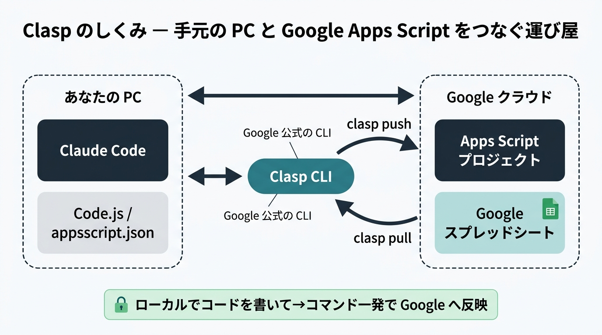
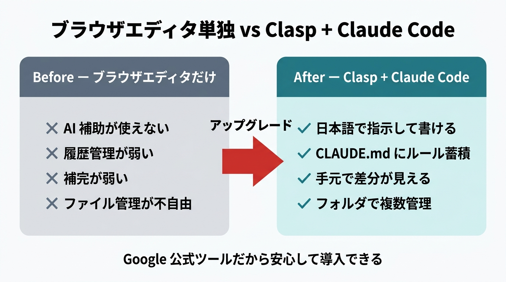
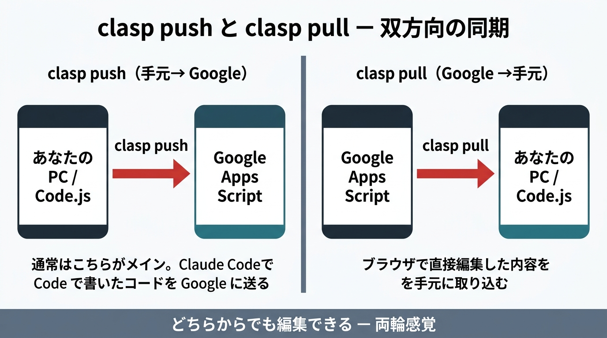

# 応用3: Claude Code で GAS 開発入門 -- Clasp セットアップ編（90分）

## これまでのおさらい

これまでの講座で以下を体験しました:

- Claude Code の基本操作（指示の出し方、ファイル操作）
- Next.js で TODO アプリを作成・改善
- Supabase でデータベースを接続
- GitHub でコードをバックアップ、VSCode で Git/GitHub を操作
- Vercel でアプリをインターネットに公開
- Claude.ai から Google Drive を安全に読み取り

今回は **Google Apps Script（GAS）** を Claude Code から書いて Google に送る方法を学びます。GAS はこれまでブラウザのエディタで書くのが普通でしたが、手元の Claude Code で書けるようになると **「自然言語で指示を出してスプレッドシート業務を自動化する」** が日常になります。

---

## ゴール

Clasp（Google 公式 CLI）を自分の PC にセットアップし、Claude Code で GAS コードを書いて `clasp push` で Google の Apps Script プロジェクトに反映できるようになる。題材として「勤怠記録スプレッドシート」を自動生成する GAS を作ります。

---

## 参考リンク集

| トピック | URL |
|---------|-----|
| Google Apps Script 公式 | https://developers.google.com/apps-script |
| Clasp 公式リポジトリ | https://github.com/google/clasp |
| Apps Script ユーザー設定（API 有効化） | https://script.google.com/home/usersettings |
| Node.js 公式 | https://nodejs.org |
| SpreadsheetApp リファレンス | https://developers.google.com/apps-script/reference/spreadsheet |

---

## 導入（5分）

「月初に勤怠表のテンプレートを手作業で作っている」「同じフォーマットのシートを毎月コピーして日付だけ入れ直している」 -- こういう作業、ありませんか?

GAS を使えば、**「今月分の勤怠表を自動で作って」** とボタン一発で解決できます。しかも GAS はブラウザ上のエディタで書けるのですが、Claude Code からは使えないため、せっかくの AI 補助が活かせません。

そこで登場するのが **Clasp** です。Clasp を使うと、GAS のコードを自分の PC で編集し、Claude Code に「こんなシートを作る GAS を書いて」と日本語で指示して、`clasp push` コマンドで Google に送れます。今回はその環境を一から作って、**勤怠記録スプレッドシートを自動生成する GAS** を Claude Code で書いて動かすところまで一気に体験します。

---

## 講義パート（15分）

### GAS（Google Apps Script）とは

> 💡 **GAS って何?**
> Google が提供する JavaScript の実行環境です。スプレッドシート、Gmail、カレンダー、Drive など Google のサービスを操作する「マクロ」を書けます。Excel の VBA の Google 版、と言うとイメージしやすいでしょう。無料で使え、実行環境も Google のサーバー上に用意されるので、自分のサーバーを立てる必要もありません。

GAS でできることの代表例:

- スプレッドシートの自動生成・集計
- Gmail の定型文自動送信
- カレンダー予定の一括登録
- Google Form の回答を Slack に通知
- 時間トリガーで毎朝 9 時に自動実行

### 従来のブラウザエディタ開発の限界

GAS は通常、ブラウザ上の「スクリプトエディタ」で書きます。ただ、この方法には弱点があります:

- **Claude Code が使えない**: AI 補助なしで書くことになる
- **履歴管理が弱い**: 誰がいつ何を変えたかが追いにくい
- **補完が弱い**: VSCode のような快適な入力補助がない
- **ファイル管理が不自由**: 複数ファイルの行き来がしづらい

### Clasp とは

> 💡 **Clasp って何?**
> 「**C**ommand **L**ine **A**pps **S**cript **P**rojects」の略で、Google 公式のコマンドラインツールです。手元の PC と Google の Apps Script プロジェクトを同期する「運び屋」の役割を果たします。`clasp push` でローカル → Google、`clasp pull` で Google → ローカル、という双方向のやり取りができます。


*Clasp は手元の PC と Google Apps Script プロジェクトを繋ぐ Google 公式の「運び屋」*

### Claude Code × Clasp の組み合わせメリット

| 項目 | ブラウザエディタ単独 | Clasp + Claude Code |
|------|--------------------|---------------------|
| AI 支援 | なし | Claude Code で自然言語指示 |
| ルール蓄積 | なし | `CLAUDE.md` に書き溜められる |
| 差分確認 | なし | ローカルで diff が見える |
| 複数プロジェクト管理 | タブを行き来 | フォルダで管理 |
| 学習曲線 | 低い | 低〜中（今回でクリア） |


*従来のブラウザエディタ単独の開発と、Clasp + Claude Code の組み合わせの違い*

> 重要なポイント: Clasp は Google 公式ツールです。「サードパーティのあやしいツールを入れる」わけではないので、個人 PC で使うぶんには安心して導入できます（業務 PC で使う場合は IT 部門へ相談）。

---

## ハンズオン（65分）

### Step 1: Node.js バージョンの確認とアップグレード（10分）

> **この Step でやること:** Clasp v3 系は **Node.js 22.0.0 以上** が必須です。まずはお手元の Node.js のバージョンを確認し、古ければアップグレードします。

**1-1. 現在のバージョンを確認**

ターミナル（Mac は「ターミナル」、Windows は「PowerShell」）を開いて以下を実行:

```bash
node -v
```

結果が `v22.x.x` 以上なら OK。`v18` や `v20` が表示される場合はアップグレードが必要です。

> 💡 **なぜ 22 以上が必要なの?**
> Clasp の最新版（v3 系）が、Node.js 22 から提供される新しい機能を使っているためです。古い Node.js だと `clasp` コマンドが起動しない、あるいはエラーで止まります。

**1-2. アップグレード方法（古い場合のみ）**

**Mac の場合（Homebrew を使っている方）:**

```bash
brew update
brew upgrade node
```

**Mac / Windows 共通（公式インストーラ）:**

1. https://nodejs.org にアクセス
2. 「LTS」版（22 系）をダウンロード
3. インストーラを実行して「次へ」を連打
4. インストール後、ターミナルを一度閉じて開き直してから `node -v` で確認

> 💡 **ターミナルを開き直すのはなぜ?**
> インストール時に設定された「node の場所」が、既に開いているターミナルには反映されないためです。再起動すると新しい設定が読み込まれます。

**確認ポイント:**
- [ ] `node -v` の結果が `v22.0.0` 以上になっている

---

### Step 2: Clasp のインストールと Google ログイン（15分）

> **この Step でやること:** Clasp をグローバルインストールし、Google アカウントと連携します。これで Clasp が「あなたの Google アカウントで Apps Script プロジェクトを作る許可」を持つ状態になります。

**2-1. Clasp をグローバルインストール**

```bash
npm install -g @google/clasp
```

「グローバルインストール」とは、このコマンドをどこのフォルダからでも使えるようにする意味です。インストールが終わったら確認:

```bash
clasp --version
```

バージョン番号が表示されれば成功です。

> 💡 **`-g` って何?**
> `global`（グローバル）の略です。PC 全体で使えるようにインストールする指定。付けないとプロジェクトフォルダの中だけで使える「ローカルインストール」になります。`clasp` のように複数プロジェクトで使い回すツールは `-g` が便利です。

**2-2. Apps Script API を有効化する**

Clasp が動くためには、Google 側で「API 経由で Apps Script を操作する」ことを許可する必要があります。

1. ブラウザで https://script.google.com/home/usersettings にアクセス
2. Google アカウントでログインしていることを確認
3. 画面の「Google Apps Script API」のトグルを **ON** にする

> 💡 **API を有効化するとは?**
> 「外部ツール（今回は Clasp）から Apps Script を操作してもいいですよ」という許可を出す設定です。デフォルトは OFF（安全側）で、一度 ON にすればずっと有効です。

**2-3. `clasp login` でログイン**

ターミナルに戻って:

```bash
clasp login
```

すると自動でブラウザが開き、Google アカウントのログイン画面が出ます。

1. ログインしたいアカウントを選択
2. 「Google Apps Script に関する権限をリクエストしています」という画面で **「許可」** をクリック
3. 「Succeeded!」のような成功メッセージがターミナルに出れば完了

認証情報は `~/.clasprc.json` という隠しファイルに保存されます。

> 💡 **`~/.clasprc.json` って何?**
> あなたのホームディレクトリ（Mac なら `/Users/あなたの名前/`、Windows なら `C:\Users\あなたの名前\`）に保存される「Clasp 用の認証トークン」です。このファイルは他人に渡してはいけません（パスワードと同じ扱い）。共有 PC で作業した場合は必ず `clasp logout` してから離席しましょう。

**確認ポイント:**
- [ ] `clasp --version` でバージョンが表示された
- [ ] Apps Script API が ON になっている
- [ ] `clasp login` が成功し、「Succeeded!」が表示された

---

### Step 3: 新規プロジェクトを作成する（10分）

> **この Step でやること:** 作業用フォルダを作り、そこに Clasp で新規の Apps Script プロジェクトを作ります。

**3-1. 作業フォルダを作る**

デスクトップに作業用フォルダを作ります:

```bash
cd ~/Desktop
mkdir gas-kintai
cd gas-kintai
```

`cd` は「ディレクトリ移動」、`mkdir` は「フォルダ作成」のコマンドです。

**3-2. `clasp create` でプロジェクト作成**

```bash
clasp create --title "勤怠記録ジェネレーター" --type standalone
```

`--type standalone`（スタンドアロン）は「スプレッドシートや Docs に紐付かない、単独で動く GAS プロジェクト」という意味です。今回は「新しいスプレッドシートを生成する」GAS を作るので、特定のファイルに紐付ける必要がありません。

成功すると、フォルダに 3 つのファイルが生成されます:

| ファイル | 役割 |
|---------|------|
| `.clasp.json` | スクリプト ID（Google 側のプロジェクトとの紐付け情報） |
| `appsscript.json` | マニフェスト（タイムゾーン・権限スコープ等の設定） |
| `Code.js` | 実際のコードが入る（空に近い状態で生成） |

> 💡 **ローカルは `.js`、Google 側は `.gs` ?**
> Clasp は push のときにローカルの `.js` ファイルを Google 側で `.gs` として扱うようにしてくれます。見た目は違いますが中身は同じ JavaScript です。「ローカルでは馴染みのある拡張子で書ける」便利機能と覚えておきましょう。

**確認ポイント:**
- [ ] `gas-kintai` フォルダが作られた
- [ ] フォルダ内に `.clasp.json` / `appsscript.json` / `Code.js` の 3 ファイルがある

---

### Step 4: Claude Code で勤怠記録 GAS を書く（20分）

> **この Step でやること:** いよいよ Claude Code の出番です。日本語で指示を出して勤怠表を生成する GAS を書き、`clasp push` で Google 側に反映します。

**4-1. Claude Code を起動**

作業フォルダ（`gas-kintai`）にいる状態で:

```bash
claude
```

Claude Code が起動します。

**4-2. `CLAUDE.md` を作ってルールを覚えさせる**

最初の指示として、以下を入力:

```
このプロジェクトは Google Apps Script を Clasp で開発しています。
コードは Code.js に書いてください。
SpreadsheetApp などの GAS のグローバル関数を使います。
初心者向けに、関数にはコメントで何をしているかを一行ずつ書いてください。
この内容を CLAUDE.md に保存してください。
```

Claude Code が `CLAUDE.md` を作って、今後の指示でこのルールを前提にしてくれます。

> 💡 **`CLAUDE.md` は「申し送り事項」**
> Claude Code が毎回最初に読む「プロジェクトの背景説明」です。新しいチャットを開いても、このファイルがあれば同じ前提で動いてくれます。

**4-3. 勤怠記録シートを作る関数を書いてもらう**

次に以下の指示を出します:

```
今月1ヶ月分の勤怠記録スプレッドシートを新規作成する関数 createKintaiSheet を書いてください。
- 列: 日付 / 曜日 / 出勤 / 退勤 / 休憩 / 実働 / 備考
- 日付行は今月の1日から末日まで
- ヘッダーは太字で青背景・白文字
- 土日の行はグレー背景
- 実働列は「退勤 - 出勤 - 休憩」の数式を入れる
- 列幅は読みやすく調整
```

Claude Code が `Code.js` にコードを書いてくれます。中身を一度目で追ってみましょう（完全に理解する必要はありません、雰囲気を掴むだけで OK）。

**4-4. `clasp push` で Google に送る**

Claude Code のチャットを終えずに、別のターミナルウィンドウで（または Claude Code の中から）以下を実行:

```bash
clasp push
```

初回は「古いファイルを上書きしていいか?」と聞かれることがあるので `y`（Yes）と答えます。「Pushed X files.」のようなメッセージが出たら成功です。

**4-5. スクリプトエディタで実行する**

```bash
clasp open-script
```

ブラウザで Apps Script のスクリプトエディタが開きます。

1. 上部の関数選択プルダウンで `createKintaiSheet` を選択
2. 「▶ 実行」ボタンをクリック
3. 初回は「権限の承認」ダイアログが出るので、自分のアカウントで許可する
4. 実行が終わったら https://drive.google.com を開き、新しいスプレッドシートが生成されていることを確認

**4-6. 追い指示で書式を調整する**

出来上がったシートを見て、気になる点があれば Claude Code に追い指示を出します:

```
土曜はグレーじゃなく薄い水色にして、日曜は薄いピンクにして。
それから最下行に「合計実働」の行を追加して、実働列の合計を表示して。
```

再度 `clasp push` → スクリプトエディタで再実行 → 新しいシートが生成されます。

> 重要なポイント: ここで **「日本語で指示 → コードに反映 → Google に送る」** のサイクルを体感してください。これが今回の講座で一番大事な体験です。コードを完全に理解できなくても、「指示して動かす」ができればもう GAS 使いの仲間入りです。

**確認ポイント:**
- [ ] `CLAUDE.md` がプロジェクトに作られた
- [ ] `clasp push` が成功した
- [ ] スクリプトエディタで関数が実行できた
- [ ] Google Drive に勤怠表シートが生成されていることを確認した
- [ ] 追い指示で書式を変更して再反映できた

---

### Step 5: `clasp pull` で Google 側の変更を取り込む（10分）

> **この Step でやること:** Clasp は双方向同期ツールです。手元の変更を Google に送るだけでなく、Google 側で直接編集した内容を手元に取り込むこともできます。「どちらでも作業できる」感覚を掴みます。

**5-1. Google 側で 1 行だけ編集**

先ほど開いたスクリプトエディタで、`Code.js` の任意のコメントを 1 行だけ書き換えます。例えば:

```javascript
// この関数は勤怠記録シートを作ります
```

を

```javascript
// この関数は今月の勤怠記録シートを新規作成します
```

に変更して保存（Ctrl+S または Cmd+S）。

**5-2. 手元で `clasp pull`**

ターミナルに戻って:

```bash
clasp pull
```

「Cloned X files.」のようなメッセージが出ます。手元の `Code.js` を開いてみると、先ほどの変更が反映されています。

> 💡 **push と pull の使い分け**
> - **push**: 手元の変更を Google に送る（通常はこちらがメイン）
> - **pull**: Google 側で直接編集した内容を手元に取り込む（誰かと共有しているプロジェクトや、スマホから緊急修正したときに使う）


*push は手元→ Google、pull は Google →手元。双方向に同期できる*

**確認ポイント:**
- [ ] スクリプトエディタで 1 行編集して保存した
- [ ] `clasp pull` で手元にその変更が反映された

---

## まとめ（10分）

### 今日できるようになったこと

- [ ] Node.js を 22 以上にアップグレードし、Clasp をインストールできた
- [ ] Google アカウントと Clasp を連携できた
- [ ] 新規 Apps Script プロジェクトをコマンドで作れた
- [ ] Claude Code に日本語指示して GAS のコードを書けた
- [ ] `clasp push` で Google 側に反映できた
- [ ] `clasp pull` で逆方向の同期もできた
- [ ] スクリプトエディタで関数を実行し、成果物を確認できた

### ここから先の選択肢

**既存のスプレッドシートに紐付けたい場合**

今回は「スタンドアロン」で新規プロジェクトを作りましたが、既存のスプレッドシートに紐付いた GAS を Clasp で扱いたいときは:

```bash
clasp clone <既存のスクリプトID>
```

で既存プロジェクトを手元に持ってこられます。

**定期実行（トリガー）を設定したい場合**

スクリプトエディタの左メニュー「トリガー」から、「毎日朝 9 時に `createKintaiSheet` を自動実行する」といった設定ができます。月初に勤怠表が勝手に作られるようになれば、もう手作業は不要です。

**さらに高度な連携**

- Gmail 自動送信（`MailApp.sendEmail`）
- Google Form の回答を Slack に通知（Webhook 連携）
- Google カレンダーの予定を一覧化
- OpenAI / Claude API との連携で AI 機能を GAS に組み込む

これらは MENTA の伴走プランで個別テーマとして扱えます。

### セキュリティの確認事項

| やっていいこと | やってはダメなこと |
|--------------|------------------|
| 個人 PC で `clasp login` して使う | 共有 PC で `clasp login` したまま離席する |
| 個人の Google アカウントで練習する | 会社アカウントで IT 部門に無断で使う |
| `CLAUDE.md` に開発ルールを溜める | `~/.clasprc.json` を Git にコミットする |
| 退職・利用終了時に `clasp logout` する | 認証トークンをチャットに貼る |

> 重要な注意: `.clasp.json`（スクリプト ID が入る）は Git にコミットしても直接的な秘密情報ではありませんが、個人作業のログを公開リポジトリに上げる場合は一応意識しておきましょう。一方、`~/.clasprc.json` は認証トークンそのものなので、絶対に外に出さないでください。

### 会社で使うときの相談テンプレート（IT 部門宛）

```
件名: Google Apps Script 開発ツール（Clasp）利用のご相談

お疲れ様です。[あなたの名前]です。

業務効率化のため、Google 公式の Apps Script 開発ツール「Clasp」を
個人の開発環境にインストールして使いたいと考えています。

■ Clasp とは
- Google 公式のコマンドラインツール（MIT ライセンス）
- 手元の PC と Apps Script プロジェクトを同期するツール
- 公式リポジトリ: https://github.com/google/clasp

■ 目的
勤怠表生成・定型メール送信など、スプレッドシート業務の自動化

■ 想定するアクセス範囲
- 私個人の Google アカウントの Apps Script プロジェクトのみ
- 他ユーザーのファイルへのアクセスは発生しません

■ 追加で有効化する機能
- Apps Script API（個人アカウントの設定画面でトグル ON）

利用許可をいただけますと幸いです。ご確認のほど、よろしくお願いいたします。
```

### 次回案内

応用シリーズは以下を予定しています（ココナラまたは MENTA で単発開催）:

- **応用4**: Claude Code Skills 入門 -- 繰り返し業務をスキル化する
- **応用5**: MCP 連携入門 -- Slack / Notion / データベースと繋ぐ

MENTA 伴走プランでは「あなたが自動化したい業務」を個別テーマとして扱えます。

---

## Notion 教材（自習用・辞書）

以下の内容を Notion の辞書セクションに用意しています:

- Clasp コマンドチートシート（login / create / clone / push / pull / open-script / logs / logout）
- 認証トラブル対処集（Apps Script API 未有効化、ブラウザが開かない、トークン失効、`EACCES` 権限エラー）
- `.clasp.json` と `appsscript.json` の読み方
- Claude Code への GAS 指示文テンプレート10選（集計／通知／定期実行／メール送信／フォーム連携 等）
- Workspace 管理者が OAuth アプリを制限しているケースの相談テンプレート
- GAS の権限スコープ早見表（どの機能がどのスコープを要求するか）
