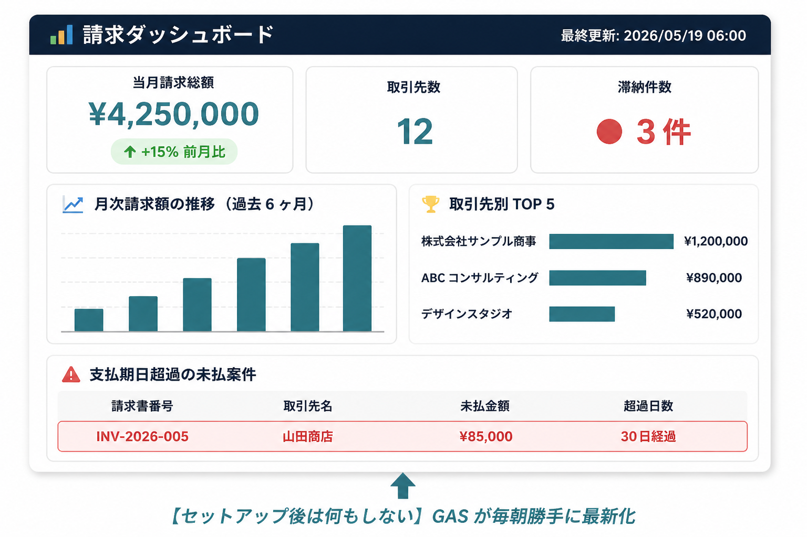
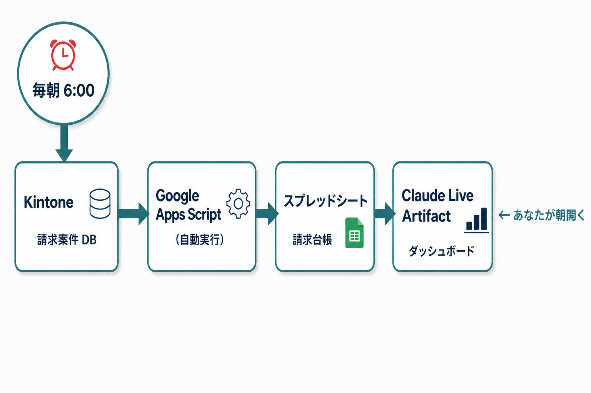
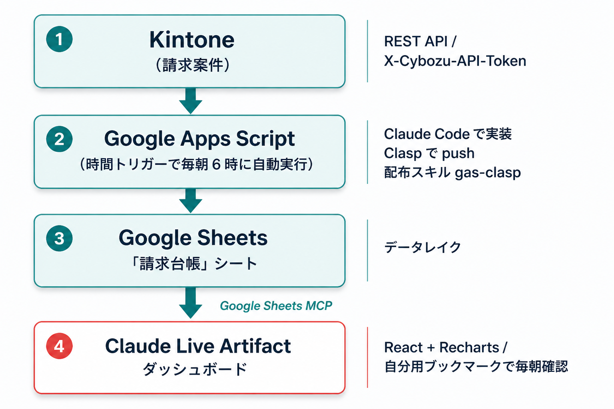
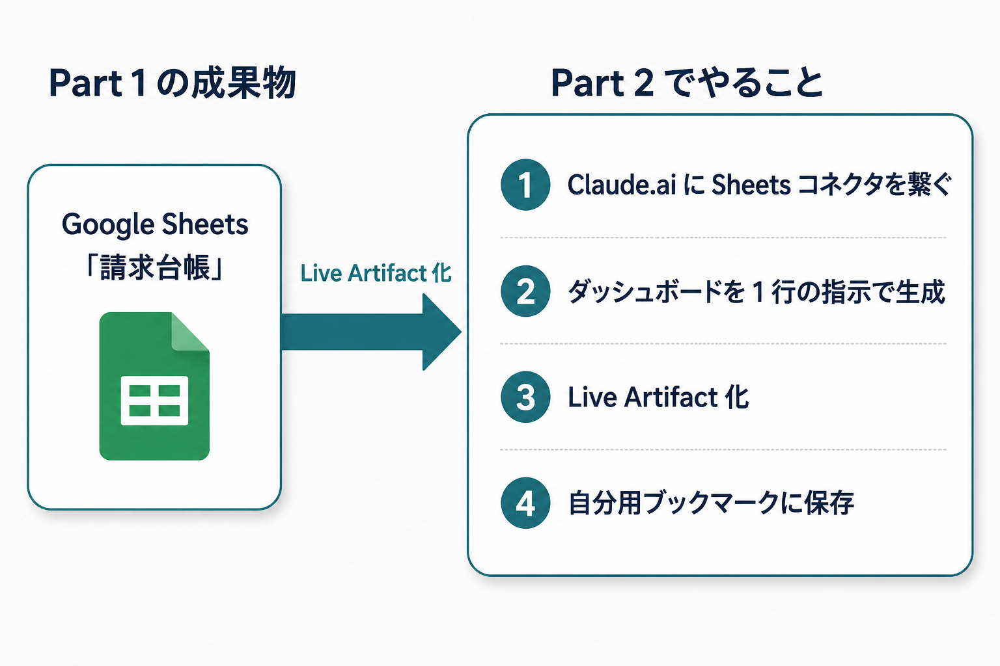

# 応用5: Claude Code で作る請求データ自動収集 × Live Artifact ダッシュボード（90分）

**今回のテーマ**: 「経理が毎月手作業でやっている請求データの集計を、AI に丸ごと任せる」。Kintone から API でデータを取りに行き、毎朝 6 時に Google スプレッドシートを自動更新。それを Claude.ai デスクトップの **Live Artifact** で見える化し、**自分のブックマークから毎朝ワンクリックで開ける** ところまでを 1 本のハンズオンで体験します。

---

## 🎯 この 90 分でできるようになること

> **朝コーヒーを淹れながら Claude を開くだけで、昨日までの請求状況がグラフで一目瞭然になる世界** を、自分の手で作ります。

### ✨ ビフォー → アフター

| | ビフォー（今までのあなた） | アフター（90 分後のあなた） |
|---|---|---|
| 🌅 **毎朝** | Kintone を開いて当月の請求案件を CSV エクスポート → Excel に貼り付け → ピボット集計 → 取引先別に並べ替え… | Claude.ai のブックマークをクリック。**数秒**でダッシュボードが今日の最新状態で表示される |
| ⏱️ **所要時間** | 1 回 30 分〜 1 時間。月末月初はこれだけで半日溶ける | **運用後はゼロ**。一度仕掛けてしまえば、あなたは朝ブックマークを開くだけ |
| 👥 **共有** | Excel を Slack に貼って「これ見てください」。誰かが更新すると食い違う | 自分のブックマークで毎朝確認。共有が必要なら **スクショ・PDF・Sheets の URL** を貼る（後述） |
| 🔄 **データ更新** | 自分でやる。たまに忘れる | 毎朝 6 時に GAS が自動で Kintone から取得して Sheets を書き換える |
| 📊 **見え方** | Excel の数字の海。月次比較は手計算 | KPI カード・棒グラフ・滞納アラートが React 製のモダンな画面で |

### 🛠️ 完成イメージ



*【セットアップ後は何もしない】GAS が毎朝勝手に最新化*

### 🤖 裏側で動く仕組み（一度作れば自動運転）



> 💡 **コードはあなたが書きません**
> コードを書くのは **Claude Code**。あなたの仕事は「何を作りたいか」を **日本語で要件を伝える** ことと、**できあがった仕組みを 1 回だけ動かしてみる**（クリック・実行ボタン・スクリプトプロパティ登録など）ことだけです。
> プログラミング経験ゼロでも 90 分後にはこの仕組みが自分の手で動き始めます。

> ※ Live Artifact の動作には **Claude.ai Pro 以上のプラン** が必要です。詳細は Step 0 を参照。

### 💎 持ち帰れるもの

ハンズオン終了時、あなたの手元には次のものが残ります:

1. **自分の Claude.ai に保存された Live ダッシュボード**（毎朝ブックマークから開くと最新化）
2. **毎朝 6 時に勝手にデータ更新する GAS スクリプト**（自分の Google アカウントで動く）
3. **同じ仕組みを他の業務に応用するための型**（例: 在庫 / 受注 / 勤怠 / KPI 等）

---

## ゴール

1. **Claude Code に GAS（Google Apps Script）を書かせて**、Kintone から日次で請求データを自動取得し、Google スプレッドシートを更新できるようになる
2. その台帳スプレッドシートを **Claude.ai デスクトップの Live Artifact** でダッシュボード化し、再オープン時に最新データへ自動リフレッシュさせられるようになる
3. 完成したダッシュボードを **自分のブックマーク** から毎朝開ける状態にし、社内共有が必要な場合の **代替手段（スクショ / PDF / Sheets URL）** を選べるようになる

題材: 「請求ダッシュボード（月次請求額・取引先別・支払予定・滞納アラート）」

> 💡 **データソースの選択について**
> 本編では **Kintone のみ** を扱います。invox（受取請求書クラウド）をデータソースに加えたい場合は、ハンズオン完走後に [references/invox-連携ガイド.md](references/invox-連携ガイド.md) を読んでください。invox は **プロフェッショナルプラン契約＋サポートへの client_id 発行申請** が必須のため、当日体験のスコープからは外しています。

---

## 90分の時間配分

| パート | 時間 | 内容 |
|--------|------|------|
| 導入 | 5分 | 「請求データの転記、まだ手作業ですか?」掴み |
| 講義 | 15分 | アーキテクチャ全体像 / API トークンと OAuth / Live Artifact とは |
| Part 1: GAS でデータ収集 | 45分 | Kintone REST API → スプレッドシート更新 → 毎朝6時トリガー |
| Part 2: Live Artifact 化 | 20分 | Sheets MCP 接続 → ダッシュボード生成 → ローカル運用 + 共有代替手段 |
| まとめ | 5分 | 振り返り・運用ルール・次の選択肢 |

> 💡 **「全部完走できなくても大丈夫」**
> Part 1 の Kintone 接続でつまずいたら、配布スキルに同梱の **モックモード**（サンプル JSON を読み込ませる経路）で先に進めてください。Part 2 の Live Artifact 体験はモックでもまったく同じです。「動くダッシュボードを 1 枚必ず持ち帰る」を最優先に。

---

## Step 0: 事前準備チェックリスト（講座前にやっておく）

ハンズオン本番中に「アカウントがありません」「API トークンがありません」で詰まらないよう、**講座開始までに以下を済ませておいてください**。

### 必須（環境）

- [ ] **Mac（推奨）または Windows + Git Bash** が使える状態
- [ ] **Claude Code** がインストール済み（ターミナルで `claude --version` が通る）
- [ ] **Node.js 22 以上** が入っている（`node -v` で確認）
- [ ] **Clasp v3 系** が入っている（`clasp --version` で `3.x.x`）
- [ ] **Google アカウント**にログイン済み（個人 Gmail 推奨）
- [ ] **Claude.ai Pro（または Max / Team / Enterprise）** プランに加入済み（Live Artifact / MCP は無料プランでは使えません）
- [ ] **Claude.ai デスクトップアプリ**（https://claude.ai/download）がインストール済み

> 環境チェックは配布スキル `gas-clasp` に同梱の診断スクリプトで一括確認できます:
> ```bash
> ~/.claude/skills/gas-clasp/references/diagnose.sh
> ```

### 必須（Kintone）

- [ ] **Kintone** のアカウント（30日無料お試しで OK: https://kintone.cybozu.co.jp/trial/）
- [ ] テストアプリ「請求案件」を作成（フィールド構成は本文 Step 1 で指示）
- [ ] **API トークン** を発行済み（権限: **レコード閲覧のみ**）

> API トークンがどうしても用意できない場合は、配布スキル `kintone-api` の `references/mock-sample.md` にあるサンプル JSON を使えば、当日モックモードで完走できます。

### 配布スキルのインストール

このハンズオンでは **Claude Code 用の専用スキル 2 つ** を配布しています。先にインストールしておいてください。

```bash
# このリポジトリをクローン
git clone <repo-url> ClaudeCode_handson
cd ClaudeCode_handson

# スキルを ~/.claude/skills/ にインストール
./skills/install.sh

# Claude Code を再起動して認識させる
```

> 💡 **動作確認**: `ls ~/.claude/skills/` で `kintone-api` と `gas-clasp` が並んでいれば OK。並んでいない場合は `./skills/install.sh` が失敗していないか出力を確認してください。Claude Code を再起動してから次に進みます。

インストールされるスキル:

| スキル | 役割 |
|--------|------|
| `kintone-api` | Kintone REST API（レコード取得・query 文法・API トークン）の知識を Claude に与える |
| `gas-clasp` | Clasp 環境診断・GAS プロジェクト作成・スクリプトプロパティ・時間トリガーまでを案内 |

詳細は `skills/README.md` を参照。

### 不要なもの

❌ プログラミング経験／JavaScript の知識／会計知識 -- すべて手順内でカバーします。

> 💡 **会社の Workspace アカウントを使う場合**
> 多くの組織で「外部 API への送信」が IT 部門によって制限されています。**個人 Google アカウント＋個人 Kintone トライアル** での参加を強く推奨します。会社で本番運用したくなったタイミングで、改めて IT 部門に「Kintone からスプレッドシートへ自動転記する GAS を社内ドライブで運用したい」と相談してください。

---

## 参考リンク集

| トピック | URL |
|---------|-----|
| Kintone REST API 概要 | https://cybozu.dev/ja/kintone/docs/rest-api/ |
| Kintone レコード一覧取得 API | https://cybozu.dev/ja/kintone/docs/rest-api/records/get-records/ |
| Kintone API トークン発行手順 | https://jp.cybozu.help/k/ja/id/040835.html |
| Google Apps Script 公式 | https://developers.google.com/apps-script |
| GAS UrlFetchApp リファレンス | https://developers.google.com/apps-script/reference/url-fetch |
| GAS ScriptApp トリガー | https://developers.google.com/apps-script/reference/script/script-app |
| Clasp 公式リポジトリ | https://github.com/google/clasp |
| Claude Artifacts 公式ヘルプ | https://support.claude.com/en/articles/9487310-what-are-artifacts-and-how-do-i-use-them |
| Claude Connectors（MCP）一覧 | https://claude.ai/connectors |
| invox 連携拡張ガイド（本リポジトリ） | [references/invox-連携ガイド.md](references/invox-連携ガイド.md) |

---

## 導入（5分）

「月初の朝、経理担当が Kintone を開いて当月の請求案件一覧を CSV エクスポートし、Excel に貼り付けて取引先別に並べ替えて、社内共有用のサマリーシートを作る」 -- こんな作業、ありませんか?

1 社あたりでも 30 分〜 1 時間。**月末月初は経理担当が請求台帳作業だけで半日溶ける**、というのはよく聞く話です。しかも、ヒューマンエラーが許されない数字なのに、コピペ事故が起きやすい。

今回はこの「請求データの集約と見える化」を Claude Code に丸ごと任せる方法を学びます。鍵になるのは **「データ収集」と「見える化」を分離する** という考え方です。

- **データ収集**: GAS が毎朝 6 時に Kintone を叩いて Sheets を更新する
- **見える化**: Claude の Live Artifact が Sheets を読みに行ってグラフを再描画する

データ収集と表示を分けておくと、**「データソースが増えても表示を作り直さなくていい」「表示を直してもデータ収集に影響しない」** という嬉しい状態が手に入ります。実際、本編完走後に invox やマネフォを足したくなっても、Part 1 を拡張するだけで Part 2 はそのまま使えます。

---

## 講義パート（15分）

### A. 全体アーキテクチャ（5分）



> 💡 **なぜ Sheets を「真ん中」に置くのか?**
> 経理担当が SaaS を切り替えても Excel に戻ってくるのと同じで、**人間が一番触り慣れている場所をハブにする** のがコツです。直接 Kintone → Artifact もできますが、Sheets を挟むことで「データを直接見たい」「監査ログを残したい」「他のツール（freee / マネフォ / invox）でも使いたい」という要望にも応えられます。

### B. API トークン認証 vs OAuth 2.0（5分）

API を扱うときに知っておきたい「鍵の種類」を整理します。

| 種類 | 例 | 性質 |
|------|----|----|
| **API トークン** | Kintone・Slack Bot 等 | アプリ単位／ユーザー単位で発行。権限が限定的（GET だけ／POST だけ等）。漏れても被害範囲が狭い。**今回これを使う**。 |
| **OAuth 2.0** | Google・Microsoft・invox 等 | ユーザー本人の同意を経て発行。期限付き。応用2 / 応用4 で扱った方式。 |

> 💡 **「狭い鍵」を選ぶのが鉄則**
> 今回 Kintone API トークンは **「請求案件アプリのレコード閲覧のみ」** に絞って発行します。GAS から書き込み操作はしないので、書き込み権を渡す必要はありません。**鍵は必要な分だけ削った状態で発行する** のがセキュリティの基本です。

トークンは **GAS のスクリプトプロパティ**に保存します。コード本文に直書きすると、GitHub に push した瞬間に漏洩します。配布スキル `gas-clasp` がこの作法を Claude に教えるので、自然に安全な書き方になります。

### C. Live Artifact とは（5分）

通常の Artifact が「**作って終わりの 1 枚絵**」だとすると、Live Artifact は **「開くたびに最新データを取りに行く生きたページ」** です。

| 項目 | 通常の Artifact | Live Artifact |
|------|----------------|--------------|
| データ | 作成時点で固定 | 開くたびに最新を再取得 |
| 外部接続 | なし | MCP コネクタ経由で Google Sheets 等に接続 |
| 永続性 | チャットを閉じると残らない | アカウントに保存、URL で再アクセス可 |
| 外部共有 | Publish で URL 共有可 | **作成者専用**（MCP 連携の認証制約で現状 Publish 不可。共有はスクショ・PDF・Sheets URL で代替） |
| プラン | 全プラン | **Pro 以上**（今回の前提） |

ダッシュボードに必要な「**毎朝開いたら最新のグラフが見える**」を実現する核がこの仕組みです。GAS 側で 6 時に Sheets を更新しておけば、9 時に開いたダッシュボードは自動的に当日の朝 6 時時点のデータを反映します。

---

## ハンズオン（65分）

ここから手を動かします。**Part 1 の Step 1〜4 でデータ収集の仕組みを作り**、**Part 2 の Step 5〜7 で見える化** までを一気に体験します。

> ⚠️ **API トークンの取り扱いについて**
> このハンズオンで使う API トークンは **絶対にスクリプト本文に書き込まないでください**。GAS の「スクリプトプロパティ」に保存します。GitHub に push する場合は `.gitignore` で `.clasp.json` 以外の秘密情報を除外します。応用2 の Google Drive セキュリティ回と同じ作法です。

> 💡 **Claude Code に配布スキルを活用してもらう**
> Part 1 で「Kintone から取得する GAS 書いて」と指示すると、Claude は自動的に `kintone-api` スキルと `gas-clasp` スキルを発火させて、スクリプトプロパティ管理・cursor API・query 文法を踏まえた安全なコードを生成します。受講者はスキルの存在を意識しなくても、ベストプラクティスに従ったコードが出てきます。

---

## Part 1: GAS で Kintone から毎朝データを集める（45分）

Part 1 のゴールは「**毎朝 6 時に、Kintone の請求案件レコードを Google スプレッドシートへまるっと転記する仕組み**」を 45 分で完成させること。具体的には以下 4 つの Step を順に踏みます。

| Step | 所要 | やること |
|------|------|---------|
| Step 1 | 10分 | Kintone 側で「請求案件」アプリと API トークンを準備 |
| Step 2 | 10分 | Clasp で GAS プロジェクトを作り、スクリプトプロパティを登録 |
| Step 3 | 15分 | Claude Code で本体コードを生成 → `clasp push` → 手動実行で動作確認 |
| Step 4 | 10分 | 毎朝 6 時の時間トリガーをコード経由で設定 |

> 💡 **配布スキルがあなたの代わりに考えてくれる**
> Part 1 では Kintone REST API 仕様や GAS の流儀を覚える必要はありません。配布スキル `kintone-api` と `gas-clasp` が「query 文法はこう書く」「スクリプトプロパティはこう取り出す」といった知識を Claude にロードしてくれるので、受講者は **「何を作りたいか」を日本語で書くだけ** で OK です。

---

### Step 1: Kintone 側の準備（10分）

> **この Step でやること:** Kintone に「請求案件」アプリを 1 つ作り、レコード閲覧専用の API トークンを 1 本発行します。GAS から覗くための「窓」と「鍵」を用意するイメージです。

#### 1-1. Kintone にログインしてアプリを作る

1. ブラウザで自分の Kintone（`https://〇〇.cybozu.com`）にログイン
2. ポータル画面右上の「**+**」アイコン → 「**はじめから作成**」をクリック
3. アプリ名を「**請求案件**」と入力して「作成」

> 💡 **「はじめから作成」を選ぶ理由**
> Kintone には「ピープル管理」「案件管理」など便利なテンプレートが多数ありますが、教材どおりのフィールド名で進めるために今回は **白紙からフィールドを 6 つ手動で並べます**。所要 3 分です。

#### 1-2. フィールドを 6 つ並べる

左側のパレットから以下のフィールドをドラッグ＆ドロップして、**フィールドコード**（プログラムから参照する名前）を以下の表のとおりに設定してください。

| フィールド名 | 種類 | フィールドコード | 設定 |
|---|---|---|---|
| 案件番号 | 文字列（1行） | `案件番号` | 重複禁止 ON |
| 取引先 | 文字列（1行） | `取引先` | -- |
| 請求額 | 数値 | `請求額` | 単位記号 = `円`、単位記号の位置 = 後 |
| 請求日 | 日付 | `請求日` | 初期値 = 今日 |
| 支払期日 | 日付 | `支払期日` | -- |
| 状態 | ドロップダウン | `状態` | 選択肢: `未払` / `保留` / `完了` |

> ⚠️ **フィールドコードは必ず日本語そのまま**
> Kintone はフィールド名を変えるとフィールドコードも自動更新しますが、後から変更すると GAS のコードと食い違ってエラーになります。**今この時点でコードを上記のとおり統一**しておきましょう。フィールドの歯車アイコン → 「フィールドコード」を直接編集できます。

#### 1-3. アプリを保存してテストレコードを 5〜10 件入れる

右上の「**アプリを公開**」をクリックして公開します。公開後、トップから「**＋**（レコード追加）」で適当にレコードを 5〜10 件作ってください。例:

| 案件番号 | 取引先 | 請求額 | 請求日 | 支払期日 | 状態 |
|---|---|---|---|---|---|
| INV-2026-001 | 株式会社サンプル商事 | 150,000 | 2026-05-01 | 2026-05-31 | 未払 |
| INV-2026-002 | 山田商店株式会社 | 280,000 | 2026-05-03 | 2026-06-30 | 未払 |
| INV-2026-003 | ABC コンサルティング合同会社 | 450,000 | 2026-04-15 | 2026-05-15 | 完了 |

> 💡 **データは「リアルすぎず」「空すぎず」**
> ダッシュボードのグラフが映えるように、**取引先は 3〜4 社・状態は 3 種類混ぜる** のがコツです。全部「未払」だと取引先別グラフが棒 1 本になって面白くありません。

#### 1-4. API トークンを発行する（権限はレコード閲覧のみ）

ここが Step 1 の山場です。**書き込み権限のないトークン** を作ります。

1. 「請求案件」アプリを開いた状態で、画面右上の **歯車アイコン** → 「**アプリの設定**」
2. 「**設定**」タブ → 「**API トークン**」
3. 「**生成する**」ボタンをクリック
4. 表示された 20 文字程度の文字列が **API トークン**。**この画面を閉じる前にコピーしてどこかに貼っておく**（再表示はできません。万一閉じてしまったら「生成する」でもう 1 本作り直せば OK）
5. **同じ画面のまま** 続けて **アクセス権**の項目で「**レコード閲覧**」だけにチェック。**追加 / 編集 / 削除のチェックは外す**（権限を絞らないまま保存すると、後で書き換えられてしまうトークンになります。**生成直後のこの画面で必ず権限を絞り込む** のがポイントです）
6. 右上の「**保存**」をクリック
7. 一覧画面に戻り、**必ず**「**アプリを更新**」ボタンをクリック（これを忘れるとトークンが有効になりません!）

> ⚠️ **「アプリを更新」のクリック忘れに注意**
> Kintone は設定変更を保存しても、アプリの「更新（公開）」をしないと反映されません。保存後に画面上部に出る青いバー「**アプリの設定が変更されています。更新してください**」を必ず押してください。

> 💡 **なぜ閲覧だけにする?**
> もしこのトークンが GitHub やチャットに漏れても、外部からできるのは「請求案件アプリのレコードを読むこと」だけ。**書き換え・削除はできない** ので被害が限定されます。「鍵は必要な分だけ削った状態で作る」が API セキュリティの基本中の基本です。

#### 1-5. サブドメインとアプリ ID を控える

GAS から呼び出すために、あと 2 つだけ情報をメモしておきます。

| 項目 | どこを見る? | 例 |
|------|-----------|----|
| **サブドメイン** | アプリ画面の URL の `https://〇〇.cybozu.com` の `〇〇` 部分 | `your-tenant` |
| **アプリ ID** | アプリ画面の URL の `/k/123/` の数字部分 | `123` |

例えば URL が `https://acme.cybozu.com/k/42/` なら、サブドメインは `acme`、アプリ ID は `42` です。

**Step 1 のまとめ（控えておく 3 点セット）:**

```
サブドメイン: ____________________
アプリ ID    : ____________________
API トークン: ____________________
```

> ⚠️ ここはローカルメモ用。テキストファイルに残す場合は `.gitignore` で必ず除外する（API トークンの漏洩防止）。応用2 の Google Drive セキュリティ回で扱った作法と同じです。

> 💡 **どうしても Kintone を用意できない場合**
> 「会社の Kintone は IT 部門に申請が必要で間に合わない」「トライアルの登録時間がない」という場合は、配布スキル `kintone-api` 同梱の **モックモード**で先に進めましょう。`skills/kintone-api/references/mock-sample.md` のサンプル JSON を Google Drive に保存しておけば、Step 3 で Kintone の代わりにこの JSON を読み込ませて Sheets を更新できます。Part 2 のダッシュボード体験はモックでも全く同じです。

**確認ポイント:**
- [ ] 「請求案件」アプリが作成されていて、レコードが 5〜10 件入っている
- [ ] フィールドコードが `案件番号` / `取引先` / `請求額` / `請求日` / `支払期日` / `状態` の 6 つになっている
- [ ] API トークンが「レコード閲覧のみ」で発行され、文字列を控えた
- [ ] サブドメインとアプリ ID をメモした
- [ ] **「アプリを更新」を押して** トークンが有効化されている

---

### Step 2: GAS プロジェクトを Clasp で作成（10分 ※ Clasp 未セットアップなら +10 分）

> **この Step でやること:** Clasp で空っぽの GAS プロジェクトを 1 つ作り、Step 1 で控えた 3 点セット＋スプレッドシート ID をスクリプトプロパティに登録します。コードはまだ書きません。「**箱と鍵束を準備する**」フェーズです。
>
> ⚠️ Clasp / Node.js が手元に入っていない方は、本 Step 着手前に **応用3 の Step 1〜2 を 10 分かけてセットアップ** してください。Step 0 のチェックリストで「Clasp v3.x.x が出る」状態になっていれば追加時間は不要です。

#### 2-1. 作業フォルダを作って `clasp create-script`

応用3 で勤怠表 GAS を作ったときと同じ要領です。Clasp / Node.js のセットアップがまだの方は応用3 の Step 1〜2 に戻ってください（5 分で終わります）。

```bash
cd ~/Desktop
mkdir billing-gas
cd billing-gas
clasp create-script --title "請求ダッシュボード自動更新" --type standalone --rootDir ./src
```

| 引数 | 意味 |
|------|------|
| `--title` | GAS プロジェクト名（Apps Script 一覧に並ぶ名前） |
| `--type standalone` | スプレッドシートに紐付かない単独プロジェクトとして作成 |
| `--rootDir ./src` | ローカルのソースは `src/` フォルダに置く（ファイル分割しやすくなる） |

成功すると以下のような構成ができあがります。

```
billing-gas/
├── .clasp.json            # Google 側のプロジェクト ID が入っている
└── src/
    └── appsscript.json    # GAS のマニフェスト（タイムゾーン等）
```

> ※ `main.js` などのソースファイルは Step 3 で Claude Code に書かせます。今は `src/appsscript.json` だけある状態で OK です。

> 💡 **`--type standalone` を選ぶ理由**
> 今回は「Sheets を `openById` で開いて書き込む」スタイルです。GAS をスプレッドシートに「貼り付ける」必要はなく、独立した小さなプログラムとして動かす方が後で複数シートを扱うときに楽です。

#### 2-2. 出力先となる Google スプレッドシートを 1 枚作る

GAS が書き込む先となる **空のスプレッドシート** を、ブラウザで普通に新規作成します。

1. https://sheets.new を開く（または Google Drive 右上の「+ 新規」→ Google スプレッドシート）
2. シート名を「**請求台帳**」に変更
3. URL を確認: `https://docs.google.com/spreadsheets/d/【ここがシートID】/edit`
4. **シート ID** をコピーして控える

> 💡 **シート ID って何?**
> URL の `/d/` と `/edit` の間の長い英数字（44 文字くらい）が、そのスプレッドシートを世界で 1 つに特定する ID です。例えば URL が `.../d/1AbCdEfGhIjKlMn.../edit` なら、シート ID は `1AbCdEfGhIjKlMn...` の部分です。

#### 2-3. GAS エディタを開いてスクリプトプロパティを 4 つ登録

ターミナルから GAS エディタを開きます。

```bash
clasp open-script
```

ブラウザで Apps Script のエディタが立ち上がります。左メニューから:

1. **⚙️ プロジェクトの設定** をクリック
2. 下にスクロールして「**スクリプト プロパティ**」セクションへ
3. 「**スクリプト プロパティを追加**」を 4 回押して、以下を 1 つずつ入力

| プロパティ名 | 値 | 出どころ |
|---|---|---|
| `KINTONE_SUBDOMAIN` | `your-tenant` のような部分だけ（`.cybozu.com` は含めない） | Step 1-5 で控えたサブドメイン |
| `KINTONE_APP_ID` | `123` のような数字 | Step 1-5 で控えたアプリ ID |
| `KINTONE_TOKEN` | 20 文字程度の英数字 | Step 1-4 で発行した API トークン |
| `TARGET_SHEET_ID` | 44 文字程度の英数字 | Step 2-2 で控えたシート ID |

入力したら「**スクリプト プロパティを保存**」を押します。

> ⚠️ **トークンを「コードに直書き」は禁止**
> 「面倒だから `Code.js` の 1 行目に書いておこう」は **絶対 NG** です。GitHub に push した瞬間にトークンが世界中に公開されます。スクリプトプロパティに入れておけば、コードは「`PropertiesService.getScriptProperties().getProperty('KINTONE_TOKEN')`」と書くだけで取り出せ、Git にも残りません。これは応用2 で扱った「Google Drive セキュリティ」と同じ考え方です。

> 💡 **モックモードを使う方は追加でもう 2 つ**
> Step 1 でモックモードを選んだ方は、ここでさらに以下 2 つも入れてください。Kintone トークンの代わりに Drive の JSON ファイルを読み込ませる切り替えになります。
>
> | プロパティ名 | 値 |
> |---|---|
> | `USE_MOCK` | `true` |
> | `KINTONE_MOCK_FILE_ID` | Drive に保存した `kintone-mock.json` のファイル ID |

**確認ポイント:**
- [ ] `billing-gas/` フォルダができ、`.clasp.json` と `src/appsscript.json` が生成された
- [ ] 「請求台帳」という名前のスプレッドシートが新規作成され、シート ID を控えた
- [ ] GAS エディタの「プロジェクトの設定」にスクリプトプロパティが **4 つ以上** 登録されている
- [ ] どのプロパティ名も **タイポしていない**（大文字小文字も含めて表のとおり）

---

### Step 3: Claude Code で実装＆ push（15分）

> **この Step でやること:** いよいよ Claude Code に「Kintone から取って Sheets を更新する GAS を書いて」と指示します。配布スキルが裏で発火するので、安全＆ベストプラクティス準拠のコードが出てきます。`clasp push` → 手動実行 → Sheets にデータが入る、までを一気に走ります。

#### 3-1. 作業フォルダで Claude Code を起動

ターミナルで `billing-gas/` にいることを確認してから:

```bash
claude
```

Claude Code が立ち上がります。

#### 3-2. プロジェクトのお作法を `CLAUDE.md` に書いてもらう

最初の指示として、以下をそのままコピペしてください（**Claude Code のチャット入力欄に貼り付けて Enter**）。

```
このプロジェクトは Google Apps Script を Clasp で開発しています。
配布スキル kintone-api と gas-clasp の両方を必ず参照してください。
方針:
- Kintone API トークンは絶対にコード本文に書かない。スクリプトプロパティから取得する。
- ソースは src/ 配下に main.js / config.js / kintone.js / sheet.js / notify.js / trigger.js の6ファイルに分割する。
- エントリポイントは main() と installDailyTrigger() の2つ。それ以外のヘルパー関数は名前末尾に _ を付ける。
- 初心者向けに、関数の頭にコメントで「何をする関数か」を必ず書く。
この内容を CLAUDE.md に保存してください。
```

Claude が `CLAUDE.md` をプロジェクト直下に作ってくれます。**以降のチャットはこのファイルを暗黙の前提として動いてくれる** ので、毎回同じ作法を説明する必要がなくなります。

> 💡 **配布スキルが自動発火する**
> 上の指示に「kintone-api」「gas-clasp」というキーワードが入っているので、Claude は手元の `~/.claude/skills/` に入っている 2 つのスキルを読み込みに行きます。読み込まれた後は「query 文法はこう」「スクリプトプロパティの読み方はこう」という知識が Claude の頭に入った状態でコードを書いてくれます。

#### 3-3. 本体コードを書いてもらう

続けて、以下を Claude Code に指示します。

```
請求案件アプリのレコードを Kintone API で全件取得し、
スプレッドシート「請求台帳」の「案件」シートに洗い替えで書き込む GAS を、
配布スキル gas-clasp の references/templates.md の構成に従って書いてください。

要件:
- main() がエントリポイント。try/catch で全体を囲む
- 失敗時は notifySlack() で Webhook に通知（Webhook 未設定なら Logger.log にフォールバック）
- Kintone から取得するフィールドは 案件番号 / 取引先 / 請求額 / 請求日 / 支払期日 / 状態 の6つだけ
- Kintone API への GET リクエストでは `fields` クエリパラメータを明示し、上記6フィールドだけに絞って取得する（不要フィールドを取らないことで転送量を節約）
- シート1行目はヘッダー（太字・薄い青背景）
- 請求額列は通貨フォーマット（¥#,##0）
- USE_MOCK スクリプトプロパティが 'true' のときは Drive 上のサンプル JSON を使う
- installDailyTrigger() は別ファイル（trigger.js）に分離
ファイル: src/main.js, src/config.js, src/kintone.js, src/sheet.js, src/notify.js, src/trigger.js
```

Claude が 6 ファイルを順番に作っていきます。配布スキル `kintone-api` / `gas-clasp` 側で「API トークン直書き禁止」「スクリプトプロパティ経由でのみ取得」が **既に徹底されている** ので、基本的にはそのまま受け取って大丈夫です。念のため `KINTONE_TOKEN` が `getProperty('KINTONE_TOKEN')` 経由になっているかだけ目視で確認し、万一直書きされていたら「**スクリプトプロパティから取り出す形に直して**」と追い指示すれば修正してくれます。

> 💡 **6 ファイルに分ける意味**
> 「main は主役、kintone はデータの取り口、sheet は書き出し口」のように **役割で分けておく** と、後から「Slack 通知を Discord に変えたい」「他のアプリも取りたい」という拡張がやりやすくなります。今は意味が分からなくても OK、Claude がきれいに分けてくれるはずです。

#### 3-4. 生成されたコードをサッと目で追う

`src/main.js` を開いてみると、こんな雰囲気になっているはずです（**実物は Claude が生成したものを正とする**、参考イメージ）。

```javascript
/**
 * 請求ダッシュボード自動更新スクリプト
 * 時間トリガー（毎朝6時）から main() が呼ばれる
 */
function main() {
  try {
    const config = getConfig();
    const records = fetchKintoneRecords(config);
    updateSheet(records, config.sheetId);
    notifySlack(`✅ 請求台帳を更新しました（${records.length} 件）`);
  } catch (e) {
    Logger.log(e.toString());
    notifySlack(`❌ 請求台帳の更新に失敗: ${e.message}`);
    throw e;
  }
}
```

「**設定を読む → Kintone から取る → Sheets に書く → Slack に通知**」という日本語の流れがそのまま JavaScript になっています。完璧に理解する必要はありません。**読めなくても、流れだけ感じ取れれば OK** です。

> 💡 **コードが読めなくて不安なときの呪文**
> Claude Code に「**main.js を 1 行ずつ日本語で説明して**」と聞けば、コメント付きの解説が返ってきます。気になる関数があったら遠慮なく聞いてみてください。

#### 3-5. `clasp push` で Google に送る

`src/` 配下の 6 ファイルを書き終えたら、ターミナルに戻って（Claude Code は起動したまま別ウィンドウで OK）:

```bash
clasp push
```

「Pushed X files.」のようなメッセージが出れば成功です。初回は「Manifest file has been updated. Do you want to push and overwrite?」と聞かれることがあるので `y` で進めます。

#### 3-6. GAS エディタで `main` を手動実行

```bash
clasp open-script
```

ブラウザで GAS エディタが開きます。

1. 上部の関数選択プルダウンで `main` を選択
2. 「▶ **実行**」ボタンをクリック
3. **初回のみ権限承認ダイアログ** が出る
   - 「権限を確認」→ アカウント選択 → 「**詳細**」→ 「**〈プロジェクト名〉（安全ではないページ）に移動**」→ 「**許可**」
   - 英語 UI の場合: 「**Advanced**」→ 「**Go to 〈project〉 (unsafe)**」→ 「**Allow**」
4. 実行ログに「実行完了」と出れば成功

> ⚠️ **「安全ではないページ」の警告は怖くない**
> これは「Google が審査していない自作スクリプト」に対して必ず出る警告です。今回動かすのは **あなた自身が今書いたコード** なので問題ありません。社内・本番用に展開するときは別途審査フローを通すこともできますが、個人練習では「許可」で OK です。

#### 3-7. スプレッドシートに結果が入っているか確認

Step 2-2 で作った「請求台帳」を開きます（Drive から `clasp open-script` ではなく Sheets を直接開く）。

「**案件**」というシートが追加され、ヘッダー行＋ Kintone のレコードが流し込まれているはずです:

| ID | 案件番号 | 取引先 | 請求額 | 請求日 | 支払期日 | 状態 | 更新日時 |
|---|---|---|---|---|---|---|---|
| 1 | INV-2026-001 | 株式会社サンプル商事 | ¥150,000 | 2026-05-01 | 2026-05-31 | 未払 | 2026-05-20 ... |
| 2 | INV-2026-002 | 山田商店株式会社 | ¥280,000 | 2026-05-03 | 2026-06-30 | 未払 | 2026-05-20 ... |
| ... | | | | | | | |

**ここで「動いた!」を確認できたら Part 1 の山は越えました。** お疲れ様です。

#### 3-8. うまくいかなかったときの代表的なエラー

| 症状 | 原因 | 対処 |
|------|------|------|
| `必須プロパティが未設定: KINTONE_TOKEN` | スクリプトプロパティの登録漏れ or タイポ | プロパティ名の大文字小文字を Step 2-3 の表と突き合わせ |
| `Kintone API error: 401` | API トークンが間違っている / アプリを更新していない | トークンを再コピー、Kintone 側で「アプリを更新」を押す |
| `Kintone API error: 403` | トークンの権限不足 / アプリのアクセス権なし | Kintone 側でトークンの「レコード閲覧」が ON か確認 |
| Sheets への権限エラー（`openById` や Drive 系で 403 相当のメッセージ） | シート ID が違う / GAS のオーナーがシートの閲覧権を持っていない | `TARGET_SHEET_ID` を貼り直す、同じ Google アカウントで作ったシートか確認 |
| 実行はされたがシートが空のまま | Kintone にレコードがない / クエリが厳しすぎる | Kintone 側でレコードが存在するか確認、フィールドコードのスペル確認 |

> 💡 **エラーは Claude Code にそのまま投げる**
> 赤いエラーメッセージはコピーして、Claude Code のチャットに「**この GAS のエラーを直して: 〈エラー文〉**」と貼り付ければ、配布スキルの知識を踏まえて修正案が返ってきます。1 人で抱え込まず、まず投げる癖をつけましょう。

**確認ポイント:**
- [ ] `CLAUDE.md` がプロジェクト直下に作られた
- [ ] `src/` 配下に 6 ファイル（main / config / kintone / sheet / notify / trigger）が生成された
- [ ] コード本文に API トークンが直書きされていない
- [ ] `clasp push` が成功した
- [ ] GAS エディタで `main` を実行し、初回権限承認を通した
- [ ] 「請求台帳」スプレッドシートの「案件」シートに Kintone のデータが入った

---

### Step 4: 毎朝 6 時の時間トリガー設定（10分）

> **この Step でやること:** 「毎朝 6 時に `main()` を自動実行する」予約をセットします。これが終わると、もう手動で `clasp push` も「▶ 実行」も押す必要がなく、**翌朝以降は寝ている間に Sheets が最新化される** 状態になります。

#### 4-1. `installDailyTrigger` を一度だけ手動実行

Step 3 で Claude が `src/trigger.js` に書いてくれた `installDailyTrigger` 関数を、**1 回だけ手動で呼び出します**。これが「毎朝 6 時に main を実行してね」という予約を Google に登録する作業です。

GAS エディタで:

1. 関数選択プルダウンで `installDailyTrigger` を選択
2. 「▶ **実行**」をクリック
3. 実行ログに「**毎日6時のトリガーを設定しました**」と出れば成功

参考までに、`trigger.js` の中身はこんな形です（コードの全文は Claude が生成したものを正とする）。

```javascript
/**
 * 毎日6時台に main() を自動実行するトリガーをセットする。
 * このスクリプトは1回だけ手動実行すればよい。再実行すると古いトリガーは削除される。
 */
function installDailyTrigger() {
  // 既存の main トリガーをクリア（重複防止）
  ScriptApp.getProjectTriggers()
    .filter(t => t.getHandlerFunction() === 'main')
    .forEach(t => ScriptApp.deleteTrigger(t));

  // 新規セット: 毎朝6時台に main() を実行
  ScriptApp.newTrigger('main')
    .timeBased()
    .everyDays(1)
    .atHour(6)
    .create();

  Logger.log('毎日6時のトリガーを設定しました');
}
```

> 💡 **「コード経由」でトリガーを設定する理由**
> GAS エディタの ⏰「トリガー」メニューから GUI で設定することもできます。でもコードでセットしておくと、**新しい PC・新しいアカウントに移行したときに `installDailyTrigger` を 1 回押すだけで同じ予約が再現できる**ので圧倒的に楽です。「再現性」は仕事ツールの命です。

#### 4-2. トリガー一覧で予約を確認

GAS エディタの左メニュー **⏰ トリガー** をクリックします。一覧に以下のような行が 1 行だけ並んでいるはずです。

| 関数 | デプロイ | イベント | 時刻 | エラー率 |
|---|---|---|---|---|
| `main` | Head | 時間ベース - Day timer | 午前6時〜7時 | 0% |

> 💡 **「午前6時〜7時」の幅は仕様**
> GAS の時間トリガーは「指定した時間帯のどこか」で起動します（6:00:00 ピッタリではなく 6:00〜6:59 のいずれか）。Sheets を見るのは早くて 9 時、というユースケースなら十分です。秒単位の正確さが必要な業務には別の仕組みを使います。

#### 4-3.（任意）失敗時の Slack 通知をつなぐ

トリガーで動いた `main()` が失敗したとき、誰も気付かないと **「気付いたら 3 日間 Sheets が止まっていた」** が起こります。これを防ぐために **Slack 通知** を仕込んでおきましょう。

1. Slack で「**Incoming Webhook**」を 1 本作成（[Slack Apps](https://api.slack.com/apps) → Create New App → Incoming Webhook をオン → Add New Webhook → 投稿先チャンネル選択）
2. 払い出された Webhook URL（`https://hooks.slack.com/services/...`）をコピー
3. GAS エディタ → ⚙️ プロジェクトの設定 → スクリプトプロパティに以下を追加:

| プロパティ名 | 値 |
|---|---|
| `SLACK_WEBHOOK` | コピーした Webhook URL |

これだけで、`main()` が成功すると `✅ 請求台帳を更新しました（N 件）`、失敗すると `❌ 請求台帳の更新に失敗: 〈エラー文〉` が指定チャンネルに飛びます。

> 💡 **Slack を使っていない場合**
> Discord にも同じ Incoming Webhook の仕組みがあります。`SLACK_WEBHOOK` プロパティに Discord の Webhook URL を入れても動きます（Slack 形式の JSON を Discord も受け取ってくれます）。メール通知に変えたければ Claude Code に「`notifySlack` を `MailApp.sendEmail` に置き換えて」と指示すれば書き換えてくれます。

#### 4-4. 翌朝 6 時を待つ前に動作確認

「明日まで待たないと動いてるか分からない」と不安になるので、**今すぐ動作確認** しましょう。

1. GAS エディタで関数選択を `main` に戻す
2. 「▶ 実行」をクリック
3. 「請求台帳」シートが更新されていることを確認
4. Slack を設定した方は通知が飛んでいることを確認

> ⚠️ **トリガーを「外したい」「テストで時刻を変えたい」とき**
> `trigger.js` には `uninstallAllTriggers` という関数も入っています。テストで毎時実行に変えたい等の場合は、Claude Code に「トリガーを毎時実行に書き換えて」と指示してから `installDailyTrigger` を実行すれば、古いトリガーは自動的に削除されてから新しいものが登録されます。

**確認ポイント:**
- [ ] `installDailyTrigger` を 1 回実行して「毎日6時のトリガーを設定しました」のログが出た
- [ ] GAS エディタの「トリガー」画面に `main` の予約が 1 行表示されている
- [ ] （任意）`SLACK_WEBHOOK` を登録し、`main` 実行時に Slack に通知が届いた
- [ ] もう 1 度 `main` を手動実行しても問題なく Sheets が更新される

---

### Part 1 ゴールまとめ

ここまでで **「経理担当が毎朝出社前にやっていた Kintone → Sheets コピペ作業」が、Google のサーバー上で勝手に走る** 状態が完成しました。具体的には:

- Kintone「請求案件」アプリのレコード閲覧専用トークンを発行できた
- Clasp で空っぽの GAS プロジェクトを作り、スクリプトプロパティで API キーを安全に管理できた
- Claude Code に日本語で指示するだけで、ベストプラクティスに沿った GAS（6 ファイル構成）が出てきた
- 毎朝 6 時の時間トリガーをコード経由で設定でき、失敗時の Slack 通知まで仕込めた

> 重要なポイント: ここで体験した「**API トークンはスクリプトプロパティ → コードは Claude に書かせる → トリガーはコード経由で再現性確保**」の 3 点セットは、Kintone 以外（freee / マネフォ / Shopify / 自社 SaaS など）でもそのまま使い回せるパターンです。**1 つ覚えれば 10 個の SaaS に応用が利く** スキルを今手に入れました。

次は Part 2 で、この「請求台帳」スプレッドシートを **Claude.ai デスクトップの Live Artifact** に喰わせて、毎朝開くたびに最新グラフが描画されるダッシュボードに仕立てていきます。グラフは Claude が React + Recharts で書いてくれるので、こちらも手書きコードは 1 行も不要です。

---

## ハンズオン Part 2: Live Artifact でダッシュボード化（20分）

Part 1 で「**毎朝 6 時に最新化される請求台帳スプレッドシート**」という “生きたデータレイク” が手に入りました。ここからの 20 分は、その上に **見える化レイヤー** を 1 枚乗せるパートです。書くコードはゼロ、書くのは **日本語の指示文 2 つだけ**。



> 💡 **Live Artifact って何が「Live」なの?**
> 通常の Artifact は「チャットを送った瞬間のデータでスナップショットを 1 枚作る」ものです。それに対して **Live Artifact** は、**開くたびに裏で MCP コネクタ（今回は Google Sheets）を叩き直して**、その時点の最新データで再描画します。つまり「経理が毎朝 9 時に開くたびに、当日朝 6 時の Sheets の値が反映されたグラフが見える」状態が手に入ります。
>
> ⚠️ **Live Artifact は「自分の Claude.ai に紐づく自分専用ダッシュボード」** です。Publish で公開 URL を発行することは現時点では仕様上できません（MCP コネクタが閲覧者ごとに OAuth を必要とするため）。社内共有が必要な場合は本パート末尾の **Step 7** で代替手段を扱います。

---

### Step 5: Claude.ai デスクトップに Google Sheets コネクタを接続（5分）

> **この Step でやること:** Claude.ai デスクトップアプリの **Connectors** 設定から Google Sheets を接続し、Part 1 で作った「請求台帳」スプレッドシートが Claude から見える状態にします。

> ⚠️ **ここから先は Claude Pro / Max / Team / Enterprise が必須です**
> Free プランの方は Step 6-3 の **Live Artifact 化** で止まります（MCP コネクタを含む Live 動作は有料プラン限定）。コネクタの接続自体は Free でも触れる場合がありますが、ダッシュボードを Live で再フェッチさせる挙動が完成しません。Step 0 に戻って **プランのアップグレード可否を判断** してから進んでください。当日アップグレードしない方は、配布スキルの **モックモード** で「静的な Artifact を 1 枚作る」体験までを目標にすれば、Part 2 の本質は十分掴めます。

#### 5-1. Claude.ai デスクトップアプリを起動する

「ブラウザ版の claude.ai」ではなく、**デスクトップアプリ** を起動してください。アイコンをダブルクリックすると、ブラウザとそっくりな画面が立ち上がります。

> ⚠️ **デスクトップアプリでないと Connectors が出ないことがあります**
> ブラウザ版でも一部の Connectors は使えますが、Google Sheets を含む OAuth 連携系は **デスクトップアプリのほうが安定して認可フローが通ります**。今回は迷わずデスクトップアプリで進めてください。インストールしていない場合は https://claude.ai/download から取得します。

#### 5-2. Settings > Connectors を開く

1. 左下のあなたのアカウント名（またはイニシャルアイコン）をクリック
2. メニューから **Settings**（日本語表示の場合「設定」）を選択
3. 左サイドバーの **Connectors**（「コネクタ」）を選択

ここに、現時点で接続されているコネクタが一覧で並んでいます（初回は空、または「Web search」など組み込みのものだけ）。

> 💡 **左サイドバーに「Connectors」が見当たらない場合**
> Claude.ai は UI が頻繁にアップデートされます。サイドバーに見当たらないときは、画面上のどこかにある **検索ボックスや「設定の検索」欄に `Connectors` または `コネクタ`** と入れてください。該当ページが見つかります。それでも出ない場合は、Free プランで参加しているか、デスクトップアプリのバージョンが古い可能性があります。

> 💡 **Connectors と MCP の関係**
> Connectors は Claude.ai が公式に用意した、**MCP（Model Context Protocol）** 経由で外部サービスに繋ぐためのカタログです。「カタログから選んで OAuth ボタンを押せば設定完了」になっているので、自分で MCP サーバーを建てる必要はありません。今回使う Google Sheets は Anthropic がメンテしているコネクタなので、安心して入れて大丈夫です。

#### 5-3. Google Sheets を追加する

1. 「**Browse connectors**」（または「**Add connector**」「**コネクタを追加**」）ボタンをクリック
2. 一覧から **Google Sheets** を探してクリック（検索欄に「sheets」と入れると速い）
3. 表示される「Connect」ボタンをクリック
4. ブラウザの新しいタブで Google のログイン画面が開きます

> ⚠️ **Part 1 と同じ Google アカウントを選ぶ**
> ここでログインするアカウントは、**Part 1 で「請求台帳」スプレッドシートを作ったアカウントと同一** にしてください。別アカウントで繋いでしまうと、後で Claude が「請求台帳が見つかりません」と言ってきます。「個人 Gmail で全部統一」が一番ハマりにくい構成です。

5. 権限承認画面で「**Google Drive のファイルを表示・管理する**」「**Google Sheets を表示・管理する**」といった項目が出ます。チェックを外さずに **「許可」** をクリック
6. ブラウザに「**You can return to Claude**（Claude に戻ってください）」と表示されれば認可完了
7. Claude.ai デスクトップに戻ると、Connectors 画面の Google Sheets が **緑のチェック印 + “Connected”** 表示に変わっています

> 💡 **「権限が広すぎないか?」が気になったら**
> Claude のコネクタは Google Sheets を「あなたの代理として」読み書きします。書き込み権限はオフにできない仕様ですが、**ハンズオンの間は読み取りしかしません**。完走後に不要になったら、Connectors 画面の Google Sheets 横の「**…**」メニューから **Disconnect** すれば即座に権限を剥がせます。Google 側でも https://myaccount.google.com/connections から取り消せます。

#### 5-4. 接続テスト: 新規チャットで「シート一覧」を聞いてみる

接続が本当に通っているかを **30 秒で確認** します。

1. Claude.ai デスクトップ左上の「**New chat**」（「**新しいチャット**」）をクリック
2. チャット入力欄の左下にある **🔌（プラグ）アイコン** または「**+ Connectors**」ボタンをクリック
3. 一覧の **Google Sheets** をクリックして **オン**（チェック付き）にする
4. 以下を入力して送信:

```
Google Sheets コネクタで、僕の Drive にある「請求台帳」というスプレッドシートを探して、
中にどんなシート（タブ）があるか一覧で教えて。
```

> ⚠️ **コネクタを「オン」にし忘れると Claude は普通の応答に戻る**
> チャットごとに「このチャットでどのコネクタを使うか」を都度オンにする仕組みです。常時オンではありません。**毎回、入力欄の 🔌 を押して「Google Sheets ✓」になっていることを確認**してから送信するクセを付けてください。

Claude が以下のような応答を返したら接続成功です:

```
「請求台帳」スプレッドシートを見つけました。
含まれているシート:
- 案件（最新更新: 今日 6:01）
- （他にあれば一覧）
```

> 💡 **「権限がない」「シートが見つからない」と言われたら**
> 3 つの確認: ①Connectors 画面で Google Sheets が Connected か / ②チャット送信時に Sheets コネクタが ✓ になっているか / ③Part 1 と同じ Google アカウントでログインしているか。3 つすべて OK なら、Sheets 名が違う可能性があります。Drive を開いて「請求台帳」というファイル名で存在するかを確認してください。

**確認ポイント:**
- [ ] Claude.ai デスクトップアプリで Settings > Connectors を開けた
- [ ] Google Sheets コネクタを接続し、Connected 表示になった
- [ ] 新規チャットで Sheets コネクタを ✓ にして送信できた
- [ ] Claude が「請求台帳」のシート一覧を返してきた

次は Step 6 で、いよいよ **1 行の指示でダッシュボードを生成 → Live Artifact 化** していきます。

---

### Step 6: 初回 Artifact 生成 → Live Artifact 化（10分）

> **この Step でやること:** Step 5 で開いた **同じチャット** を使い、「請求台帳」シートを読ませてダッシュボードを 1 枚生成します。最初は通常の Artifact が出るので、追い指示で **Live Artifact** に書き換えてもらい、再オープンしたときに最新データを取り直す状態に仕上げます。

#### 6-1. 4 枚のカードで構成するダッシュボードを発注する

Step 5 で使ったチャット（Google Sheets コネクタが ✓ になっているチャット）の入力欄に、以下をそのまま貼り付けて送信してください:

```
Google Sheets コネクタで「請求台帳」スプレッドシートの「案件」タブを読み込んで、
以下の 4 つのカードを含む 1 ページダッシュボードを Artifact で作って。

想定する列構成（Part 1 の Kintone「請求案件」アプリから来ている）:
案件番号 / 取引先 / 請求額 / 請求日 / 支払期日 / 状態（未払 / 保留 / 完了）

1. 当月の請求総額（KPI 大表示、前月比 % を小さく併記）
2. 月次請求額の推移（棒グラフ、過去 6 ヶ月）
3. 取引先別の請求額 TOP 5（横棒グラフ）
4. 支払期日を超過した未払案件のテーブル（滞納アラート、期日が古い順）

技術要件:
- React + Recharts で実装
- Tailwind CSS でモダンな見た目
- カードはグリッドレイアウト（PC で 2 列、スマホで 1 列）
- 配色は落ち着いた紺色ベース、KPI 数字だけアクセントカラー
- 数値は 3 桁カンマ区切り、通貨は ¥ プレフィックス
```

> 💡 **「1 行の指示」でなく「箇条書きの指示」が効く理由**
> Claude.ai のダッシュボード生成では、**「何を / どんな形で / どんな見た目で」を箇条書きで分けて渡す** と精度が劇的に上がります。逆に「いい感じのダッシュボードを作って」だけだと、ジャンルもグラフ種類もブレます。**「箇条書きで 3〜5 要件、最後に技術要件 1 ブロック」** が再現性高いプロンプトの型です。

送信すると、Claude は次の順で動きます:

1. Sheets コネクタで「請求台帳」 → 「案件」タブを読みに行く（数秒）
2. レコード件数・列構成を確認する（チャット内に簡単に経過が出ます）
3. 右側に **Artifact パネルが開き**、React + Recharts のコードがリアルタイムで書かれていく
4. 数十秒後、ダッシュボードのプレビューが描画される

> ⚠️ **初回は 30 〜 90 秒ほどかかります**
> 「Sheets を読む → コード生成 → プレビュー描画」を順に走らせるので、最初の出力は気長に待ってください。チャットが固まったわけではありません。

#### 6-2. 出来上がったダッシュボードを確認する

Artifact パネルの上部には **2 つのタブ** があります。

| タブ | 用途 |
|---|---|
| **Preview**（プレビュー） | 実際にダッシュボードが描画された画面。これが **完成した画面**（自分が毎朝開くと見える状態） |
| **Code**（コード） | Claude が書いた React + Recharts の生コード。スクロールして眺めると勉強になる |

まずは Preview で 4 枚のカードが揃っていることを目視確認します。**数字が請求台帳と一致していること** を 1 件だけでもいいので照合してください。

> 💡 **「数字がおかしい」と感じたら**
> 月次の合計が変、TOP 5 の順位が逆、などの違和感があったときは、**そのままチャットで指摘**するのが最速です。例:
> ```
> 「月次請求額の推移」の今月の値が、Sheets 上の合計と 1 桁ずれてる。
> 案件タブの「金額」列は税抜なので、税込にするには 1.1 を掛けて。
> ```
> Artifact は **指摘するたびに自動で再生成** されます。コードのどこを直すかは Claude に任せて OK です。

#### 6-3. 通常 Artifact から「Live Artifact」へ昇格させる

ここまでで出来たのは **スナップショット型の Artifact**（1 回 Sheets を読んだ瞬間の数字で固定）です。これを「**開くたびに Sheets を読み直すモード**」に変えていきます。

同じチャットで、次の指示を送信してください:

```
今作ってくれた Artifact を Live Artifact として再生成して、
毎回 Google Sheets コネクタ経由で「請求台帳 > 案件」を再フェッチして
最新データで描画するように書き換えてください。

- 起動時に 1 回フェッチ
- 画面右上に「最終取得: HH:mm」のタイムスタンプを表示
- 右上に小さな「🔄 更新」ボタンを置いて、手動再フェッチもできるように
- ネットワークエラー時は「データ取得に失敗しました。再読み込みしてください」を表示
```

Claude は Artifact のコードを **Live Artifact 用の仕組みで Sheets コネクタを呼び直す形** に書き換え、Preview を再描画します。具体的にどんな API を呼んでいるかは Claude 側が裏で組み立ててくれるので、**受講者が中身を理解する必要はありません**。「Live にして」と日本語で頼めば適切な実装に置き換えてくれる、という体験ができれば OK です。

> 💡 **「Live Artifact」と「通常 Artifact」の違いを 1 行で**
> 通常 Artifact は **作成時点のデータがコードに焼き込まれている**（数字が文字列リテラルで埋め込まれる）。Live Artifact は **コードの中から実行のたびにコネクタを呼ぶ**（数字は外部のソース＝Sheets から取ってくる）。前者は「画像」、後者は「アプリ」と捉えると理解しやすいです。

#### 6-4. Live 化が成功したかをテストする

確認方法は **「Artifact を一度閉じて開き直す」** のが一番手っ取り早いです。

1. Artifact パネル右上の **「× 閉じる」** をクリック
2. チャット履歴に表示されている Artifact カードを **もう一度クリック** して再オープン
3. Preview の右上に「**最終取得: HH:mm**」が出て、**さっきと違う時刻**になっていれば Live 化成功
4. 「🔄 更新」ボタンを押すと、再フェッチが走ってタイムスタンプが更新されることを確認

さらに **本物の最新性** をテストしたい場合:

1. 別タブで Sheets「請求台帳」を開き、テスト用に 1 行追加するか金額を書き換えて保存
2. Claude 側で「🔄 更新」ボタンを押す
3. ダッシュボードの数字が **書き換え後の値に変わる** ことを確認

これが見えたら、「**Sheets が真実の源（Single Source of Truth）、ダッシュボードはその鏡**」という構造が完成したということです。

> ⚠️ **「Live Artifact にして」と言っても通常 Artifact が返ってくることがある**
> Claude が「Sheets コネクタが見つかりません」と返してきたら、**チャット入力欄の 🔌 で Google Sheets が ✓ になっているか** をまず確認。それでもダメなら一度 New chat を作り直して、「最初から Live Artifact として作って」と発注し直すのが早道です。プランが Free のままだと Live は使えない点も忘れずに（Pro / Max / Team / Enterprise が必要）。

**確認ポイント:**
- [ ] 4 枚のカードを含むダッシュボードが Artifact として生成された
- [ ] Code タブで React + Recharts のコードが見える
- [ ] 「Live Artifact にして」の追い指示で再生成された
- [ ] Artifact を閉じて開き直すと「最終取得」時刻が更新される
- [ ] 「🔄 更新」ボタンで手動再フェッチが動く
- [ ] Sheets を直接書き換えて 🔄 を押すと、ダッシュボードに反映される

次は最後の Step 7 で、このダッシュボードを **自分のブックマークに保存** し、社内共有が必要な場合の **代替手段** を選べる状態にします。

---

### Step 7: ローカル運用 + 社内共有の代替手段（5分）

> **この Step でやること:** 完成した Live Artifact を **自分のブックマークに保存** し、必要に応じて社内共有する **代替手段** を選べるようになります。

#### 7-1. Live Artifact をお気に入りに保存する

Claude.ai デスクトップ左サイドバーの履歴一覧から、いま作ったチャット（請求ダッシュボード）を右クリックし「**Star（お気に入りに追加）**」を選択。お気に入り一覧から毎朝 1 クリックで開けるようになります。

または、ブラウザのブックマークバーに直接登録してもよい:
1. Claude.ai デスクトップの **URL バー** からチャット URL をコピー
2. ブラウザに **Cmd+D（Mac）/ Ctrl+D（Win）** でブックマーク登録

#### 7-2. Publish が使えないことの確認と理解

Artifact パネル右上に **Share** ボタンがあるかを確認します。**Live Artifact（MCP コネクタ連携型）の場合、Publish ボタンが表示されない、またはグレーアウトされている** ことが多いです。

> 💡 **なぜ Publish できないのか?**
> Live Artifact は開くたびに Google Sheets MCP コネクタ経由でデータを取りに行きます。Publish して **誰でも開ける URL** を発行すると、閲覧者ごとに Google アカウントの OAuth 認可が必要になり、「URL を踏むだけで誰でも見られる」公開ページにはできません。Anthropic は現時点でこのケースの Publish UI を提供していないと推察されます（公式に明示はありません）。

#### 7-3. 社内共有の 4 つの代替手段

| 方法 | 手順 | 向いている場面 |
|------|------|-------------|
| **A. スクリーンショット** | Cmd+Shift+4（Mac）/ Win+Shift+S（Win）でダッシュボード全体を範囲選択 → Slack に貼る | 朝会・日報・週報の定型共有 |
| **B. PDF エクスポート** | ブラウザで Cmd+P / Ctrl+P → 「PDF として保存」 | 月次報告・経営会議資料に添付 |
| **C. スプレッドシート URL を直接共有** | Part 1 で更新されている「請求台帳」シートを Sheets の共有機能（「リンクを取得」）で社内ユーザーに閲覧権付与 | 数字を見たい人向け（グラフは見えないが生データは見える） |
| **D. 静的 Artifact を別途作成** | 同じチャットで「**この Artifact から今日時点のデータでスナップショットの静的 Artifact を作って、社外共有できるように**」と Claude に指示 | 1 回きりの外部報告（最新化は不要） |

#### 7-4. おすすめの運用パターン

経理担当（作成者）のおすすめ運用は **A + C のハイブリッド**:
- 毎朝 9 時、自分の Claude.ai ブックマークから Live ダッシュボードを開いて状況確認
- 上長や経理チームへの定型報告は、**スクショ + Sheets 共有 URL** を Slack に貼る
- 月次の経営会議には **B（PDF）** を別途エクスポート

これで「自分が使う」「チームに見せる」「上層部に報告する」の 3 シーンを Live Artifact 1 枚 + 代替手段でカバーできます。

#### 7-5. Disconnect の手順（Connectors のクリーンアップ）

ハンズオン完走後、Connectors の Google Sheets を切りたい場合:
1. Settings > Connectors > Google Sheets 横の **「…」** メニュー
2. **Disconnect** をクリック
3. https://myaccount.google.com/connections からも取り消し可能

**確認ポイント:**
- [ ] Claude.ai のお気に入り or ブラウザブックマークに Live ダッシュボードが登録されている
- [ ] Publish が現状非対応であることを理解した
- [ ] 自分が普段使う共有手段（A〜D）を 1 つ以上選べた

---

これで Part 2 完了。続けてまとめへ。

---

## まとめ（5分）

### 今日できるようになったこと

Part 1 + Part 2 を通して、**「経理が毎月半日溶かしていた請求台帳作業」が、寝ている間に勝手に走る状態** が完成しました。具体的にチェックしていきましょう。

#### Part 1 系（GAS でデータ収集）

- [ ] Kintone REST API トークンを **閲覧権限のみ** で発行できた
- [ ] Clasp で GAS プロジェクトを 1 から作れた
- [ ] API トークンを **スクリプトプロパティ** に逃がし、コードに直書きしない構成にできた
- [ ] Claude Code に日本語指示するだけで、6 ファイル構成の GAS が生成できた
- [ ] 毎朝 6 時の **時間トリガー** をコード経由でセットできた
- [ ] （任意）失敗時の **Slack 通知** まで仕込めた

#### Part 2 系（Live Artifact で見える化）

- [ ] Claude.ai デスクトップに **Google Sheets コネクタ** を OAuth で繋げた
- [ ] **1 つの指示文** で React + Recharts のダッシュボードが生成できた
- [ ] 通常 Artifact を追い指示で **Live Artifact 化** できた
- [ ] Live Artifact を **自分のブックマーク or Star** に登録し、毎朝 1 クリックで開ける状態にできた
- [ ] **Live Artifact は MCP コネクタの認証制約で現状 Publish できない**（作成者専用）という仕様を理解した
- [ ] 社内共有が必要な場合は **スクショ / PDF / Sheets URL / 静的 Artifact** の代替手段から選べる、という選択肢を持てた

### 運用ルール（チームで使うときの 5 か条）

ここまで作ったしくみを、**自分 1 人で使う** のと **チームで使う** のとでは、気をつけることが変わります。チームで運用するなら以下を守ってください。

| # | ルール | 理由 |
|---|---|---|
| 1 | **API トークンは閲覧専用にする** | 万が一漏れても書き込まれない |
| 2 | **トリガー実行時の通知先を設定する** | サイレント故障で「気付いたら 1 週間止まっていた」を防ぐ |
| 3 | **Sheets の閲覧権は「数字を直接見たい人」に付与する** | Live Artifact は作成者専用なので、チーム共有は Sheets URL を直接共有するのが現実的 |
| 4 | **Live Artifact は自分専用**。社内共有はスクショ / PDF / Sheets URL を使う | MCP コネクタが閲覧者ごとに OAuth を要求するため、Publish は現状不可 |
| 5 | **月次報告など外部に渡す資料は PDF or 静的 Artifact で別途用意する** | 「最新化されるダッシュボード」と「配布用スナップショット」を役割で分ける |

> 💡 **Claude Live Artifact は「作成者専用の最新化ブックマーク」**
> Live Artifact は MCP コネクタの認証制約で現状 Publish できず、作成者本人が毎朝 1 クリックで開く「自分用ダッシュボード」として運用するのが王道です。社内チームへ共有したい場合は **スクショ + Sheets URL を Slack に貼る** のが最短。Claude を使わない経営層・社外向けには **PDF エクスポート or 静的 Artifact or 本格 Web ダッシュボード（Next.js + Vercel）** を別途用意するのが現実解です。

### ここから先の選択肢

今回作ったしくみは **「データソース」と「見える化」が分離されている** ので、それぞれ独立して育てていけます。

#### データソースを広げる

| 拡張先 | 必要なもの | 参考 |
|---|---|---|
| **invox 受取請求書** | プロフェッショナルプラン + client_id 発行 | [references/invox-連携ガイド.md](references/invox-連携ガイド.md) |
| **freee** | freee API トークン | 応用5+α: 「freee 経費を当月で集計」 |
| **マネーフォワード** | MF API キー | 同上 |
| **Shopify** | Admin API トークン | 応用4 と組み合わせ |
| **GA4 / Search Console** | Service Account JSON | 応用4 と組み合わせ |

> 💡 **「データソースを増やしても表示は作り直さない」**
> Part 1 の GAS の `kintone.js` の隣に `freee.js` を 1 ファイル足し、`main.js` で両方の結果を Sheets の別タブに書き込むだけで OK です。Part 2 の Live Artifact は **「タブを増やしてダッシュボードに 1 セクション足して」** と言うだけで対応してくれます。

#### 見える化を育てる

- **複数のダッシュボードを使い分ける**（経営層向け / 経理向け / 営業向けにチャットを分けて、それぞれブックマーク）
- **アラートを追加**（「滞納が 5 件超えたら Slack 通知」を Part 1 の GAS 側で書く）
- **時系列の比較**（「前年同月比」「過去 24 ヶ月」へ Recharts のグラフを差し替え）
- **PDF 出力**（Live Artifact をブラウザで開いた状態で Cmd+P / Ctrl+P → PDF 保存し月次レポートにする）

#### Claude Code 講座の他テーマと組み合わせる

このリポジトリの他の応用編教材と組み合わせると、できることが一気に広がります。

| 教材 | 組み合わせ方 |
|---|---|
| [05_応用1_VSCode_Git_GitHub.md](05_応用1_VSCode_Git_GitHub.md) | GAS コードを GitHub で履歴管理し、Claude Code に変更履歴ごと読ませる |
| [06_応用2_GoogleDrive_Security.md](06_応用2_GoogleDrive_Security.md) | スプレッドシートの共有設定・権限まわりを安全に設計 |
| [07_応用3_GAS_Clasp.md](07_応用3_GAS_Clasp.md) | Clasp と GAS の基礎。**今回詰まった人は先にこちらを復習**するのがおすすめ |
| [08_応用4_SNSマーケAPI連携.md](08_応用4_SNSマーケAPI連携.md) | Shopify / GA4 / X API を同じパターンで Sheets に集約 → Part 2 の Live Artifact で見える化 |

### MENTA 伴走プランで扱える発展テーマ

このハンズオンの **業務適用版** は、MENTA の伴走プランで個別テーマとして扱えます。

- **自社の SaaS（freee / マネフォ / Shopify / HubSpot 等）を Kintone と同じ要領で繋ぐ**
- **Sheets の代わりに BigQuery / Supabase をデータレイクにする**
- **Live Artifact ではなく Next.js + Vercel で本格 Web ダッシュボードに昇格**
- **権限管理つきのダッシュボード**（社員以外には数字を見せない）を設計
- **エラー時の自動リトライ・障害通知・運用ランブック作成**

詳細は [curriculum.md](curriculum.md) の「MENTA 伴走プラン」のセクションを参照してください。

### 最後に

> 重要なポイント: 今日の 90 分で、**「データを集める」「最新化する」「見える化する」「共有する」** の 4 工程を、コードをほぼ 1 行も自分で書かずに全部繋げました。これは 5 年前なら **エンジニアチーム 2〜3 人が 1 週間** かけて作っていた構成です。**Claude Code + Live Artifact + MCP コネクタ** の組み合わせで、非エンジニアでも 1 人で完成させられる時代になりました。あとは「自分の業務のどこに当てはめるか」のアイデア勝負です。明日からの 1 週間で **3 つ** 業務ネタを書き出してみてください。

おつかれさまでした。次の応用編教材で、また会いましょう。

---

### 関連教材へのリンク

- [00_事前準備.md](00_事前準備.md) — Claude Code 環境構築
- [05_応用1_VSCode_Git_GitHub.md](05_応用1_VSCode_Git_GitHub.md) — VSCode / Git / GitHub
- [06_応用2_GoogleDrive_Security.md](06_応用2_GoogleDrive_Security.md) — Google Drive とセキュリティ
- [07_応用3_GAS_Clasp.md](07_応用3_GAS_Clasp.md) — Clasp で GAS 開発
- [08_応用4_SNSマーケAPI連携.md](08_応用4_SNSマーケAPI連携.md) — Shopify / GA4 / X API 連携
- [curriculum.md](curriculum.md) — 講座全体の見取り図と MENTA 伴走プラン

